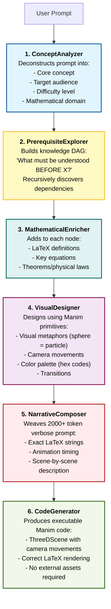
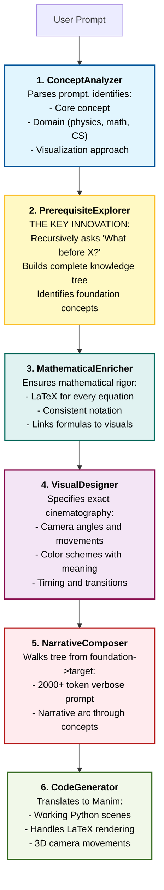
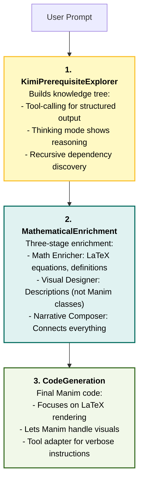

# Math-To-Manim

<div align="center">

<!-- Core Requirements -->
[](https://www.python.org/)
[](LICENSE)
[](https://ffmpeg.org/)
[](https://www.manim.community/)
[](https://github.com/HarleyCoops/Math-To-Manim)

<!-- AI Models / LLMs -->
[](https://www.anthropic.com)
[](https://deepmind.google/technologies/gemini/)
[](https://kimi.moonshot.cn/)
[](https://www.deepseek.com/)
[](https://x.ai/)

</div>

[](https://www.star-history.com/#HarleyCoops/Math-To-Manim&type=date&legend=top-left)

---

<div align="center">


**Transform natural language into beautiful mathematical animations using AI-powered agent pipelines.**

</div>

---

## The Core Innovation: Reverse Knowledge Tree

Most AI animation systems try to learn patterns from examples. **Math-To-Manim does the opposite.**

Instead of pattern matching, we use **Recursive Prerequisite Discovery**:

```
"Explain cosmology"
    |
    v
What must I understand BEFORE cosmology?
    -> General Relativity, Hubble's Law, Redshift, CMB radiation
    |
    v
What must I understand BEFORE General Relativity?
    -> Special Relativity, Differential Geometry, Gravitational Fields
    |
    v
What must I understand BEFORE Special Relativity?
    -> Galilean Relativity, Speed of light, Lorentz Transformations
    |
    v
[Continue until hitting foundational concepts...]
    |
    v
Build animation from foundation -> target concept
```

**Result**: Every animation builds understanding layer by layer, generating verbose LaTeX-rich prompts that produce working code.

---

## Three AI Pipelines, One Goal

Math-To-Manim offers **three distinct AI pipelines**. Choose based on your API access and preferences:

### Pipeline Comparison

| Feature | Gemini 3 (Google ADK) | Claude Sonnet 4.5 | Kimi K2 |
|:--------|:---------------------|:------------------|:--------|
| **Framework** | Google Agent Development Kit | Anthropic Agent SDK | OpenAI-compatible API |
| **Architecture** | Six-Agent Swarm | Six-Agent Pipeline | Three-Stage Enrichment |
| **Strengths** | Complex topology, physics reasoning | Reliable code generation, recursion | Chain-of-thought, structured tools |
| **Best For** | Advanced 3D math, Kerr metrics | General purpose, production use | LaTeX-heavy explanations |
| **Setup Complexity** | Moderate | Simple | Simple |

---

## Pipeline 1: Google Gemini 3 (ADK)

**Location**: `Gemini3/`

The Gemini pipeline uses the **Google Agent Development Kit** with a six-agent swarm architecture. Each agent is a specialist with a specific role in the animation generation process.

### How It Works



### Quick Start

```bash
# Set API key
echo "GOOGLE_API_KEY=your_key_here" >> .env

# Run the pipeline
python Gemini3/run_pipeline.py "Explain the Hopf Fibration"
```

### Key Files

- `Gemini3/run_pipeline.py` - Entry point
- `Gemini3/src/agents.py` - Agent definitions with system prompts
- `Gemini3/src/pipeline.py` - Orchestration logic
- `Gemini3/docs/GOOGLE_ADK_AGENTS.md` - Full documentation

---

## Pipeline 2: Claude Sonnet 4.5 (Anthropic SDK)

**Location**: `src/`

The Claude pipeline uses the **Anthropic Agent SDK** with automatic context management and built-in tools.

### How It Works




### Key Files

- `src/app_claude.py` - Gradio UI entry point
- `src/agents/prerequisite_explorer_claude.py` - Claude SDK agent
- `docs/ARCHITECTURE.md` - System design details

---

## Pipeline 3: Kimi K2 Thinking Model

**Location**: `KimiK2Thinking/`

The Kimi pipeline uses Moonshot AI's **K2 thinking model** with an OpenAI-compatible API and tool-calling interface.

### How It Works



### Quick Start

```bash
# Set API key
echo "MOONSHOT_API_KEY=your_key_here" >> .env

# Run prerequisite exploration
python KimiK2Thinking/examples/test_kimi_integration.py

# Run full enrichment pipeline
python KimiK2Thinking/examples/run_enrichment_pipeline.py path/to/tree.json
```

### Key Files

- `KimiK2Thinking/kimi_client.py` - API client
- `KimiK2Thinking/agents/enrichment_chain.py` - Three-stage pipeline
- `KimiK2Thinking/README.md` - Complete documentation

---

## See It In Action

<div align="center">

**Brownian Motion: From Pollen to Portfolio**


*A journey from Robert Brown's microscope to Einstein's heat equation, arriving at the Black-Scholes model for financial options pricing.*

---

**Recursive Rhombicosidodecahedron**


*A fractal Archimedean solid where every vertex spawns another complete rhombicosidodecahedron.*

---

**The Hopf Fibration**


*Stereographic projection of S3 fibers creating nested tori - pure topology rendered in 3D.*

</div>

---

## Installation

```bash
# Clone repository
git clone https://github.com/HarleyCoops/Math-To-Manim
cd Math-To-Manim

# Install dependencies
pip install -r requirements.txt

# Set up your preferred API key
echo "ANTHROPIC_API_KEY=your_key" >> .env    # For Claude
echo "GOOGLE_API_KEY=your_key" >> .env       # For Gemini
echo "MOONSHOT_API_KEY=your_key" >> .env     # For Kimi

# Install FFmpeg (required for video rendering)
# Windows: choco install ffmpeg
# Linux: sudo apt-get install ffmpeg
# macOS: brew install ffmpeg
```

---

## Run Example Animations

We have **55+ working examples** organized by topic:

```bash
# Physics - Black Hole Symphony
manim -pql examples/physics/black_hole_symphony.py BlackHoleSymphony

# Mathematics - Hopf Fibration
manim -pql examples/misc/epic_hopf.py HopfFibrationEpic

# Finance - Option Pricing
manim -pql examples/finance/optionskew.py OptionSkewScene

# Computer Science - Neural Networks
manim -pql examples/computer_science/machine_learning/AlexNet.py AlexNetScene
```

**Flags**: `-p` preview, `-q` quality (`l` low, `m` medium, `h` high, `k` 4K)

Browse all examples: [docs/EXAMPLES.md](docs/EXAMPLES.md)

---

## Repository Structure

```
Math-To-Manim/
|
+-- src/                    # Claude Sonnet 4.5 pipeline
|   +-- agents/             # Agent implementations
|   +-- app_claude.py       # Gradio UI
|
+-- Gemini3/                # Google Gemini 3 pipeline
|   +-- src/                # Agent definitions
|   +-- docs/               # Gemini-specific docs
|   +-- run_pipeline.py     # Entry point
|
+-- KimiK2Thinking/         # Kimi K2 pipeline
|   +-- agents/             # Enrichment chain
|   +-- examples/           # Usage examples
|
+-- examples/               # 55+ working animations
|   +-- physics/            # Quantum, gravity, particles
|   +-- mathematics/        # Geometry, topology, analysis
|   +-- computer_science/   # ML, algorithms
|   +-- cosmology/          # Cosmic evolution
|   +-- finance/            # Option pricing
|
+-- docs/                   # Documentation
+-- tests/                  # Test suite
+-- tools/                  # Utility scripts
```

---

## Why LaTeX-Rich Prompting Works

### The Problem with Vague Prompts

```
"Create an animation showing quantum field theory"
```
**Result**: Generic, incorrect, or broken code.

### The Solution: Verbose LaTeX Prompts

```
"Begin with Minkowski spacetime showing the metric:

$$ds^2 = -c^2 dt^2 + dx^2 + dy^2 + dz^2$$

Each component highlighted in different hues. Introduce the QED Lagrangian:

$$\mathcal{L}_{\text{QED}} = \bar{\psi}(i \gamma^\mu D_\mu - m)\psi - \tfrac{1}{4}F_{\mu\nu}F^{\mu\nu}$$

with Dirac spinor $\psi$ in orange, covariant derivative $D_\mu$ in green..."
```
**Result**: Perfect animations with correct LaTeX, camera movements, and timing.

**Our agents generate these verbose prompts automatically** by walking the knowledge tree.

---

## Common Pitfalls (And How We Solve Them)

| Problem | Traditional Approach | Our Solution |
|:--------|:--------------------|:-------------|
| **LaTeX Errors** | Hope for the best | Verbose prompts show exact formulas |
| **Vague Cinematography** | "Show quantum field" | Specify colors, angles, timing |
| **Missing Prerequisites** | Jump to advanced topics | Recursive dependency discovery |
| **Inconsistent Notation** | Mixed symbols | Mathematical enricher maintains consistency |

---

## Technical Requirements

- **Python**: 3.10+
- **API Key**: Anthropic, Google, or Moonshot
- **FFmpeg**: For video rendering
- **Manim Community**: v0.19.0
- **RAM**: 8GB minimum, 16GB recommended

---

## Contributing

We welcome contributions:

1. **Add Examples**: Create animations for new topics
2. **Improve Agents**: Enhance prerequisite discovery
3. **Fix Bugs**: Report and fix issues
4. **Documentation**: Improve guides

See [CONTRIBUTING.md](CONTRIBUTING.md) for guidelines.

---

## Documentation

- [Reverse Knowledge Tree](docs/REVERSE_KNOWLEDGE_TREE.md) - Core innovation
- [Architecture](docs/ARCHITECTURE.md) - System design
- [Examples Catalog](docs/EXAMPLES.md) - All 55+ animations
- [Gemini Pipeline](Gemini3/docs/GOOGLE_ADK_AGENTS.md) - Google ADK details
- [Kimi Pipeline](KimiK2Thinking/README.md) - Moonshot AI integration
- [Quick Start Guide](docs/QUICK_START_GUIDE.md) - Get started fast

---

## License

MIT License - See [LICENSE](LICENSE)

---

## Acknowledgments

- **Manim Community** - Incredible animation framework
- **Anthropic** - Claude Sonnet 4.5 and Agent SDK
- **Google** - Gemini 3 and Agent Development Kit
- **Moonshot AI** - Kimi K2 thinking model
- **1400+ Stargazers** - Thank you for the support!

---

<div align="center">

**Built with recursive reasoning, not training data.**

**Star this repo if you find it useful!**

</div>
