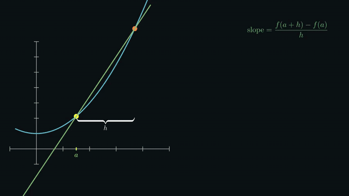
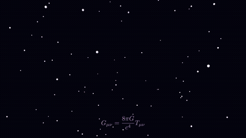
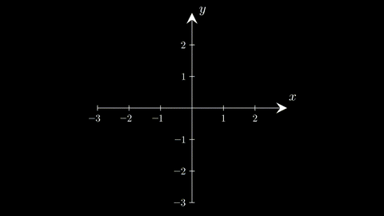
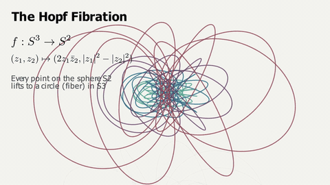

<div align="center">

# Math to Manim

### Ask a question → build the lesson → render the visual explanation

[](https://www.python.org/)
[](https://www.manim.community/)
[](https://openai.github.io/openai-agents-python/)
[](#hermes-learns-manim)
[](LICENSE)

[Motion showcase](docs/showcase/README.md) · [Architecture](docs/ARCHITECTURE.md) · [Launch plan](docs/HERMES_LEARNS_MANIM.md) · [Agent guide](AGENTS.md)

<br />


<br />

<a href="docs/showcase/README.md">
  
</a>

*Classic calculus beat from the original pipeline: secant tension resolving into a tangent.*

<p align="center">
  <a href="docs/showcase/README.md"></a>
  <a href="docs/showcase/README.md"></a>
  <a href="docs/showcase/README.md"></a>
  <a href="docs/showcase/README.md"></a>
</p>

<p align="center">
  <a href="docs/showcase/README.md"></a>
  <a href="docs/showcase/README.md"></a>
  <a href="docs/showcase/README.md"></a>
  <a href="docs/showcase/README.md"></a>
</p>

<p align="center">
  <a href="docs/showcase/README.md"></a>
  <a href="docs/showcase/README.md"></a>
  <a href="docs/showcase/README.md"></a>
  <a href="docs/showcase/README.md"></a>
</p>

**Math-To-Manim helps teachers, tutors, parents, and guardians turn questions into visual explanations they can inspect, adjust, and reuse.**

[**Browse the local GIF gallery →**](docs/showcase/README.md)

</div>

---

## Start here: Hermes + Math-To-Manim setup

This repo is meant to be operated by **Hermes Agent** while Math-To-Manim provides the visual explanation pipeline. The split is intentional:

- **Hermes** is the repo operator: skills, file/search/patch tools, terminal checks, vision review, todos, delegation, memory, and GitHub verification.
- **Math-To-Manim** is the Python package: typed curriculum/storyboard artifacts, Manim code generation, validation, render/review bundles, and showcase assets.

Fastest path for a new checkout:

```bash
git clone https://github.com/HarleyCoops/Math-To-Manim.git
cd Math-To-Manim

# 1. Install and verify the Python package.
python3 -m venv .venv
source .venv/bin/activate
python -m pip install -U pip
python -m pip install -e ".[dev]"
python -m pytest

# 2. Install and verify Hermes.
curl -fsSL https://raw.githubusercontent.com/NousResearch/hermes-agent/main/scripts/install.sh | bash
hermes setup
hermes doctor
hermes tools list --summary
hermes skills list

# 3. Start Hermes with the repo skills that matter here.
hermes --skills agents-md,codebase-inspection,manim-video,systematic-debugging
```

Once Hermes is inside this repo, the expected workflow is concrete: read `AGENTS.md`, inspect `pyproject.toml` and CLI help, run deterministic smoke generations, open the `runs/<run_id>/` artifact bundle, visually inspect frames/GIFs when media changes, then commit/push only verified docs/code/assets.

See [How Hermes uses this repo](#hermes-learns-manim) for the detailed tool map.

---

## What this is

**Math to Manim** is for the moment when a learner asks, “Can you show me why?” A teacher, tutor, parent, or guardian can type a question and get back a visual explanation plan: the concept, the missing prerequisites, the order of ideas, the screen beats, the generated Manim code, and optionally the rendered video.

The input can be short, but the product is the explanation: what the learner needs to understand, what should appear first, where the aha moment lives, and which visual metaphor makes the idea feel inevitable.

Math-To-Manim proves that calculus, topology, chaos, spacetime, stochastic finance, and ML concepts can become useful mathematical motion when agents plan the explanation before they write code.

This repo turns that idea into a durable teaching pipeline:

- a prerequisite-story pipeline inspired by the original reverse knowledge tree;
- typed Pydantic artifacts between every stage;
- OpenAI Agents SDK-compatible adapters for planning and generation;
- optional Codex CLI-backed codegen for subscription-authenticated iteration;
- a reproducible `runs/<run_id>/` bundle for every generation;
- static validation, render metadata, review artifacts, and manifests that are easy to inspect in CI, by Hermes, or by another agent.

The design principle is simple: **story before symbols, geometry before algebra, artifacts before side effects.**

---

## What makes this different

A normal text-to-code demo jumps from a request straight to Python. Math to Manim takes the long way on purpose:

```text
question
  → intent: what is the learner really asking?
  → prerequisite graph: what must be understood first?
  → curriculum: what order makes the idea click?
  → math packet: which definitions/equations matter?
  → storyboard: what should move on screen?
  → scene spec: what Manim objects and beats are needed?
  → generated_scene.py
  → static validation / repair
  → Manim render
  → review artifacts / showcase GIF
```

That gives every run a memory: JSON contracts, generated code, render results, review notes, and a manifest. The output is not just a video; it is an inspectable path from **question** to **understanding** to **animation**.

---

## Clone and run

### 1. Clone

Windows PowerShell:

```powershell
git clone https://github.com/HarleyCoops/Math-To-Manim.git
cd Math-To-Manim
python -m venv .venv
.\.venv\Scripts\Activate.ps1
python -m pip install -U pip
python -m pip install -e ".[dev]"
python -m pytest
```

macOS / Linux / WSL:

```bash
git clone https://github.com/HarleyCoops/Math-To-Manim.git
cd Math-To-Manim
python3 -m venv .venv
source .venv/bin/activate
python -m pip install -U pip
python -m pip install -e ".[dev]"
python -m pytest
```

### 2. Run a no-API smoke test

This proves the CLI, artifact contracts, and validators are wired before you spend model or render time:

```bash
math-to-manim generate "Explain why derivatives are slopes" --deterministic --no-render
```

Equivalent module form:

```bash
python -m math_to_manim.cli generate "Explain why derivatives are slopes" --deterministic --no-render
```

### 3. Generate with model calls

Set an OpenAI key and choose a model if desired:

```bash
export OPENAI_API_KEY="sk-..."
export OPENAI_MODEL="gpt-4.1"
math-to-manim generate "Explain Fourier epicycles as rotating vectors" --no-render
```

PowerShell:

```powershell
$env:OPENAI_API_KEY = "sk-..."
$env:OPENAI_MODEL = "gpt-4.1"
math-to-manim generate "Explain Fourier epicycles as rotating vectors" --no-render
```

### 4. Install render extras when you want MP4 output

Python render dependency:

```bash
python -m pip install -e ".[dev,render]"
```

System render dependencies are also needed for real Manim output, especially FFmpeg and LaTeX for `MathTex`. On Debian/Ubuntu/WSL:

```bash
./scripts/bootstrap-render.sh
```

The package list lives in [`requirements-system.txt`](requirements-system.txt).

---

## Codex CLI codegen path

Math-To-Manim can keep the typed planning pipeline while sending the Manim codegen and repair loop through a locally authenticated Codex CLI session.

Check Codex first:

```bash
codex --version
codex exec "Say ready from inside this repo"
```

Then route codegen through Codex:

```bash
math-to-manim generate "Explain derivatives as slopes with a cinematic tangent-line reveal" \
  --codegen-provider codex-cli \
  --codex-full-auto \
  --style cinematic \
  --quality l
```

Earlier planning stages remain on the typed adapters; only the generated-code and repair stages move first. That makes the migration incremental instead of all-or-nothing.

---

## What lands on disk

A generation writes a self-contained run bundle:

```text
runs/<run_id>/
  request.json
  intent.json
  knowledge_graph.json
  curriculum.json
  math_packet.json
  storyboard.json
  scene_spec.json
  generated_code.json
  generated_scene.py
  validation_report.json
  render_result.json
  review_report.json
  draft_review/
    draft_review.md
    contact_sheet.png
    frames/
  animation_package.json
  manifest.json
```

Package layout:

```text
math_to_manim/
  agents/      # stage adapters
  schemas/     # versioned artifact contracts
  tools/       # graph, validation, rendering, video, artifact helpers
  pipeline/    # orchestration, tracing, repair loop
  rendering/   # Manim and FFmpeg wrappers
  review/      # static and visual review scoring
```

---

## Motion showcase

Sixteen curated GIFs are tracked under [`docs/showcase/assets/`](docs/showcase/assets/) as the **art direction target** for Math-To-Manim's visual explanations.

<table>
<tr>
<td width="33%"><a href="docs/showcase/README.md"></a></td>
<td width="33%"><a href="docs/showcase/README.md"></a></td>
<td width="33%"><a href="docs/showcase/README.md"></a></td>
</tr>
<tr>
<td><b>Geometry as spectacle</b></td>
<td><b>Topology as choreography</b></td>
<td><b>Chaos as intuition</b></td>
</tr>
</table>

See the full gallery with descriptions: **[`docs/showcase/README.md`](docs/showcase/README.md)**.

### Make a README-sized GIF from a render

```bash
MP4="media/videos/your_scene/480p15/YourScene.mp4"

ffmpeg -y -ss 95 -t 24 -i "$MP4" \
  -vf "fps=12,scale=720:-1:flags=lanczos,split[s0][s1];[s0]palettegen=max_colors=96[p];[s1][p]paletteuse=dither=bayer:bayer_scale=5" \
  docs/showcase/assets/your-clip.gif
```

Adjust `-ss` and `-t` to capture the teaching beat you want.

---

## Hermes learns Manim

This repo is also a live **Hermes Agent workspace**. Hermes is not imported by Math-To-Manim and is not a runtime dependency; it is the contributor/operator layer that uses the repo the way a developer would: read files, search code, patch docs and code, run terminal checks, inspect generated artifacts, review media with vision, delegate larger work, track todos, and preserve useful context through skills and memory.

| Hermes-native capability | How it is used in Math-To-Manim |
| --- | --- |
| File + search tools | Read `README.md`, `AGENTS.md`, `pyproject.toml`, schemas, tests, docs, and generated run artifacts before making claims. |
| Patch tool | Make surgical edits to docs, schemas, tests, pipeline code, and launch copy while preserving repo style and typed contracts. |
| Terminal tool | Run `pytest`, CLI help, deterministic smoke generations, Codex checks, Manim, FFmpeg, link validators, git, and GitHub verification. |
| Vision/media review | Inspect screenshots, contact sheets, frames, and GIFs so showcase media is judged visually, not trusted because filenames exist. |
| Delegation + todos | Split larger work across focused agents, track acceptance criteria, and keep implementation/review/checklist state explicit. |
| Session search + memory | Recover prior repo decisions and preserve stable conventions without storing secrets or temporary run noise. |
| Skills | Load procedures such as `agents-md`, `codebase-inspection`, `manim-video`, `systematic-debugging`, `writing-plans`, `test-driven-development`, and `subagent-driven-development`. |

The Math-To-Manim side gives Hermes concrete things to operate: the `math-to-manim` CLI, deterministic helpers in `math_to_manim/tools/`, typed stages in `math_to_manim/agents/` and `math_to_manim/pipeline/`, schemas in `math_to_manim/schemas/`, render/review helpers, and reproducible `runs/<run_id>/` bundles containing JSON contracts, `generated_scene.py`, validation/render/review reports, contact sheets, frames, and `manifest.json`.

Start a repo-aware Hermes session:

```bash
# Install/configure Hermes if needed.
curl -fsSL https://raw.githubusercontent.com/NousResearch/hermes-agent/main/scripts/install.sh | bash
hermes setup
hermes doctor

# From the repo root, preload skills for this repo.
hermes --skills agents-md,manim-video,codebase-inspection,systematic-debugging
```

See [`AGENTS.md`](AGENTS.md) for the full operating contract and [`docs/HERMES_LEARNS_MANIM.md`](docs/HERMES_LEARNS_MANIM.md) for the launch/thread plan and new animation slate.

---

## License

MIT.
