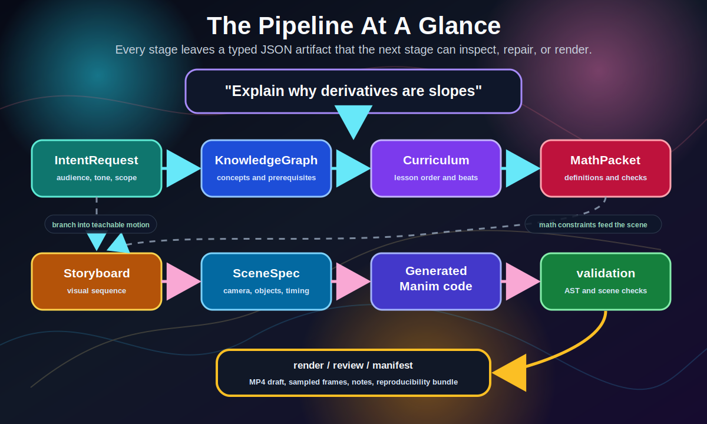

<div align="center">

# M2M2 · Math-To-Manim, rewritten

### Prompt → typed curriculum → Manim code → renderable mathematical motion

[](https://www.python.org/)
[](https://www.manim.community/)
[](https://openai.github.io/openai-agents-python/)
[](#hermes-skills-make-this-repo-easier-to-evolve)
[](LICENSE)

[Motion showcase](docs/showcase/README.md) · [Architecture](docs/ARCHITECTURE.md) · [Docs index](docs/README.md) · [Legacy Math-To-Manim](https://github.com/HarleyCoops/Math-To-Manim)

<br />

<a href="docs/showcase/README.md">
  
</a>

*Classic calculus beat from the original pipeline: secant tension resolving into a tangent.*

<p align="center">
  <a href="docs/showcase/README.md"></a>
  <a href="docs/showcase/README.md"></a>
  <a href="docs/showcase/README.md"></a>
  <a href="docs/showcase/README.md"></a>
</p>

<p align="center">
  <a href="docs/showcase/README.md"></a>
  <a href="docs/showcase/README.md"></a>
  <a href="docs/showcase/README.md"></a>
  <a href="docs/showcase/README.md"></a>
</p>

<p align="center">
  <a href="docs/showcase/README.md"></a>
  <a href="docs/showcase/README.md"></a>
  <a href="docs/showcase/README.md"></a>
  <a href="docs/showcase/README.md"></a>
</p>

**The rewrite keeps the visual ambition of the original project, but gives the pipeline contracts, traces, and repeatable run folders.**

[**Browse the local GIF gallery →**](docs/showcase/README.md)

</div>

---

## What this is

The public [Math-To-Manim](https://github.com/HarleyCoops/Math-To-Manim) repo proved the core product idea: short educational prompts can become lecture-grade Manim animations when agents first plan the lesson instead of jumping straight to code.

**M2M2** is the rewrite of that idea around a cleaner spine:

- typed Pydantic artifacts between every stage;
- OpenAI Agents SDK-compatible adapters for planning and generation;
- optional Codex CLI-backed codegen for subscription-authenticated iteration;
- a reproducible `runs/<run_id>/` bundle for every generation;
- static validation, render metadata, review artifacts, and manifests that are easy to inspect in CI or by another agent.

The design principle is simple: **story before symbols, geometry before algebra, artifacts before side effects.**

---

## The pipeline at a glance

<p align="center">
  
</p>

Each stage writes structured JSON so humans, tests, and Hermes/Codex agents can all understand what happened.

---

## Clone and run

### 1. Clone

Windows PowerShell:

```powershell
git clone https://github.com/HarleyCoops/M2M2.git
cd M2M2
python -m venv .venv
.\.venv\Scripts\Activate.ps1
python -m pip install -U pip
python -m pip install -e ".[dev]"
python -m pytest
```

macOS / Linux / WSL:

```bash
git clone https://github.com/HarleyCoops/M2M2.git
cd M2M2
python3 -m venv .venv
source .venv/bin/activate
python -m pip install -U pip
python -m pip install -e ".[dev]"
python -m pytest
```

### 2. Run a no-API smoke test

This proves the CLI, artifact contracts, and validators are wired before you spend model or render time:

```bash
m2m2 generate "Explain why derivatives are slopes" --deterministic --no-render
```

Equivalent module form:

```bash
python -m math_to_manim.cli generate "Explain why derivatives are slopes" --deterministic --no-render
```

### 3. Generate with model calls

Set an OpenAI key and choose a model if desired:

```bash
export OPENAI_API_KEY="sk-..."
export M2M2_MODEL="gpt-4.1"
m2m2 generate "Explain Fourier epicycles as rotating vectors" --no-render
```

PowerShell:

```powershell
$env:OPENAI_API_KEY = "sk-..."
$env:M2M2_MODEL = "gpt-4.1"
m2m2 generate "Explain Fourier epicycles as rotating vectors" --no-render
```

### 4. Install render extras when you want MP4 output

Python render dependency:

```bash
python -m pip install -e ".[dev,render]"
```

System render dependencies are also needed for real Manim output, especially FFmpeg and LaTeX for `MathTex`. On Debian/Ubuntu/WSL:

```bash
./scripts/bootstrap-render.sh
```

The package list lives in [`requirements-system.txt`](requirements-system.txt).

---

## Codex CLI codegen path

M2M2 can keep the typed planning pipeline while sending the Manim codegen and repair loop through a locally authenticated Codex CLI session.

Check Codex first:

```bash
codex --version
codex exec "Say ready from inside this repo"
```

Then route codegen through Codex:

```bash
m2m2 generate "Explain derivatives as slopes with a cinematic tangent-line reveal" \
  --codegen-provider codex-cli \
  --codex-full-auto \
  --style cinematic \
  --quality l
```

Environment equivalents:

```bash
export M2M2_CODEGEN_PROVIDER=codex-cli
export M2M2_CODEX_FULL_AUTO=1
export M2M2_CODEX_COMMAND=codex
export M2M2_CODEX_TIMEOUT_SECONDS=900
```

Earlier planning stages remain on the typed adapters; only the generated-code and repair stages move first. That makes the migration incremental instead of all-or-nothing.

---

## What lands on disk

A generation writes a self-contained run bundle:

```text
runs/<run_id>/
  request.json
  intent.json
  knowledge_graph.json
  curriculum.json
  math_packet.json
  storyboard.json
  scene_spec.json
  generated_code.json
  generated_scene.py
  validation_report.json
  render_result.json
  review_report.json
  draft_review/
    draft_review.md
    contact_sheet.png
    frames/
  animation_package.json
  manifest.json
```

Package layout:

```text
math_to_manim/
  agents/      # stage adapters
  schemas/     # versioned artifact contracts
  tools/       # graph, validation, rendering, video, artifact helpers
  pipeline/    # orchestration, tracing, repair loop
  rendering/   # Manim and FFmpeg wrappers
  review/      # static and visual review scoring
```

---

## Motion showcase

Thirteen curated GIFs from the legacy repo's [`public/readme-showcase/`](https://github.com/HarleyCoops/Math-To-Manim/tree/main/public/readme-showcase) directory are copied into this repo under [`docs/showcase/assets/`](docs/showcase/assets/). They are not outputs from the rewrite yet; they are the **art direction target**.

<table>
<tr>
<td width="33%"><a href="docs/showcase/README.md"></a></td>
<td width="33%"><a href="docs/showcase/README.md"></a></td>
<td width="33%"><a href="docs/showcase/README.md"></a></td>
</tr>
<tr>
<td><b>Geometry as spectacle</b></td>
<td><b>Topology as choreography</b></td>
<td><b>Chaos as intuition</b></td>
</tr>
</table>

See the full gallery with descriptions: **[`docs/showcase/README.md`](docs/showcase/README.md)**.

### Make a README-sized GIF from a render

```bash
MP4="media/videos/your_scene/480p15/YourScene.mp4"

ffmpeg -y -ss 95 -t 24 -i "$MP4" \
  -vf "fps=12,scale=720:-1:flags=lanczos,split[s0][s1];[s0]palettegen=max_colors=96[p];[s1][p]paletteuse=dither=bayer:bayer_scale=5" \
  docs/showcase/assets/your-clip.gif
```

Adjust `-ss` and `-t` to capture the teaching beat you want.

---

## Hermes skills make this repo easier to evolve

This rewrite is designed for skill-driven agent work. When using Hermes Agent, start by loading the skill that matches the change rather than improvising a one-off workflow.

Recommended skill map:

| Work | Hermes skill to reach for | Why it matters here |
| --- | --- | --- |
| Break a feature into reviewable tasks | `writing-plans` | Keeps pipeline changes bite-sized and tied to file paths. |
| Implement a plan with parallel workers | `subagent-driven-development` | Useful when one agent inspects schemas, one checks CLI behavior, and one edits docs/tests. |
| Add behavior safely | `test-driven-development` | M2M2's value is typed, testable stages; tests should lead changes. |
| Diagnose render/codegen failures | `systematic-debugging` | Manim failures often hide the real cause one stage earlier. |
| Ask another agent to review before commit | `requesting-code-review` | Good for schema migrations, CLI flags, and generated-code sandboxing. |
| Keep repo docs honest | `codebase-inspection` | Verify entrypoints from `pyproject.toml`, CLI help, tests, and actual files. |

Hermes plans can live under `.hermes/plans/` and should read like executable design docs: scope, skill, files, acceptance criteria, verification commands, and known pitfalls. If a PR changes the pipeline contract, update the plan or cite the skill used so future agents can resume without rediscovering context.

---

## Relationship to the classic repo

Use [HarleyCoops/Math-To-Manim](https://github.com/HarleyCoops/Math-To-Manim) for historical Claude / Gemini / Kimi experiments, examples, and the original orchestration experiments. Use **M2M2** for the refactor focused on typed artifacts, tracing, staged provider migration, and repeatable agent workflows.

---

## License

MIT. Showcase GIFs originate from the upstream Math-To-Manim project and are duplicated locally here for documentation and art-direction continuity.
