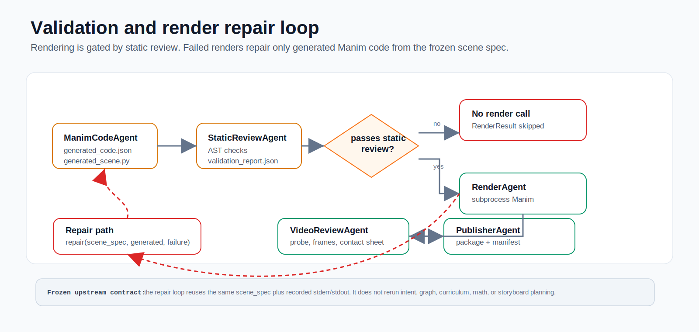
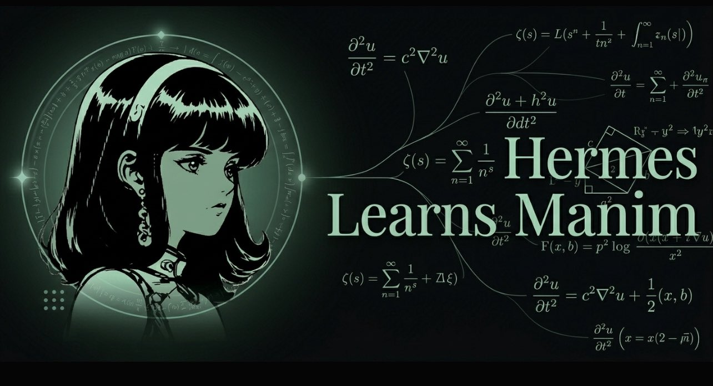

<div align="center">

<a href="https://www.star-history.com/#HarleyCoops/Math-To-Manim&Date">
  <picture>
    <source media="(prefers-color-scheme: dark)" srcset="https://api.star-history.com/svg?repos=HarleyCoops/Math-To-Manim&type=Date&theme=dark" />
    <source media="(prefers-color-scheme: light)" srcset="https://api.star-history.com/svg?repos=HarleyCoops/Math-To-Manim&type=Date" />
    
  </picture>
</a>

# Math to Manim

### Ask a question -> get a freakin' movie

[](https://www.python.org/)
[](https://www.manim.community/)
[](https://openai.github.io/openai-agents-python/)
[](#hermes-agent)
[](LICENSE)

[Motion showcase](docs/showcase/README.md) · [Architecture](docs/ARCHITECTURE.md) · [Prime RL](docs/PRIME_INTELLECT_RL.md) · [Roadmap](docs/ROADMAP.md) · [Agent guide](AGENTS.md)

<br />

<p align="center">
  
  
</p>

<br />

<p align="center">
  <a href="docs/showcase/README.md"></a>
  <a href="docs/showcase/README.md"></a>
  <a href="docs/showcase/README.md"></a>
  <a href="docs/showcase/README.md"></a>
</p>

<p align="center">
  <a href="docs/showcase/README.md"></a>
  <a href="docs/showcase/README.md"></a>
  <a href="docs/showcase/README.md"></a>
  <a href="docs/showcase/README.md"></a>
</p>

<p align="center">
  <a href="docs/showcase/README.md"></a>
  <a href="docs/showcase/README.md"></a>
  <a href="docs/showcase/README.md"></a>
  <a href="docs/showcase/README.md"></a>
  <a href="docs/showcase/README.md"></a>
</p>

**Math-To-Manim turns serious math and physics prompts into Manim explainer videos and the reusable artifacts that produced them: intent, prerequisite graphs, lesson plans, math packets, storyboards, scene specs, generated code, validation reports, render evidence, review notes, and stage traces.**

</div>

---

## What this is

**Math-To-Manim** started in the R1 shockwave. GitHub records the repo as created at `2025-01-20T11:04:50Z` / `04:04:50 MST`. The first commit landed twenty minutes later at `2025-01-20T04:24:50-07:00` and added exactly two files: `DeepSeek_R1_zero.ipynb` and `Readme.md`. DeepSeek had released [R1](https://huggingface.co/deepseek-ai/DeepSeek-R1) and R1-Zero, and I read it as a Sputnik-style signal: open reasoning models were now real, geopolitical, and weirdly timed. My first move was to clone the model, point it at math reasoning, and ask whether the chain of thought could become a chain of visual artifacts.

```text
09a2f22  2025-01-20T04:24:50-07:00  updated
A        DeepSeek_R1_zero.ipynb
A        Readme.md
```

The first artifact was not a polished hero image. It was a notebook that tried to load `deepseek-ai/DeepSeek-R1-Zero` with `trust_remote_code=True`, quantization notes, and a tiny inference test. The origin was rough, fast, and more interesting: a clone, a notebook, and the realization that reasoning traces could become movies.

Three hours later, the first Manim file landed: `pythagorean.py` at `2025-01-20T07:18:12-07:00`. Then the tweet took off.

<p align="center">
  <a href="https://x.com/christiancooper/status/1881335734256492605?s=20"></a>
</p>

> "I asked #R1 to visually explain to me the Pythagorean theorem. This was done in one shot with no errors in less than 30 seconds. Wrap it up, its over: #DeepSeek #R1"
>
> — [Christian H. Cooper, January 20, 2025](https://x.com/christiancooper/status/1881335734256492605?s=20)

That post reached nearly a million views because the implication was obvious: if a reasoning model could produce a working visual proof on release morning, then "text in, movie out" was not a toy demo. It was the first flash of a new interface for math and physics.

What I imagined with R1 is now becoming practical: Math-To-Manim can still one-shot a question into a movie, but the real value is the preserved reasoning spine around that movie. Every run leaves behind typed artifacts: prompt, intent, prerequisite graph, lesson plan, math packet, storyboard, scene spec, generated Manim, validation, render evidence, review notes, and the final GIF or video.

That makes this repo an out-of-the-box natural experiment for reinforcement learning: **text prompt -> JSON reasoning artifacts -> Manim code -> movie/GIF -> text correction -> revised movie/GIF**. The model does not just get a pass/fail score; it gets the screen, the code, the intermediate reasoning, and the human correction that says what should change.

The next pivot is to make Math-To-Manim a public, fully hosted Prime Intellect experiment. Prime Intellect's [Hosted Evaluations](https://www.primeintellect.ai/blog/hosted-evaluations) now make it realistic to evaluate models against custom environments at scale, so these run bundles can become the RL spine I train and eval against: generate the movie, inspect the artifacts, apply the correction, render again, and reward the model for making the visual explanation clearer.

The training method I want to adopt is the Recursive Language Model pattern: keep the intermediate state explicit, let the model revise its own artifacts, and evaluate whether each recursive edit makes the final output better. Math-To-Manim is a natural fit because the state is already public and typed: text prompt, JSON artifacts, Manim code, render evidence, GIF/video output, correction, and revised output.

The first concrete training target is the quantum GIF on the main screen: fix the formula overlap, improve the point of view, and zoom into the equations when the learner needs to read them. That pair — a prompt, a movie, a text correction, and a better movie — is exactly the kind of loop visual reasoning models should learn from.

This repo is the build log for that loop: agents learning to reason through complex topics, preserve their work, and turn corrections into better visual explanations.

- Christian

Today, that means a durable agent pipeline with:

- audience-aware request artifacts, from grade-school intuition to advanced notation;
- a prerequisite-story pipeline inspired by the original reverse knowledge tree;
- typed Pydantic artifacts between every stage;
- OpenAI Agents SDK-compatible adapters for planning and generation;
- optional Codex CLI-backed codegen for subscription-authenticated iteration;
- a reproducible `runs/<run_id>/` bundle for every generation;
- static validation, render metadata, review artifacts, and manifests that are easy to inspect in CI or by another agent.

The design principle is simple: **story before symbols, geometry before algebra, artifacts before side effects.**

---

## Reverse reasoning pipeline

A normal text-to-code demo jumps from request to Python. Math-To-Manim takes the long way on purpose: it reasons backward from the final concept to the prerequisites, then walks forward through a teachable visual sequence.

The code path is explicit in [`math_to_manim/pipeline/runner.py`](math_to_manim/pipeline/runner.py). `AnimationPipeline.generate()` runs a fixed stage chain: `IntentAgent`, `PrerequisiteGraphAgent`, `CurriculumAgent`, `MathAgent`, `StoryboardAgent`, `SceneSpecAgent`, `ManimCodeAgent`, `StaticReviewAgent`, `RenderAgent`, `VideoReviewAgent`, and `PublisherAgent`.

| Stage | Why it exists | Artifact |
| --- | --- | --- |
| Intent | Clarify what the learner is really asking. | `intent.json` |
| Reverse prerequisites | Build the knowledge graph needed before the target idea. | `knowledge_graph.json` |
| Curriculum | Turn the graph into a teachable order. | `curriculum.json` |
| Math packet | Select definitions, equations, assumptions, and examples. | `math_packet.json` |
| Storyboard | Decide the screen beats before code exists. | `storyboard.json` |
| Scene spec | Compile the visual plan into Manim objects, animations, timing, and camera notes. | `scene_spec.json` |
| Code, validation, render, review | Generate runnable Manim, gate it with static checks, render when allowed, and package the evidence. | `generated_scene.py`, reports, manifest |

<p align="center">
  
</p>

That gives every run a memory: JSON contracts, generated code, render results, review notes, and a manifest. The output is not just a video; it is an inspectable path from **question** to **understanding** to **animation**.

For current editable-video status and the planned prompt/spec/code edit loop, see the [roadmap](docs/ROADMAP.md).

---

## Prime Intellect RL repair loop

Math-To-Manim is also becoming a Prime Intellect reinforcement-learning environment. The first RL target is not "make the whole video in one shot." It is the edit move that matters after a base model produces a plausible but flawed scene: text overlaps formulas, equations are too small, the camera angle hides the point, or the zoom never lands on the symbol the learner needs to read.

A concrete target is the quantum-physics homepage-style failure mode: a beautiful Manim pass that still has text/formula collisions. The experiment is to give the model the typed scene plan, the generated Python, validation/render evidence, and a human request such as "fix the overlap," "change the POV angle," or "zoom into the formulas before the narration moves on." The policy should return a sparse code edit that preserves the scene while making the movie more readable.

<p align="center">
  
</p>

<p align="center">
  
</p>

<table>
<tr>
<td width="33%"></td>
<td width="33%"></td>
<td width="33%"></td>
</tr>
<tr>
<td><b>Run bundle as environment</b></td>
<td><b>Reward function as critic</b></td>
<td><b>Policy update as repair engine</b></td>
</tr>
</table>

The current hub environment is `harleycooper/math-to-manim`. A repair task carries the original prompt, typed `scene_spec`, generated Manim Python, static-validation report, and render/recovery evidence when available. The model must return one strict `GeneratedCode` JSON block. The Verifiers reward checks whether the proposed code parses, defines the expected Manim scene, avoids unsafe imports and calls, preserves expected math terms, and reduces obvious text/layout crowding hazards.

```text
generated_scene.py + scene_spec + validation/render evidence
  -> Prime Intellect Verifiers environment
  -> model proposes corrected GeneratedCode JSON
  -> static reward checks parseability, scene shape, safety, terms, layout
  -> hosted RL updates the repair policy
  -> corrected, renderable Manim Python flows back into M2M2 recovery
```

That keeps the fast RL loop text-and-AST based while the slower Manim renderer remains the audit gate. The intended result is a model that learns the house style of this repo: cinematic but readable scenes, sparse formulas, staged captions, safe Manim code, and edits that can respond to text or voice change requests without throwing away the whole movie.

Current hosted-training status: the environment action passes on Prime, the hub package is published as `harleycooper/math-to-manim@0.1.1`, a 1-step smoke completed, and a 25-step W&B-enabled pilot has been launched on `Qwen/Qwen3.5-35B-A3B`.

See the full integration notes in [`docs/PRIME_INTELLECT_RL.md`](docs/PRIME_INTELLECT_RL.md).

---

## "Hey man, I just want to see a demo, I don't need a calculus lecture"

Fair. The whole point is that the pipeline should turn a one-sentence idea into something moving on screen before you have to read the architecture docs.

<p align="center">
  
</p>

WSL quickstart:

```bash
cd /mnt/c/Users/$USER

git clone https://github.com/HarleyCoops/Math-To-Manim.git
cd Math-To-Manim

python3 -m venv .venv
source .venv/bin/activate
python -m pip install -U pip
python -m pip install -e ".[dev,render]"
./scripts/bootstrap-render.sh  # Debian/Ubuntu/WSL system deps for real MP4 output

m2m2 generate \
  "Show why the quantum harmonic oscillator only allows discrete energies: start with a springy potential well, zoom into the wavefunctions, then reveal the ladder of allowed energy levels." \
  --codegen-provider codex-cli \
  --codex-full-auto \
  --style cinematic \
  --quality l \
  --runs-dir runs
```

Generated bundles and videos stay in repo-local `runs/<run_id>/` by default;
the `--runs-dir runs` flag above is intentionally explicit so agent-driven runs
do not disappear into `/tmp`.

If you want Hermes to run the harness like an operator instead of driving the CLI by hand:

```bash
hermes --skills manim-video,systematic-debugging,codebase-inspection \
  -z "Run the M2M2 pipeline on the quantum harmonic oscillator demo prompt with --runs-dir runs, inspect the repo-local run bundle, try a low-quality render, and report the generated movie path or the exact blocker. Do not put user-visible outputs in /tmp."
```

That gives you the practical loop: ask for the movie, inspect the run bundle, then tell the agent what to fix.

---

## Clone and run

### 1. Clone

Windows PowerShell:

```powershell
git clone https://github.com/HarleyCoops/Math-To-Manim.git
cd Math-To-Manim
python -m venv .venv
.\.venv\Scripts\Activate.ps1
python -m pip install -U pip
python -m pip install -e ".[dev]"
python -m pytest
```

macOS / Linux / WSL:

```bash
git clone https://github.com/HarleyCoops/Math-To-Manim.git
cd Math-To-Manim
python3 -m venv .venv
source .venv/bin/activate
python -m pip install -U pip
python -m pip install -e ".[dev]"
python -m pytest
```

### 2. Run a no-API smoke test

This proves the CLI, artifact contracts, and validators are wired before you spend model or render time:

```bash
math-to-manim generate "Explain why derivatives are slopes" --deterministic --no-render
```

Equivalent module form:

```bash
python -m math_to_manim.cli generate "Explain why derivatives are slopes" --deterministic --no-render
```

### 3. Generate with model calls

Set an OpenAI key and choose a model if desired:

```bash
export OPENAI_API_KEY="sk-..."
export OPENAI_MODEL="gpt-4.1"
math-to-manim generate "Explain Fourier epicycles as rotating vectors" --no-render
```

PowerShell:

```powershell
$env:OPENAI_API_KEY = "sk-..."
$env:OPENAI_MODEL = "gpt-4.1"
math-to-manim generate "Explain Fourier epicycles as rotating vectors" --no-render
```

### 4. Install render extras when you want MP4 output

Python render dependency:

```bash
python -m pip install -e ".[dev,render]"
```

System render dependencies are also needed for real Manim output, especially FFmpeg and LaTeX for `MathTex`. On Debian/Ubuntu/WSL:

```bash
./scripts/bootstrap-render.sh
```

The package list lives in [`requirements-system.txt`](requirements-system.txt).

---

## Codex CLI codegen path

Math-To-Manim can keep the typed planning pipeline while sending the Manim codegen and repair loop through a locally authenticated Codex CLI session.

Check Codex first:

```bash
codex --version
codex exec "Say ready from inside this repo"
```

Then route codegen through Codex:

```bash
math-to-manim generate "Explain derivatives as slopes with a cinematic tangent-line reveal" \
  --codegen-provider codex-cli \
  --codex-full-auto \
  --style cinematic \
  --quality l
```

Earlier planning stages remain on the typed adapters; only the generated-code and repair stages move first. That makes the migration incremental instead of all-or-nothing.

---

## What lands on disk

A generation writes a self-contained run bundle:

```text
runs/<run_id>/
  request.json
  intent.json
  knowledge_graph.json
  curriculum.json
  math_packet.json
  storyboard.json
  scene_spec.json
  generated_code.json
  generated_scene.py
  validation_report.json
  render_result.json
  review_report.json
  trace.jsonl  # stage-boundary events when tracing is enabled
  recovery_manifest.json  # after recover-render
  draft_review/
    draft_review.md
    contact_sheet.png
    frames/
  animation_package.json
  manifest.json
```

After editing `generated_scene.py` inside a run bundle, rerun the recovery path:

```bash
math-to-manim recover-render runs/<run_id> --quality l
```

That command refreshes validation, render, review, draft-review assets, and
`recovery_manifest.json` without regenerating upstream planning artifacts.

Package layout:

```text
math_to_manim/
  agents/      # stage adapters
  schemas/     # versioned artifact contracts
  tools/       # graph, validation, rendering, video, artifact helpers
  pipeline/    # orchestration, tracing, repair loop
  rendering/   # Manim and FFmpeg wrappers
  review/      # static and visual review scoring
```

---

## Hermes Agent

Hermes is the contributor/operator agent around this repository. It is not imported by Math-To-Manim and is not a runtime dependency; it uses the repo the way a developer would: read files, search code, patch docs and code, run terminal checks, inspect generated artifacts, review frames or GIFs, track todos, delegate larger work, and preserve stable context through skills.

<p align="center">
  
</p>

That makes Hermes useful for maintaining the reverse-reasoning pipeline without becoming part of it. A Hermes session can inspect `AGENTS.md`, `pyproject.toml`, schemas, tests, and `runs/<run_id>/` bundles; run `pytest`, CLI smoke commands, Manim, FFmpeg, and git checks; then verify that docs, code, and showcase media still match the artifact contracts.

Repo-local Hermes skills live under [`hermes/skills/`](hermes/skills/). The old Claude `./skill` path is historical; current contributor guidance is in [`AGENTS.md`](AGENTS.md), with launch notes in [`docs/HERMES_LEARNS_MANIM.md`](docs/HERMES_LEARNS_MANIM.md).

---

## Motion showcase

Sixteen curated GIFs are tracked under [`docs/showcase/assets/`](docs/showcase/assets/) as the **art direction target** for Math-To-Manim's visual explanations.

<table>
<tr>
<td width="33%"><a href="docs/showcase/README.md"></a></td>
<td width="33%"><a href="docs/showcase/README.md"></a></td>
<td width="33%"><a href="docs/showcase/README.md"></a></td>
</tr>
<tr>
<td><b>Geometry as spectacle</b></td>
<td><b>Topology as choreography</b></td>
<td><b>Chaos as intuition</b></td>
</tr>
</table>

See the full gallery with descriptions: **[`docs/showcase/README.md`](docs/showcase/README.md)**.

### Make a README-sized GIF from a render

```bash
MP4="media/videos/your_scene/480p15/YourScene.mp4"

ffmpeg -y -ss 95 -t 24 -i "$MP4" \
  -vf "fps=12,scale=720:-1:flags=lanczos,split[s0][s1];[s0]palettegen=max_colors=96[p];[s1][p]paletteuse=dither=bayer:bayer_scale=5" \
  docs/showcase/assets/your-clip.gif
```

Adjust `-ss` and `-t` to capture the teaching beat you want.

---

## License

MIT.
