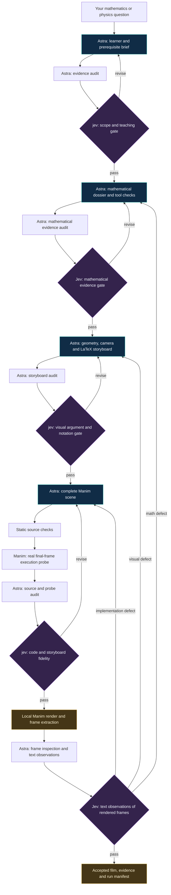
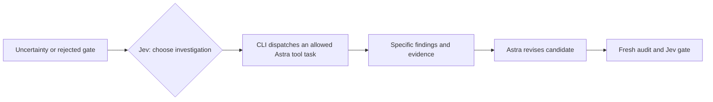

# Math To Manim

### A question becomes a mathematical world you can move through.

**GPT-6 Astra builds the explanation. Jev challenges every step. Manim makes it visible.**

The primary pipeline now uses the official **Codex SDK**, your **Codex ChatGPT
login**, and `gpt-6-astra` for authors and evidence auditors. Real **TypeSafe Jev
(`jev-1.13.0`)** evaluates each checkpoint through its separate API. Astra develops the
learning brief, verifies the mathematics, directs the visual argument, writes
the scene, and reviews the actual render. Jev reviews are **advisory by default**:
their scores are retained, but do not trigger regeneration or extra investigations.
Strict gates remain available with `--review-mode gated`.

To finish an existing scene without spending additional model credits:

```bash
math-to-manim render-existing runs/astra/<run-id> --candidate runs/astra/<run-id>/attempts/<candidate>.json -q m
```

This local-only path makes **zero Astra or Jev calls**. Manim renders and joins
the animation segments, then extracts review frames. Output is marked
`not_reviewed`, not Jev-approved; previous review records remain unchanged.

[Run the chain](#installation) · [How jev works](#astra-and-jev) ·
[Creation story](#the-morning-of-january-20-2025) · [Older films](docs/showcase/README.md)

## The New Film: Morse Theory On A Torus

A horizontal plane rises through an upright torus. The included surface changes
from a disk to a cylinder, then a punctured torus, and finally a closed torus.
Four critical points explain when those changes happen:

$$
M_a=\{p\in T^2:h(p)\le a\},\qquad
\chi(T^2)=m_0-m_1+m_2=1-2+1=0.
$$

The film uses a genuine Morse height with isolated critical points, rather than
the degenerate height of a horizontal donut. The colored object is the surface
below the scanning plane; it is not a volume of water.

The live run is in progress at **720p, 30 fps**, with geometry and review history
retained. Remaining production is local-only, with no further model review or
automatic regeneration. [Read the production request](docs/prompts/astra-morse-torus.md).

## Astra And Jev

The diagram below documents the optional **gated** mode. Default advisory mode
records one Jev evaluation per checkpoint and continues without repair loops.


```mermaid
flowchart TD
    Q[Your mathematics or physics question] --> B[Astra: learner and prerequisite brief]
    B --> A1[Astra: evidence audit]
    A1 --> J1{jev: scope and teaching gate}
    J1 -- revise --> B
    J1 -- pass --> M[Astra: mathematical dossier and tool checks]
    M --> A2[Astra: mathematical evidence audit]
    A2 --> J2{Jev: mathematical evidence gate}
    J2 -- revise --> M
    J2 -- pass --> S[Astra: geometry, camera and LaTeX storyboard]
    S --> A3[Astra: storyboard audit]
    A3 --> J3{jev: visual argument and notation gate}
    J3 -- revise --> S
    J3 -- pass --> C[Astra: complete Manim scene]
    C --> V[Static source checks]
    V --> P[Manim: real final-frame execution probe]
    P --> A4[Astra: source and probe audit]
    A4 --> J4{jev: code and storyboard fidelity}
    J4 -- revise --> C
    J4 -- pass --> R[Local Manim render and frame extraction]
    R --> A5[Astra: frame inspection and text observations]
    A5 --> J5{Jev: text observations of rendered frames}
    J5 -- math defect --> M
    J5 -- visual defect --> S
    J5 -- implementation defect --> C
    J5 -- pass --> F[Accepted film, evidence and run manifest]
    classDef author fill:#102c46,stroke:#41d6c3,color:#f2f7ff
    classDef judge fill:#34234c,stroke:#c69aff,color:#f2f7ff
    classDef output fill:#453617,stroke:#ffd166,color:#fff5d6
    class B,M,S,C author
    class J1,J2,J3,J4,J5 judge
    class R,F output
```

| Checkpoint | What Astra produces | What jev must check |
|---|---|---|
| Brief | Learner, prerequisites, definitions, scope and acceptance criteria | Does the proposed explanation answer the question at the right level? |
| Mathematics | Derivations, hypotheses, parametrizations, references and numerical checks | Does the text evidence support explicit domains and documented formula checks? |
| Storyboard | Timed shots, surface geometry, camera moves, color semantics and exact formulas | Do the pictures teach the argument? Can the notation be read? |
| Scene | Complete Python scene | Does the implementation preserve the checked mathematics and shot plan? |
| Render | MP4 and sampled frames | Do Astra’s frame observations support readable formulas and intended geometry? |

Each gate has two parts: a fresh **Astra evidence audit**, followed by a real
**TypeSafe Jev** request. Jev receives the candidate and the audit as text and
returns typed **Score**, **Noul**, and **Choice** answers. It does not receive
images: Astra inspects the rendered frames and supplies explicit observations.

Two focused Score questions require an expected score of at least **3.2/4** and
confidence of **0.65**. Evidence sufficiency must be at least **0.8** and blocking
defect probability at most **0.2**. Astra's unresolved blockers also prevent
approval. Choice routes repairs to the earliest responsible role; uncertain
routing stays at the current stage. Repairs invalidate downstream approvals.

These are initial engineering thresholds, not calibrated correctness guarantees
or formal proofs. Jev evaluates supplied evidence; it does not independently
prove the mathematics. API failures stop the run without an Astra substitute.
See [the Jev contract](docs/JEV.md) for the exact gates and evidence handling.

The [detailed design map](docs/JEV_DESIGN_MAP.md) covers 16 artistic and teaching
decisions, from geometric reveals to LaTeX hierarchy and local-to-global camera
movement. Jev can also select focused investigations: check a formula, clarify a definition,
inspect source or frames, or replan camera and label layout. Our CLI executes the
choice through Astra and records concrete recommendations; Jev itself does not
run tools or write prose. Low-confidence selections do not execute.


```mermaid
flowchart LR
    D[Uncertainty or rejected gate] --> J{Jev: choose investigation}
    J --> T[CLI dispatches an allowed Astra tool task]
    T --> E[Specific findings and evidence]
    E --> R[Astra revises candidate]
    R --> G[Fresh audit and Jev gate]
```

```bash
math-to-manim recommend runs/astra/<run-id> --stage render --design --execute
```

### What Jev Decides

| Decision | TypeSafe primitive | What the chain does with it |
|---|---|---|
| Is the checkpoint supported by evidence? | Two `Score` answers plus `Noul` checks | Advance only when the readiness policy passes and Astra has no unresolved blockers |
| Where should a repair start? | `Choice` | Route to brief, mathematics, storyboard or scene; invalidate downstream approvals |
| Which investigation would help? | `Choice` over allowed actions | Dispatch a focused Astra tool session when confidence is sufficient |
| Where can the film improve? | Sixteen independent `Score` questions | Record supported strengths, concrete improvement opportunities and evidence gaps |

The artistic map examines **dramatic questions and geometric reveals**,
**definition order and reading time**, **LaTeX hierarchy and mathematical
integrity**, **symbol-to-geometry links**, **purposeful camera movement and
local-to-global views**, **depth and overlay clearance**, **surface/volume/boundary
distinctions**, **topology changes**, **color semantics**, and **an earned finale**.
Every rubric specifies its evidence, repair action and verification criterion.

Available investigations are `check_math`, `clarify_definitions`, `inspect_scene`,
`inspect_frames`, and `replan_camera`, plus `no_action`. Jev chooses among these;
our CLI executes them through Astra. For example, a camera investigation can
recommend an exact target, zoom and label position, while a definition check can
identify the first unexplained symbol and propose replacement wording. These
written recommendations come from Astra, not from Jev.

A rejected gate may receive one additional investigation and a new Jev decision
on the expanded evidence. Both decisions remain recorded. Mathematical blockers
cannot be overruled by an artistic score. Low-confidence action choices do not
execute, and advisory design scores do not silently change an approved film.
Source changes still require a new render and review.

```bash
# Inspect every decision, evidence requirement and repair mapping offline.
math-to-manim design-map
math-to-manim design-map --stage render

# Ask real Jev to evaluate the design and select a focused investigation.
math-to-manim recommend runs/astra/<run-id> --stage render --design --execute
```

Each live evaluation retains its input, raw TypeSafe response, interpreted
scores and action selection. New calls also retain **HTTP receipts**: UTC time,
endpoint, status and request-body hash, with credentials excluded. Astra tool
traces and recommendations are separate, so model roles remain inspectable.
See the [complete design and optimization map](docs/JEV_DESIGN_MAP.md) and
[API/evidence contract](docs/JEV.md).

## Installation

Install Python 3.10+, Node.js 18+, Manim's system dependencies, FFmpeg and LaTeX.
Then, in the repository:

```bash
python -m venv .venv
# Activate .venv with the command for your shell.
pip install -e ".[dev,render]"
npm ci
npx codex login
# Save TYPESAFE_API_KEY=your-key in the git-ignored .env.local file.
math-to-manim doctor
math-to-manim run "Explain a new mathematical or physical idea" -q h
```

The pinned Codex SDK and CLI are **0.156.1**. Astra uses **GPT-6 Astra**; TypeSafe SDK **0.7.1** calls **Jev 1.13.0**.
Use `--effort high`, `xhigh`, or `max`; `high` is the default. `-q h` renders
1080p at 60 fps with Manim's high quality preset. `--max-revisions 6` bounds the
repair loop. `--no-render` stops after the checked scene and produces no film.

```bash
math-to-manim resume runs/astra/<run-id>
math-to-manim runs
```

Astra authentication uses cached Codex login. TypeSafe uses `TYPESAFE_API_KEY`
from the environment or repository `.env.local`. API keys are removed from
child environments. The SDK's built-in read only permission mode applies to
Astra author and audit sessions; the trusted Python harness writes returned artifacts
and launches the local renderer. **Local rendering is not a container security
boundary.** Static checks reduce accidental misuse but do not make arbitrary
Python safe. See [the architecture](docs/ASTRA_PIPELINE.md).

## Run Artifacts

Each `runs/astra/<run-id>/` records the original request, accepted artifacts,
all candidate attempts, independent reviews, SDK thread IDs, tool traces,
render logs, sampled frames and a completion manifest. SHA-256 hashes bind
reviews to their supplied files. Resume reuses only matching accepted stages
and always rerenders and rechecks the film before completion.

## The Morning Of January 20, 2025

I started Math To Manim on the morning of January 20, 2025, the day
[DeepSeek R1 was released](https://huggingface.co/deepseek-ai/DeepSeek-R1/commit/5a56bdbde75a16bdfbf3a8e9c852be3dfcfb8eef).
GRPO made me wonder how far **recursive self reasoning** could go: could a model
revisit its own argument, discover what it skipped, and explain it better?

The repository was created at 11:04:50 UTC; the
[earliest original commit](https://github.com/HarleyCoops/Math-To-Manim/commit/09a2f22ec02b0374d38373d28f76c5764a1e9a2e)
was authored at 04:24:50 Mountain time, twenty minutes later. That intuition
became a practical loop: discover prerequisites, teach them forward, inspect
the result, and revise. It remains a research hypothesis about learning.

Today's Astra/jev loop repairs artifacts at inference time. **It does not update
model weights.** The separate [RL experiment](docs/PRIME_INTELLECT_RL.md) and
[visual improvement environment](environments/m2m2_visual_improvement/README.md)
explore learning across attempts. Neither measured training gains nor recursive
self improvement is claimed here.

[Repository screenshot](docs/assets/math-to-manim-root.png) ·
[R1 release screenshot](docs/assets/deepseek-r1-release.png). Both were captured
September 24, 2026, not on release morning.

## Testing

```bash
python -m pytest
python -m pytest tests/test_astra.py
```

Offline tests verify gate failures, backward repair, invalidated approvals,
evidence references, credential filtering, source checks and resume behavior.
Live runs have separate manifests; a passing unit suite does not prove that a
film has been generated.

## Earlier Pipelines And Films

The existing provider implementations remain available under their explicit
commands: `math-to-manim-mythos`, `math-to-manim-sol`, `math-to-manim-grok`,
`math-to-manim-glm`, and `math-to-manim-mimo`. They do not orchestrate the new
Astra chain. The primary `math-to-manim` and `m2m` commands now run Astra.

The [motion showcase](docs/showcase/README.md) retains the older films.
Legacy service and pipeline references remain in [the documentation](docs/).

## License

[MIT](LICENSE).

<a href="https://www.star-history.com/?repos=HarleyCoops%2FMath-To-Manim&type=date&legend=top-left">
  <picture>
    <source media="(prefers-color-scheme: dark)" srcset="https://api.star-history.com/chart?repos=HarleyCoops/Math-To-Manim&type=date&theme=dark&legend=top-left&sealed_token=EjITEOSI8nKcGNkepdjUHZ8WTRNOw4dKGtyggkiM_yrNBnjxIr00U2Pgt5DqaUF8Qgx4-WIhM4WdOM2ipFiXTXOJxhJU87yp_iOKrGOHkaIBES1Wrpn1f7i_TMd8chdgnaa09DKge1DJ93Hwe4MmjX0YO1PpzSsDF9ebqWr0MDDTnpRzPNbPUvweMI00" />
    <source media="(prefers-color-scheme: light)" srcset="https://api.star-history.com/chart?repos=HarleyCoops/Math-To-Manim&type=date&legend=top-left&sealed_token=EjITEOSI8nKcGNkepdjUHZ8WTRNOw4dKGtyggkiM_yrNBnjxIr00U2Pgt5DqaUF8Qgx4-WIhM4WdOM2ipFiXTXOJxhJU87yp_iOKrGOHkaIBES1Wrpn1f7i_TMd8chdgnaa09DKge1DJ93Hwe4MmjX0YO1PpzSsDF9ebqWr0MDDTnpRzPNbPUvweMI00" />
    
  </picture>
</a>
