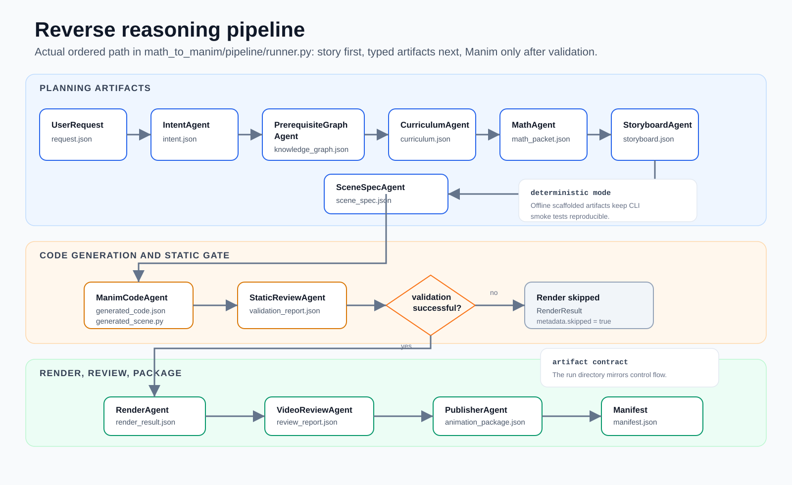

<div align="center">

<a href="https://www.star-history.com/?repos=HarleyCoops%2FMath-To-Manim&type=date&legend=top-left">
  <picture>
    <source media="(prefers-color-scheme: dark)" srcset="https://api.star-history.com/chart?repos=HarleyCoops/Math-To-Manim&type=date&theme=dark&legend=top-left&sealed_token=EjITEOSI8nKcGNkepdjUHZ8WTRNOw4dKGtyggkiM_yQrNBnjxIr00U2Pgt5DqaUF8Qgx4-WIhM4WdOM2ipFiXTXOJxhJU87yp_iOKrGOHkaIBES1Wrpn1f7i_TMd8chdgnaa09DKge1DJ93Hwe4MmjX0YO1PpzSsDF9ebqWr0MDDTnpRzPNbPUvweMI00" />
    <source media="(prefers-color-scheme: light)" srcset="https://api.star-history.com/chart?repos=HarleyCoops/Math-To-Manim&type=date&legend=top-left&sealed_token=EjITEOSI8nKcGNkepdjUHZ8WTRNOw4dKGtyggkiM_yQrNBnjxIr00U2Pgt5DqaUF8Qgx4-WIhM4WdOM2ipFiXTXOJxhJU87yp_iOKrGOHkaIBES1Wrpn1f7i_TMd8chdgnaa09DKge1DJ93Hwe4MmjX0YO1PpzSsDF9ebqWr0MDDTnpRzPNbPUvweMI00" />
    
  </picture>
</a>

# Math To Manim

### Ask a question. Get a visual explainer.

[](#mythos)
[](#sol)
[](#make-your-first-explainer)
[](https://www.python.org/)
[](https://www.manim.community/)
[](LICENSE)

[The idea](#the-idea) ·
[Featured films](#featured-films) ·
[The gallery](#the-gallery) ·
[How it works](#how-it-works) ·
[What you can ask](#what-you-can-ask) ·
[Make your first explainer](#make-your-first-explainer) ·
[Native pipelines](#choose-a-native-pipeline) ·
[Reference](#installation)

<br />

<p align="center">
  <a href="docs/showcase/assets/erdos-1038-potential-landscape.mp4">
    
  </a>
</p>

<p align="center"><em>One sentence in — <strong>“how narrow can the footprint of a polynomial be?”</strong> — and a 79-second film comes out, with the mathematics checked along the way.</em></p>

</div>

<br />

> **Math To Manim turns a math or physics question into a carefully reasoned
> visual explanation.** It finds what the learner needs to know, teaches those
> ideas in order, checks the mathematics, and builds the explanation in Manim.

<br />

## The idea

Most "AI video" tools jump straight from a sentence to pixels. Math To Manim
refuses to. **The reasoning is the product.** Before a single frame is drawn,
six specialist agents work backward from your question to find the missing
prerequisites, rebuild those ideas in teaching order, choose the mathematics,
plan the camera, and only *then* compose a Manim scene — which is statically
validated, rendered, and repaired if it breaks.

[Manim](https://docs.manim.community/en/stable/) is the open-source animation
engine created by Grant Sanderson for 3Blue1Brown. This project uses the
community edition, and treats it as the *output medium* of a reasoning
pipeline rather than a thing you drive by hand.

The result is an explainer that feels like an idea becoming visible — not a
slideshow of formulas, but a film where the camera is the narrator.

<p align="center">
  <a href="docs/showcase/assets/qed-minkowski-epic-3d.gif">
    
  </a>
</p>
<p align="center"><em>A complete pipeline render: Minkowski light cones become electromagnetic waves, then compact QED notation, gauge symmetry, and renormalization flow.</em></p>

---

## Featured films

These are not demos stitched together by hand. Each is a full reasoning run —
intent mapped, prerequisites charted, curriculum sequenced, mathematics
checked, camera directed, scene composed, and rendered — then preserved as a
readable artifact bundle you can open and inspect.

### Erdős 1038 — the potential landscape

<p align="center">
  <a href="docs/showcase/assets/erdos-1038-potential-landscape.mp4">
    
  </a>
</p>

A polynomial is usually a line of symbols. Here it is a **landscape made by its
roots** — every root pressing into a flexible sheet above the number line. The
transparent plane marks zero; wherever the landscape falls beneath it, the
polynomial has size less than one. The footprint under the plane is the exact
set whose width the problem asks us to measure.

How should the roots be arranged to make that footprint as narrow or as wide
as possible? Gather clusters toward their centres and the footprint never
grows — repeating that idea leads toward an ever-finer one-sided distribution
no finite polynomial quite reaches, with width **1.834430475762661…** (the
certified floor, shown by the curved valley). The widest case is simpler:
pile the roots at −1 and +1 to get **f(x) = (x² − 1)ᵐ**, and the region runs
from −√2 to +√2 — a width of **2√2**. Two different kinds of extreme: a lower
value approached forever but never attained, and an upper value reached
exactly by piling roots at the endpoints.

<p align="center"><em><a href="docs/showcase/assets/erdos-1038-potential-landscape.mp4">Watch the 79-second explainer</a> · <a href="docs/prompts/erdos-1038-off-white-3d.md">Read the Sol production prompt</a></em></p>

### Olin — the space inside a tweet

<p align="center">
  <a href="docs/showcase/assets/olin-off-white-3d-space.mp4">
    
  </a>
</p>

One tweet supplies only a flat pair of coordinates,
\((u,v)=(q+40\cos c,\;q\sin c+35d)\). A picture with two coordinates cannot
determine one unique object in three dimensions — so the film explores two
ways to reveal the space the code suggests.

The **exact lift** \(E(i,t)=(u,\;40\sin c,\;v)\) adds a hidden depth
coordinate while leaving \(u\) and \(v\) untouched; look straight down that
hidden direction and every point lands exactly on the original drawing. The
**cylindrical reading**
\(C(i,t)=((40+q)\cos c,\;(40+q)\sin c,\;35d)\) is an alternate
interpretation, not another exact lift — its projection does not reproduce the
original. The distinction matters: \(E\) preserves what the code drew, while
\(C\) asks what other spatial form the same ingredients can suggest.

<p align="center"><em><a href="docs/showcase/assets/olin-off-white-3d-space.mp4">Watch the Olin explainer</a> · <a href="docs/prompts/olin-off-white-3d-space.md">Read the Mythos production prompt</a> · <a href="examples/mythos/olin_off_white_3d_space.py">Inspect the Manim scene</a></em></p>

### The Jacobian conjecture — local vs. global

<p align="center">
  
</p>

<p align="center"><em>A small cube becomes a parallelepiped, making the Jacobian determinant visible as <strong>local</strong> volume change. The camera then pulls back to show why a map can be reversible nearby without being reversible <strong>everywhere</strong>.</em></p>

<p align="center"><strong><a href="docs/showcase/README.md">Explore every film in the motion showcase →</a></strong></p>

---

## The gallery

A cross-section of what the engine produces — geometry, topology, calculus,
physics, probability, and machine learning, each rendered as motion. Sources
live in [`examples/`](examples/) and [`docs/showcase/`](docs/showcase/).

<table>
<tr>
<td width="33%" align="center"><a href="docs/showcase/assets/circle-area-3d-unwrapped.gif"></a></td>
<td width="33%" align="center"><a href="docs/showcase/assets/derivatives-as-slopes.gif"></a></td>
<td width="33%" align="center"><a href="docs/showcase/assets/fourier-epicycles.gif"></a></td>
</tr>
<tr>
<td align="center"><b>Circle area, unwrapped</b><br /><sub>Nested annuli become a triangular prism — A = ½(2πr)r, spatial not memorized.</sub></td>
<td align="center"><b>Derivatives as slopes</b><br /><sub>A secant tightens into a tangent; slope becomes visible, not symbolic.</sub></td>
<td align="center"><b>Fourier epicycles</b><br /><sub>Rotating carriers trace structure from circles; analysis as choreography.</sub></td>
</tr>
<tr>
<td width="33%" align="center"><a href="docs/showcase/assets/hopf-fibration.gif"></a></td>
<td width="33%" align="center"><a href="docs/showcase/assets/lorenz-attractor.gif"></a></td>
<td width="33%" align="center"><a href="docs/showcase/assets/rhombicosidodecahedron.gif"></a></td>
</tr>
<tr>
<td align="center"><b>Hopf fibration</b><br /><sub>Topology as choreography: nested colored fibers give projection a rhythm.</sub></td>
<td align="center"><b>Lorenz attractor</b><br /><sub>Glowing trajectories make sensitive dependence a butterfly-shaped object.</sub></td>
<td align="center"><b>Rhombicosidodecahedron</b><br /><sub>An Archimedean solid as spectacle: blue vertices, warm struts, 3D symmetry.</sub></td>
</tr>
<tr>
<td width="33%" align="center"><a href="docs/showcase/assets/exceptional-point-monodromy.gif"></a></td>
<td width="33%" align="center"><a href="docs/showcase/assets/continuous-geometric-picture.gif"></a></td>
<td width="33%" align="center"><a href="docs/showcase/assets/cosmic-gravity-3d.gif"></a></td>
</tr>
<tr>
<td align="center"><b>Exceptional-point monodromy</b><br /><sub>One loop around an exceptional point swaps the eigenvalue branches.</sub></td>
<td align="center"><b>GRPO semantic manifold</b><br /><sub>Sibling completions become points; preference turns the objective into motion.</sub></td>
<td align="center"><b>Cosmic gravity</b><br /><sub>Spacetime curvature framed like a documentary: geometry, stars, field energy.</sub></td>
</tr>
</table>

### Opposed art directions — proof the grammar survives a change of costume

The engine's cinematography is not locked to one look. The same charter
drives deliberately different palettes:

<table>
<tr>
<td width="50%" align="center"><a href="docs/showcase/assets/associate-family-riso.gif"></a></td>
<td width="50%" align="center"><a href="docs/showcase/assets/blueprint-holonomy.gif"></a></td>
</tr>
<tr>
<td align="center"><b>Plate VII — the associate family (risograph)</b><br /><sub>The anti-Mythos: two-ink print on warm cream. The helicoid deforms isometrically into the catenoid; every length on the surface survives the journey.</sub></td>
<td align="center"><b>DWG 001 — holonomy (cyanotype blueprint)</b><br /><sub>A working drawing that performs its own proof. One amber vector is slid — never turned — around a geodesic octant and returns rotated by the area it walled in. Gauss–Bonnet as drafting practice.</sub></td>
</tr>
<tr>
<td colspan="2" align="center"><a href="docs/showcase/assets/vortex-leapfrog.gif"></a></td>
</tr>
<tr>
<td colspan="2" align="center"><b>VORTEX — after hours</b><br /><sub>A new space for the repo — fluid dynamics — in a new voice: the bioluminescent deep. Two vortex rings leapfrog under a Biot–Savart field integrated live, every frame, while plankton tracers stream through their throats.</sub></td>
</tr>
</table>

---

## How it works

The pipeline does not generate a film. It generates a **reasoning trail**, and
the film is the last artifact in that trail. Every step is a typed artifact
written to disk, so a run is something you can open, read, and revise.

<p align="center">
  
</p>

### The six agents

Each agent receives the prior artifact as JSON and returns one JSON object of
its own. The charters are the product — they live in
[`mythos/agents/*.md`](mythos/agents) and are the single source of truth for
both interactive and headless runs.

| # | Agent | The question it answers | Artifact |
|---|---|---|---|
| 1 | **Intent** | What does the learner *really* want to know, and at what depth? | `01_intent.json` |
| 2 | **Cartographer** | What must they already understand — and where does the ground they know begin? | `02_knowledge_map.json` |
| 3 | **Curriculum** | In what order should those ideas arrive so the final one feels earned? | `03_curriculum.json` |
| 4 | **Math Director** | Which definitions, equations, examples, and checks carry the explanation? | `04_math_dossier.json` |
| 5 | **Cinematographer** | What appears on screen, what changes, and where does the camera guide attention? | `05_shot_list.json` |
| 6 | **Scene Composer** | How does the shot list become addressable Manim objects and timing? | `06_scene_spec.json` |

Then a seventh step — **codegen** — turns the full dossier into one complete,
runnable Manim CE file (`mythos_scene.py`).

<p align="center"><em>The repo's thesis, filmed: a question decomposes backward into glowing prerequisite constellations, bottoms out at known ground, then a gold pulse walks it forward as a curriculum — before tilting into 3D.</em></p>
<p align="center"><a href="docs/showcase/assets/reverse-reasoning-tree.gif"></a></p>

### The Cinematic Charter

Every generated scene obeys one visual contract — the
[`Cinematic Charter`](mythos/charter.py), injected into every stage:

> 1. **Camera is the narrator.** A top-down stage that reads as 2D, tilting
>    into 3D only for set pieces.
> 2. **Headline before symbols.** A full-screen plain-language statement,
>    held, faded — *then* the mathematics.
> 3. **Zoom into terms.** Dim the rest, color the part, fly the camera in;
>    pull back so the part is seen inside the whole.
> 4. **Caption everything.** One plain-English lower-third caption per
>    formula. A viewer who knows no notation must follow from captions and
>    camera motion alone.
> 5. **Pacing.** Deliberate beats between ideas — never a wall of symbols.

<p align="center"><em>The charter, beat by beat: headline before symbols, camera flying into each term of E = mc², captions in plain English, then a rippled energy surface as the 3D set piece.</em></p>
<p align="center"><a href="docs/showcase/assets/mythos-grammar-reel.gif"></a></p>

### Validate, render, repair

Code is never trusted on faith. The scene is **statically validated** (it must
compile, define exactly one `ThreeDScene`, and obey the charter's camera rules)
before render is ever attempted. If the render fails, the failure output is
fed back to the model for a bounded number of surgical repairs — preserving
the cinematic structure and fixing only what broke.

<p align="center">
  
</p>

A degenerate artifact is caught early, too: the math director once returned an
empty dossier, and every downstream agent faithfully storyboarded an empty
film. The harness now rejects degenerate output and retries before it can
poison the chain.

---

## What you can ask

A simple homework question is enough — the pipeline expands it into a
teaching plan. You can name the learner's age, prior knowledge, pace, preferred
visual model, worked example, notation level, and final comprehension check.

<table>
<tr>
<td>

**Middle school arithmetic**
> Explain why a negative times a negative is positive to an eighth grader.
> Use a number line, one everyday analogy, and one worked example.

</td>
<td>

**Geometry**
> Show why the Pythagorean theorem works without advanced algebra. Build the
> squares on all three sides and rearrange their areas.

</td>
</tr>
<tr>
<td>

**High school physics**
> Explain conservation of momentum using two carts that collide. Show the
> momentum arrows before and after impact.

</td>
<td>

**University mathematics**
> Explain Fourier series as rotating vectors that rebuild a signal. Begin
> with a circle and add one frequency at a time.

</td>
</tr>
<tr>
<td>

**Research mathematics**
> Show why one loop around an exceptional point swaps the eigenvalue branches.
> Assume I know complex numbers but not covering spaces.

</td>
<td>

**A useful prompt recipe**
> Explain [topic] to [learner]. Assume they know [starting point]. Use
> [visual metaphor]. Work through [example]. End with [check question].

</td>
</tr>
</table>

---

## Make your first explainer

The easiest path is a conversation with an assistant that speaks MCP.

```bash
pip install -e ".[mcp]"
math-to-manim serve-mcp
```

The server uses the official MCP Python SDK 2.x and speaks the current MCP
protocol over stdio. For a local network endpoint instead:

```bash
math-to-manim serve-mcp --transport streamable-http --port 8643
```

The Streamable HTTP endpoint is `http://127.0.0.1:8643/mcp`. Add the server to
your MCP client:

```json
{
  "mcpServers": {
    "math-to-manim": {
      "command": "math-to-manim",
      "args": ["serve-mcp"]
    }
  }
}
```

Then just ask, in ordinary language:

> Use Math To Manim to create a visual explainer for my eighth grade student.
> Explain why solving an equation means doing the same thing to both sides.
> Use a balance scale, solve 3x + 5 = 20, and end with one practice question.

You don't memorize tool names. The assistant starts the explainer, reports
progress, can inspect every reasoning artifact, and the final scene and render
stay in your local run directory.

---

## Choose a native pipeline

Math To Manim contains two complete, independent ways to make a film. Pick the
command-line account you already use — neither pipeline routes through the
other.

<table>
<tr>
<th width="50%">Mythos</th>
<th width="50%">Sol</th>
</tr>
<tr>
<td valign="top">

**Claude Fable 5 · six-agent charter chain**

Reasons through learner intent, prerequisite mapping, curriculum,
mathematics, camera direction, and scene composition.

```bash
math-to-manim doctor --ping
math-to-manim run "Explain fractions with a
  folding paper model for a sixth grader." \
  --render -q m
```

</td>
<td valign="top">

**GPT-5.6 · Codex CLI specialist stages**

Each role saves its artifact and session so a run can be inspected, resumed,
and repaired by the responsible specialist.

```bash
math-to-manim-sol doctor
math-to-manim-sol run "Explain fractions with a
  folding paper model for a sixth grader."
```

Read the [complete Sol contract](docs/SOL_5_6_SILO.md).

</td>
</tr>
</table>

**Kimi** uses an agent architecture different enough to warrant its own
repository — explore [Kimi K3 Manim](https://github.com/HarleyCoops/KimiK3Manim).

---

## Installation

```bash
git clone https://github.com/HarleyCoops/Math-To-Manim.git
cd Math-To-Manim
python -m venv .venv
pip install -e ".[dev,render,mcp,api]"
python -m pytest -q
```

Run `math-to-manim doctor --ping` (Mythos) or `math-to-manim-sol doctor` (Sol)
before a live request, so login and rendering problems surface immediately.
For rendering, native Cairo/Pango/TeX/FFmpeg packages are needed — install
them with `scripts/bootstrap-render.sh` (see `requirements-system.txt`).

## Run artifacts

Every run keeps its reasoning, scene source, validation evidence, and
manifest inside the repository. Mythos writes to `runs/mythos/`; Sol writes to
`runs/sol/`. Open the intermediate JSON to understand or revise how the
explainer was built:

```text
learner intent
      ↓
prerequisite map
      ↓
teaching sequence
      ↓
mathematics and examples
      ↓
visual plan
      ↓
Manim scene
      ↓
validation, render, and repair evidence
```

## MCP reference

| Tool | Purpose |
|---|---|
| `m2m_create_animation` | Starts the Mythos reasoning chain as a background job |
| `m2m_get_job` | Reports live progress for each reasoning stage |
| `m2m_list_runs` | Lists local runs, newest first |
| `m2m_get_run` | Returns the manifest and artifact list for one run |
| `m2m_get_artifact` | Reads a reasoning artifact such as the prerequisite map |
| `m2m_get_scene_code` | Returns the generated Manim scene |
| `m2m_cinematic_charter` | Returns the visual composition contract |

Headless driver:

```bash
python scripts/drive_mcp_pipeline.py "why does a spinning handle flip itself?" --render -q l --log runs/drive.log
```

## REST API

```bash
pip install -e ".[api]"
math-to-manim serve-api          # OpenAPI docs at http://127.0.0.1:8642/docs
```

| Method | Route | Purpose |
|---|---|---|
| `GET` | `/health` | Service health and version |
| `POST` | `/v1/runs` | Submit a prompt, get a job record |
| `GET` | `/v1/jobs/{job_id}` | Queued / running / completed / failed state |
| `GET` | `/v1/runs` | Local run ledger |
| `GET` | `/v1/runs/{run_id}` | Manifest and artifact listing |
| `GET` | `/v1/runs/{run_id}/artifacts/{name}` | One JSON or Python artifact |

```bash
curl -s -X POST localhost:8642/v1/runs \
  -H "Content-Type: application/json" \
  -d '{"prompt": "explain Fourier epicycles as rotating vectors", "render": false}'
```

## Configuration

Mythos reads configuration from the environment or a local `.env` file.

| Variable | Default | Purpose |
|---|---|---|
| `M2M_MODEL` | `claude-fable-5` | Baseline model |
| `M2M_MODEL_FALLBACKS` | `claude-opus-4-8,claude-sonnet-5` | Models tried on a model-specific failure |
| `M2M_COMMAND` | `claude` | Backend command: `claude`, `codex`, or `fugu-api` |
| `M2M_TIMEOUT` | `900` | Model call budget (seconds) |
| `M2M_RENDER_TIMEOUT` | `1800` | Render budget (seconds) |
| `M2M_RUNS_DIR` | `runs/` | Local run directory |
| `M2M_MANIM` | automatic | Override the Manim executable |

See the [Sol contract](docs/SOL_5_6_SILO.md) for its Codex CLI login, staged
sessions, resume command, manifest, and environment.

## Testing

```bash
python -m pytest -q
math-to-manim run "the heat equation" --offline
math-to-manim-sol run "the heat equation" --offline
```

Offline runs validate the complete artifact shape with **no model calls and no
expensive render** — use them for plumbing changes.

## More from the project

- **[Motion showcase](docs/showcase/README.md)** — every visual study and the
  full asset archive.
- **[The Plates](docs/showcase/THE-PLATES.md)** — the atlas: a series with a
  story, beginning in the middle on purpose and closing as one continuous
  surface.
- **[Prime Intellect notes](docs/PRIME_INTELLECT_RL.md)** — reinforcement
  learning work for visual repair.
- **[Roadmap](docs/ROADMAP.md)** — future work.
- **[Agent guide](AGENTS.md)** — repository boundaries and verification rules.

## Repository layout

```text
mythos/            Claude CLI reasoning chain, service, API, MCP, and CLI
sol/               Codex CLI specialist pipeline
examples/mythos/   Hand-finished Mythos examples
docs/showcase/     Complete visual archive
tests/             Offline repository tests
runs/              Local reasoning and render artifacts
archive/           Retired implementations kept for history
legacy/            Original January 2025 repository material
```

## License

[MIT](LICENSE).
