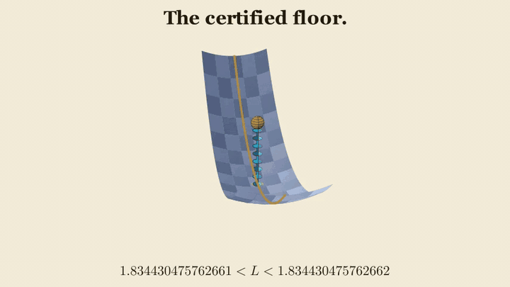
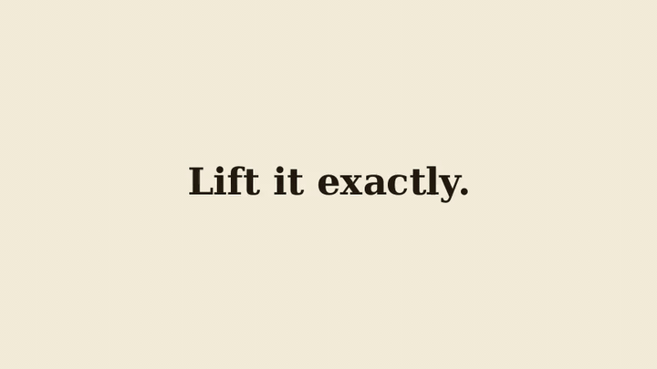

<div align="center">

<a href="https://www.star-history.com/?repos=HarleyCoops%2FMath-To-Manim&type=date&legend=top-left">
  <picture>
    <source media="(prefers-color-scheme: dark)" srcset="https://api.star-history.com/chart?repos=HarleyCoops/Math-To-Manim&type=date&theme=dark&legend=top-left&sealed_token=EjITEOSI8nKcGNkepdjUHZ8WTRNOw4dKGtyggkiM_yrNBnjxIr00U2Pgt5DqaUF8Qgx4-WIhM4WdOM2ipFiXTXOJxhJU87yp_iOKrGOHkaIBES1Wrpn1f7i_TMd8chdgnaa09DKge1DJ93Hwe4MmjX0YO1PpzSsDF9ebqWr0MDDTnpRzPNbPUvweMI00" />
    <source media="(prefers-color-scheme: light)" srcset="https://api.star-history.com/chart?repos=HarleyCoops/Math-To-Manim&type=date&legend=top-left&sealed_token=EjITEOSI8nKcGNkepdjUHZ8WTRNOw4dKGtyggkiM_yrNBnjxIr00U2Pgt5DqaUF8Qgx4-WIhM4WdOM2ipFiXTXOJxhJU87yp_iOKrGOHkaIBES1Wrpn1f7i_TMd8chdgnaa09DKge1DJ93Hwe4MmjX0YO1PpzSsDF9ebqWr0MDDTnpRzPNbPUvweMI00" />
    
  </picture>
</a>

# Math To Manim

### Ask a question. Get a visual explainer.

[](#make-your-first-explainer)
[](https://www.python.org/)
[](https://www.manim.community/)
[](LICENSE)

[Featured explainers](#featured-visual-explainers) ·
[The idea](#what-is-math-to-manim) ·
[What you can ask](#what-can-i-ask) ·
[How the film is earned](#how-the-picture-is-earned) ·
[Start here](#make-your-first-explainer) ·
[Your own bot](#make-a-custom-bot)

<br />

> *You ask a question. Grok walks backward from the claim you will believe
> when the lights come up, then films the walk forward.*

<br />

## Featured Visual Explainers

<p align="center">
  <a href="docs/showcase/assets/erdos-1038-potential-landscape.mp4">
    
  </a>
</p>

<p align="center"><strong>ERDŐS 1038: THE POTENTIAL LANDSCAPE</strong></p>

A polynomial is usually introduced as a line of symbols, but it can also be
seen as a landscape made by its roots. Imagine every root pressing into a
flexible sheet stretched above the number line. Taken together, the roots
raise and lower that sheet. The transparent plane in the explainer marks zero.
Wherever the landscape falls beneath it, the polynomial has size less than
one. The footprint under the plane is therefore the exact set whose width the
problem asks us to measure.

That turns the question into something physical. How should the roots be
arranged to make the submerged footprint as narrow as possible, or as wide as
possible? For the narrow side, clusters of roots can be gathered toward their
centres without making the footprint larger. Repeating that idea leads toward
an increasingly fine, one sided distribution of roots. No finite polynomial
quite reaches the limiting shape, but a sequence of them gets arbitrarily
close. Its width is **1.834430475762661…**. This is the certified floor shown
by the curved valley.

The widest case is beautifully simpler. Put the roots at the two endpoints,
−1 and +1, in equal numbers. This produces the family
**f(x) = (x² − 1)ᵐ**, and the region where the polynomial is smaller than one
runs from −√2 to +√2. Its width is therefore **2√2**. The explainer ends by
contrasting two different kinds of extreme: a lower value that can be
approached forever but never attained by a finite polynomial, and an upper
value reached exactly by piling the roots at the endpoints.

<p align="center"><em><a href="docs/showcase/assets/erdos-1038-potential-landscape.mp4">Watch the complete 79 second visual explainer</a> · <a href="docs/prompts/erdos-1038-off-white-3d.md">Read the complete production prompt</a></em></p>

<br />

<p align="center">
  <a href="docs/showcase/assets/olin-off-white-3d-space.mp4">
    
  </a>
</p>

<p align="center"><strong>OLIN: THE SPACE INSIDE A TWEET</strong></p>

A tiny program draws ten thousand points by passing each one through five
linked quantities: \(k\), \(e\), \(d\), \(c\), and \(q\). The final screen
coordinates are only a flat pair,
\((u,v)=(q+40\cos c,\;q\sin c+35d)\). A picture with two coordinates does not
determine one unique object in three dimensions, so the film explores two
different ways to reveal the space suggested by the code.

The first construction is the exact lift
\(E(i,t)=(u,\;40\sin c,\;v)\). It adds a hidden depth coordinate while
leaving \(u\) and \(v\) untouched. Look straight down that hidden direction
and every point lands exactly on the original drawing. This makes \(E\) a
faithful spatial source for the flat shadow.

The film then explores
\(C(i,t)=((40+q)\cos c,\;(40+q)\sin c,\;35d)\). Here \(c\) turns each point
around a vertical axis, \(q\) changes its radius, and \(35d\) sets its height.
This is an alternate cylindrical interpretation, not another exact lift.
Its projection does not reproduce the original drawing. The distinction
matters: \(E\) preserves what the code drew, while \(C\) asks what other
spatial form the same ingredients can suggest.

<p align="center"><em><a href="docs/showcase/assets/olin-off-white-3d-space.mp4">Watch the complete Olin visual explainer</a> · <a href="docs/prompts/olin-off-white-3d-space.md">Read the complete production prompt</a> · <a href="examples/mythos/olin_off_white_3d_space.py">Inspect the Manim scene</a></em></p>

<br />

<p align="center">
  
</p>

<p align="center"><em><strong>THE JACOBIAN CONJECTURE.</strong> This explainer separates local certainty from global truth. A small cube becomes a parallelepiped, making the Jacobian determinant visible as local volume change. The camera then pulls back to show why a map can be reversible nearby without being reversible everywhere.</em></p>

<br />

<p align="center"><strong><a href="docs/showcase/README.md">Explore every visual explainer in the motion showcase</a></strong></p>

</div>

---

## What Is Math To Manim

Math To Manim turns a math or physics question into a carefully reasoned visual explanation.
A learner asks. Grok does not start with the formula. Grok starts with the
thing you will believe at the end, then walks backward until it reaches what
you already know, then films the walk forward.

That walk is reverse thinking. The film is not a lecture with pictures glued
on. The picture is the argument.

[Manim](https://docs.manim.community/en/stable/) is the open source animation
engine originally created by Grant Sanderson for 3Blue1Brown. It powers many
of the most recognizable math and physics animations online. This project
uses the edition maintained by the Manim community. Grok 4.6 is the mind
that decides what must be understood, what must be shown, and in what order
each idea should appear.

A sentence is enough. A photographed page is enough. The product is the
reasoning that turns either one into a film.

## What Can I Ask

Photograph tonight's middle school worksheet. Grok reads the page the way a
patient tutor would, then treats it as one claim. Ninety seconds later an
eighth grade student can watch why a negative number times a negative number
becomes positive, a number line folding through an everyday analogy and one
worked example that finally stays put.

Ask the Pythagorean theorem to stop being a chant. Build the squares on all
three sides and let the areas rearrange until the right triangle has earned
its name.

Text a sentence from the kitchen table. Teach slope using three ramps.
Rise over run becomes steepness you can compare, then one line equation that
no longer feels like a trick.

Open a high school physics book to the collision you have never seen drawn.
Two carts meet. Ask for conservation of momentum as something visible. It
is not a slogan. It is arrows that refuse to vanish, before and after impact. Or let a cart kiss a spring and
earn a 3D set piece: mass, speed, and stiffness becoming a compression you
can walk around.

Ask for Fourier series as rotating vectors that rebuild a signal. Begin with
a circle. Add one frequency at a time. Watch a messy wave remember that it
was only ever a choir of spins.

Then go further. Show why one loop around an exceptional point swaps the eigenvalue branches.
The camera can follow a swap that a chalkboard can only name. A landscape of
roots, like the Erdős film above, is the same invitation at research scale:
a question that looked like symbols becomes a place.

If you want to steer the voice, whisper a recipe. Explain the topic to the
person in the room. Assume they already know the last honest starting point.
Name a picture they can hold. Work one example. End with a check they can
answer out loud.

## How The Picture Is Earned

The method is reverse thinking. We do not start with the formula. We start
with the solved insight, walk back to the learner, then walk forward into
light.

**Understand the learner.** Who is watching. What they fear. What they will
believe when the film is over. If a homework photo is attached, Grok uses
vision here and writes no code.

**Find the missing prerequisites.** Work backward from the claim. Depth 0 is
the target. Every edge is something that must be true the moment before.
The spine starts where the audience already stands.

**Build the teaching sequence.** Now, and only now, walk forward. Each act
opens on a question the last act planted. One new idea per act. Curiosity
is the only legal segue.

**Choose the mathematics.** The sandbox solves the homework and the physics.
Units are checked. The numbers on screen are earned, not guessed.

**Plan the visuals.** Headlines before symbols. A camera score. One to three
art direction stills so the film has a weather. 3D when space is the idea.

**Compose the Manim scene.** One spatial argument. The camera moves by
turning to look, never by sliding itself like a sticker.

**Validate the result.** The reverse tree, the scene, and the camera rules
have to agree.

**Render, inspect, and repair.** Then the explainer exists.

## Make Your First Explainer

Get an [xAI key](https://docs.x.ai/developers/models/grok-4.6). Set
`XAI_API_KEY`. That is the whole door.

```bash
pip install -e ".[dev,grok,render]"
math-to-manim-grok doctor
math-to-manim-grok run "the heat equation"
```

Doctor checks the key. It never prints the key. Then feed Grok a sentence
from tonight's homework, or a physics question you have never seen drawn.

```bash
math-to-manim-grok run "A 3 kg cart at 4 m/s hits a spring k=200. How far does it compress?"
math-to-manim-grok run "solve the problem on this page" --image homework.jpg
```

To rehearse the path with no live call, add `--offline`. The film still
lands in `runs/grok/`. Add `--render` when you want the MP4 in that same
folder.

## Make A Custom Bot

You are not reading an API catalog. You are casting a crew.

Each file in `grok/agents` is a voice on the set: the one who names the
claim, the one who walks backward, the one who walks forward, the one who
solves in the sandbox, the one who sees, the one who films. Edit those
stage voices and you have a bot that only knows how to make Manim explainer
films.

Keep reverse thinking intact. Cartography stays reverse. The first forward
pass stays a sequence of questions. The sandbox still owns the numbers.
Then ask Grok another problem.

The [Grok contract](docs/GROK_4_6_SILO.md) is backstage, for when you want
the tool map. The [motion showcase](docs/showcase/README.md) is the rest of
the finished light.

## License

[MIT](LICENSE).
