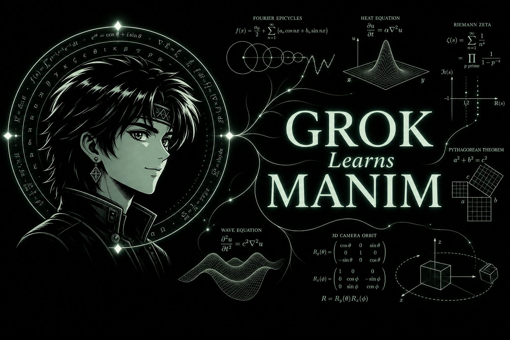
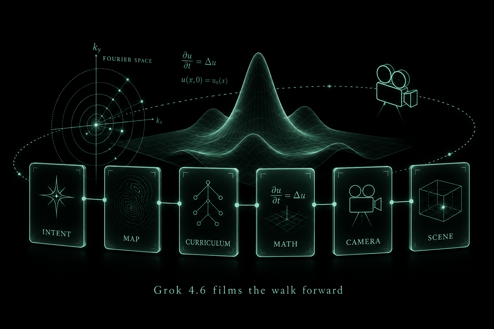

<div align="center">

<a href="https://www.star-history.com/?repos=HarleyCoops%2FMath-To-Manim&type=date&legend=top-left">
  <picture>
    <source media="(prefers-color-scheme: dark)" srcset="https://api.star-history.com/chart?repos=HarleyCoops/Math-To-Manim&type=date&theme=dark&legend=top-left&sealed_token=EjITEOSI8nKcGNkepdjUHZ8WTRNOw4dKGtyggkiM_yrNBnjxIr00U2Pgt5DqaUF8Qgx4-WIhM4WdOM2ipFiXTXOJxhJU87yp_iOKrGOHkaIBES1Wrpn1f7i_TMd8chdgnaa09DKge1DJ93Hwe4MmjX0YO1PpzSsDF9ebqWr0MDDTnpRzPNbPUvweMI00" />
    <source media="(prefers-color-scheme: light)" srcset="https://api.star-history.com/chart?repos=HarleyCoops/Math-To-Manim&type=date&legend=top-left&sealed_token=EjITEOSI8nKcGNkepdjUHZ8WTRNOw4dKGtyggkiM_yrNBnjxIr00U2Pgt5DqaUF8Qgx4-WIhM4WdOM2ipFiXTXOJxhJU87yp_iOKrGOHkaIBES1Wrpn1f7i_TMd8chdgnaa09DKge1DJ93Hwe4MmjX0YO1PpzSsDF9ebqWr0MDDTnpRzPNbPUvweMI00" />
    
  </picture>
</a>

# Math To Manim

### Ask a question. Get a visual explainer.

[](#grok-learns-manim)
[](#mythos)
[](#sol)
[](#make-your-first-explainer)
[](https://www.python.org/)
[](https://www.manim.community/)
[](LICENSE)

<p align="center">
  
</p>

<p align="center"><strong>GROK LEARNS MANIM</strong></p>

Grok 4.6 now owns the public film chain. You ask a question or photograph a
page. Grok walks backward from the claim you will believe when the lights
come up, then films the walk forward in Manim.

[Featured explainers](#featured-visual-explainers) ·
[What you can ask](#what-can-i-ask) ·
[How the reasoning works](#how-the-reasoning-pipeline-works) ·
[Grok Learns Manim](#grok-learns-manim) ·
[MCP setup](#make-your-first-explainer) ·
[Native pipelines](#choose-a-native-pipeline) ·
[Technical reference](#installation)

<br />

> *Math To Manim turns a math or physics question into a carefully reasoned
> visual explanation. It finds what the learner needs to know, teaches those
> ideas in order, checks the mathematics, and builds the explanation in Manim.*

<br />

## Featured Visual Explainers

<p align="center">
  <a href="docs/showcase/assets/erdos-1038-potential-landscape.mp4">
    
  </a>
</p>

<p align="center"><strong>ERDŐS 1038: THE POTENTIAL LANDSCAPE</strong></p>

A polynomial is usually introduced as a line of symbols, but it can also be
seen as a landscape made by its roots. Imagine every root pressing into a
flexible sheet stretched above the number line. Taken together, the roots
raise and lower that sheet. The transparent plane in the explainer marks zero.
Wherever the landscape falls beneath it, the polynomial has size less than
one. The footprint under the plane is therefore the exact set whose width the
problem asks us to measure.

That turns the question into something physical. How should the roots be
arranged to make the submerged footprint as narrow as possible, or as wide as
possible? For the narrow side, clusters of roots can be gathered toward their
centres without making the footprint larger. Repeating that idea leads toward
an increasingly fine, one sided distribution of roots. No finite polynomial
quite reaches the limiting shape, but a sequence of them gets arbitrarily
close. Its width is **1.834430475762661…**. This is the certified floor shown
by the curved valley.

The widest case is beautifully simpler. Put the roots at the two endpoints,
−1 and +1, in equal numbers. This produces the family
**f(x) = (x² − 1)ᵐ**, and the region where the polynomial is smaller than one
runs from −√2 to +√2. Its width is therefore **2√2**. The explainer ends by
contrasting two different kinds of extreme: a lower value that can be
approached forever but never attained by a finite polynomial, and an upper
value reached exactly by piling the roots at the endpoints.

<p align="center"><em><a href="docs/showcase/assets/erdos-1038-potential-landscape.mp4">Watch the complete 79 second visual explainer</a> · <a href="docs/prompts/erdos-1038-off-white-3d.md">Read the complete Sol production prompt</a></em></p>

<br />

<p align="center">
  <a href="docs/showcase/assets/olin-off-white-3d-space.mp4">
    
  </a>
</p>

<p align="center"><strong>OLIN: THE SPACE INSIDE A TWEET</strong></p>

A tiny program draws ten thousand points by passing each one through five
linked quantities: \(k\), \(e\), \(d\), \(c\), and \(q\). The final screen
coordinates are only a flat pair,
\((u,v)=(q+40\cos c,\;q\sin c+35d)\). A picture with two coordinates does not
determine one unique object in three dimensions, so the film explores two
different ways to reveal the space suggested by the code.

The first construction is the exact lift
\(E(i,t)=(u,\;40\sin c,\;v)\). It adds a hidden depth coordinate while
leaving \(u\) and \(v\) untouched. Look straight down that hidden direction
and every point lands exactly on the original drawing. This makes \(E\) a
faithful spatial source for the flat shadow.

The film then explores
\(C(i,t)=((40+q)\cos c,\;(40+q)\sin c,\;35d)\). Here \(c\) turns each point
around a vertical axis, \(q\) changes its radius, and \(35d\) sets its height.
This is an alternate cylindrical interpretation, not another exact lift.
Its projection does not reproduce the original drawing. The distinction
matters: \(E\) preserves what the code drew, while \(C\) asks what other
spatial form the same ingredients can suggest.

<p align="center"><em><a href="docs/showcase/assets/olin-off-white-3d-space.mp4">Watch the complete Olin visual explainer</a> · <a href="docs/prompts/olin-off-white-3d-space.md">Read the corrected Mythos production prompt</a> · <a href="examples/mythos/olin_off_white_3d_space.py">Inspect the Manim scene</a></em></p>

<br />

<p align="center">
  
</p>

<p align="center"><em><strong>THE JACOBIAN CONJECTURE.</strong> This explainer separates local certainty from global truth. A small cube becomes a parallelepiped, making the Jacobian determinant visible as local volume change. The camera then pulls back to show why a map can be reversible nearby without being reversible everywhere.</em></p>

<br />

<p align="center"><strong><a href="docs/showcase/README.md">Explore every visual explainer in the motion showcase</a></strong></p>

</div>

---

## What Is Math To Manim

Math To Manim turns a math or physics question into a carefully reasoned visual explanation.
It works backward to identify what the learner needs to know, rebuilds those
ideas in teaching order, checks the mathematics, and animates the explanation
in Manim.

The public chain is now Grok 4.6. A sentence is enough. A photographed page
is enough. Grok does not jump from a topic name to Python. Grok names the
claim you will believe at the end, walks back to what you already know, then
films that walk as one spatial argument.

[Manim](https://docs.manim.community/en/stable/) is the open source animation
engine originally created by Grant Sanderson for 3Blue1Brown. It powers many
of the most recognizable math and physics animations online. This project
uses the edition maintained by the Manim community.

The reasoning process is the product. Math To Manim does not jump directly
from a sentence to Python. It first decides what must be understood, what must
be shown, and in what order each idea should appear.

## What Can I Ask

### Middle School Arithmetic

> Explain why a negative number times a negative number becomes positive to
> an eighth grade student. Use a number line, one everyday analogy, and one
> worked example.

### Geometry

> Show why the Pythagorean theorem works without assuming advanced algebra.
> Build the squares on all three sides and rearrange their areas.

### Introductory Algebra

> Teach slope using three ramps. Explain rise over run, compare steepness,
> then solve one line equation.

### High School Physics

> Explain conservation of momentum using two carts that collide. Show the
> momentum arrows before and after impact.

### University Mathematics

> Explain Fourier series as rotating vectors that rebuild a signal. Begin
> with a circle and add one frequency at a time.

### Research Mathematics

> Show why one loop around an exceptional point swaps the eigenvalue branches.
> Assume I know complex numbers but not covering spaces.

### A Useful Prompt Recipe

> Explain [topic] to [learner]. Assume they already know [starting point].
> Use [visual metaphor or physical model]. Work through [specific example].
> End with [summary or check question].

You can name the learner's age, prior knowledge, pace, preferred visual model,
worked example, notation level, and final comprehension check. A simple
homework question is enough. The pipeline expands it into a teaching plan.
Photograph the page if you would rather show the problem than type it.

## How The Reasoning Pipeline Works

1. **Understand the learner.** Identify the real question, the audience, and
   the intended depth.
2. **Find the missing prerequisites.** Work backward until every branch reaches
   ideas the learner already knows.
3. **Build the teaching sequence.** Walk those ideas forward in the order that
   makes the final concept feel earned.
4. **Choose the mathematics.** Select the definitions, equations, examples,
   and checks that carry the explanation.
5. **Plan the visuals.** Decide what appears on screen, what changes, and where
   the camera guides attention.
6. **Compose the Manim scene.** Turn the teaching plan into complete,
   addressable visual objects and timing.
7. **Validate the result.** Check code structure, mathematical presentation,
   readability, and camera rules.
8. **Render, inspect, and repair.** Produce the explainer, review the evidence,
   and correct visible defects.

That order is reverse thinking. Depth 0 is the claim. Every earlier depth is
a foundation the learner already owns. The film is not a lecture with pictures
glued on. The picture is the argument.

## Grok Learns Manim

<p align="center">
  
</p>

Grok 4.6 is a complete native film silo. It talks only to the xAI Responses
API. It reads its own charters. It writes inspectable runs under `runs/grok/`.
It does not import Mythos prompts or the Sol client. It is not routed through
the Mythos harness.

The six hops stay separate on purpose. Grok does not flatten the job into one
think then write prompt. Tools change what later stages are allowed to do.
They do not change the teaching method.

| Stage | What Grok does | Tools |
|---|---|---|
| Intent | Names the audience, the core claim, and the one big zoom. Vision reads a photographed page here. | none |
| Cartographer | Builds a reverse prerequisite tree. Search is only for canonical names. | `web_search` |
| Curriculum | First forward pass. Curiosity is the only legal segue. | none |
| Math director | Solves the homework in a sandbox. Numbers on screen are earned. | `code_interpreter`, `web_search` |
| Cinematographer | Writes the camera score and one to three art direction stills. | `image_generation`, `x_search` |
| Composer | Writes `grok_scene.py` and compiles it in the same turn. | local `verify_scene` |

Composer is not a seventh codegen charter. Mythos splits spec from codegen
because that hop cannot execute local checks. Grok can, so the loop closes
here. Failed scenes go back to composer for repair.

A live run looks like this:

```text
math-to-manim-grok run "the heat equation"
  -> create runs/grok/<timestamp>-<slug>/
  -> six Responses calls to grok-4.6, each with stage tools
  -> traces, stills, reverse tree, and grok_scene.py
  -> local compile, AST, and camera checks
  -> optional manim render
  -> manifest.json
```

Get an [xAI key](https://docs.x.ai/developers/models/grok-4.6). Set
`XAI_API_KEY`. Doctor checks the key and never prints it.

```bash
pip install -e ".[dev,grok,render]"
math-to-manim-grok doctor
math-to-manim-grok run "the heat equation"
math-to-manim-grok run "A 3 kg cart at 4 m/s hits a spring k=200. How far does it compress?"
math-to-manim-grok run "solve the problem on this page" --image homework.jpg
```

Add `--offline` to rehearse the same artifact shape with zero xAI calls.
Add `--render -q l` when you want the MP4 in that same run folder.

The charters in `grok/agents/` are the product. Edit those voices and you
have a bot that only knows how to make Manim explainer films. Keep reverse
thinking intact. Cartography stays reverse. The first forward pass stays a
sequence of questions. The sandbox still owns the numbers.

Read the [complete Grok contract](docs/GROK_4_6_SILO.md).

## Make Your First Explainer

The easiest conversation path is an assistant that can use MCP. Those tools
now run the Grok chain.

```bash
pip install -e ".[mcp]"
math-to-manim serve-mcp
```

The server uses the official MCP Python SDK 2.x API and speaks the current MCP
protocol over stdio. For a local network endpoint instead, run:

```bash
math-to-manim serve-mcp --transport streamable-http --port 8643
```

The Streamable HTTP endpoint is `http://127.0.0.1:8643/mcp`.

Add the server to your MCP client:

```json
{
  "mcpServers": {
    "math-to-manim": {
      "command": "math-to-manim",
      "args": ["serve-mcp"]
    }
  }
}
```

Once the server is connected, type this in your assistant:

> Use Math To Manim to create a visual explainer for my eighth grade student.
> Explain why solving an equation means doing the same thing to both sides.
> Use a balance scale, solve 3x + 5 = 20, and end with one practice question.

You do not need to memorize tool names. The assistant starts the explainer.
The assistant reports progress. The assistant can inspect every reasoning artifact.
The final scene and render remain in the local run directory.

A login free rehearsal of the same path:

```bash
python -m venv .venv
pip install -e ".[dev]"
math-to-manim-grok run "the heat equation" --offline
```

That writes `runs/grok/<timestamp>-the-heat-equation/grok_scene.py`,
`validation.json`, and `manifest.json`. Add `--render -q l` after
`pip install -e ".[render]"` if you want the MP4 inside that same run
directory. The live layout is `runs/grok/`, `runs/mythos/`, or `runs/sol/`,
not `output/<run>/scene.py`.

## Choose A Native Pipeline

Math To Manim contains three complete and independent ways to create a visual
explainer. Choose the command line account you already use.
Neither pipeline routes through the other.

### Grok

Grok uses the xAI Responses API and the six stage charter chain above.
Vision, sandbox math, stills, and local compile are native Grok tools.

```bash
math-to-manim-grok doctor
math-to-manim-grok run "Explain fractions with a folding paper model for a sixth grade learner." --render -q m
```

### Mythos

Mythos uses the Claude CLI and a six agent charter chain. It reasons through
learner intent, prerequisite mapping, curriculum, mathematics, camera
direction, and scene composition.

```bash
math-to-manim doctor --ping
math-to-manim run "Explain fractions with a folding paper model for a sixth grade learner." --render -q m
```

### Sol

Sol uses the logged in Codex CLI and durable specialist stages. Each role saves
its artifact and session so the run can be inspected, resumed, and repaired by
the responsible specialist.

```bash
math-to-manim-sol doctor
math-to-manim-sol run "Explain fractions with a folding paper model for a sixth grade learner."
```

Read the [complete Sol contract](docs/SOL_5_6_SILO.md).

### Kimi

Kimi uses an agent architecture that is different enough to warrant its own repository.
Explore [Kimi K3 Manim](https://github.com/HarleyCoops/KimiK3Manim).

Hermes Agent is not a supported generate path. The supported operator
surfaces are Grok, Mythos, Sol, and the MCP or REST front doors. Archived
Hermes notes live under `archive/` and `docs/HERMES_LEARNS_MANIM.md`.

---

## Installation

```bash
git clone https://github.com/HarleyCoops/Math-To-Manim.git
cd Math-To-Manim
python -m venv .venv
pip install -e ".[dev,render,mcp,api,grok]"
python -m pytest -q
```

Use `math-to-manim-grok doctor` for Grok. Use `math-to-manim doctor --ping`
for Mythos. Use `math-to-manim-sol doctor` for Sol. Run the appropriate
check before a live request so login and rendering problems appear immediately.

Static checks parse `MathTex` and `Tex` fragments in process. If `chktex`
is on `PATH`, the verifier also consults it. If `M2M_LATEX_DEEP_CHECK` is
set and `lualatex` is on `PATH`, fragments are compiled with
`lualatex --halt-on-error --interaction=nonstopmode`. Both tools are
optional and not required for `pytest`.

## Run Artifacts

Every run keeps its reasoning, scene source, validation evidence, and manifest
inside the repository. Grok writes to `runs/grok/`. Mythos writes to
`runs/mythos/`. Sol writes to `runs/sol/`. Open the intermediate JSON when
you want to understand or revise how the explainer was built.

The artifacts tell a readable story:

```text
learner intent
      ↓
prerequisite map
      ↓
teaching sequence
      ↓
mathematics and examples
      ↓
visual plan
      ↓
Manim scene
      ↓
validation, render, and repair evidence
```

A Grok run also keeps `traces/<stage>.json` for thinking summaries and tool
calls, plus any generated stills under `stills/`.

## MCP Reference

These tools are available to assistants and integrations. A learner can simply
ask for an explainer in ordinary language. Each tool runs or inspects the
Grok chain.

| Tool | Purpose |
|---|---|
| `m2m_create_animation` | Starts the Grok reasoning chain as a background job |
| `m2m_get_job` | Reports live progress for each reasoning stage |
| `m2m_list_runs` | Lists local Grok runs with the newest first |
| `m2m_get_run` | Returns the manifest and artifact list for one run |
| `m2m_get_artifact` | Reads a reasoning artifact such as the prerequisite map |
| `m2m_get_scene_code` | Returns the generated Manim scene |
| `m2m_cinematic_charter` | Returns the Grok visual composition contract |

For a headless client, use the reference driver:

```bash
python scripts/drive_mcp_pipeline.py "why does a spinning handle flip itself?" --render -q l --log runs/drive.log
```

## REST API

The REST API exposes Mythos for applications and background jobs.

```bash
pip install -e ".[api]"
math-to-manim serve-api
```

OpenAPI documentation is available at `http://127.0.0.1:8642/docs`.

| Method | Route | Purpose |
|---|---|---|
| `GET` | `/health` | Reports service health and version |
| `POST` | `/v1/runs` | Submits a prompt and returns a job record |
| `GET` | `/v1/jobs/{job_id}` | Reports queued, running, completed, or failed state |
| `GET` | `/v1/runs` | Lists the local run ledger |
| `GET` | `/v1/runs/{run_id}` | Returns a manifest and artifact listing |
| `GET` | `/v1/runs/{run_id}/artifacts/{name}` | Returns one JSON or Python artifact |

```bash
curl -s -X POST localhost:8642/v1/runs \
  -H "Content-Type: application/json" \
  -d '{"prompt": "explain Fourier epicycles as rotating vectors", "render": false}'
```

## Configuration

Grok reads configuration from the environment.

| Variable | Default | Purpose |
|---|---|---|
| `XAI_API_KEY` | unset | Required for live Grok runs. Doctor never prints it. |
| `XAI_MODEL` | `grok-4.6` | Responses API model name |
| `XAI_REASONING_EFFORT` | `high` | `low`, `medium`, `high`, or `xhigh` |
| `XAI_BASE_URL` | `https://api.x.ai/v1` | Override only for tests |
| `XAI_TIMEOUT` | `900` | Seconds for one Responses call |

Mythos reads configuration from the environment or a local `.env` file.

| Variable | Default | Purpose |
|---|---|---|
| `M2M_MODEL` | `claude-fable-5` | Selects the baseline model |
| `M2M_MODEL_FALLBACKS` | `claude-opus-4-8,claude-sonnet-5` | Lists models used when the baseline has a model failure |
| `M2M_COMMAND` | `claude` | Selects the explicit backend command |
| `M2M_TIMEOUT` | `900` | Sets the model call budget in seconds |
| `M2M_RENDER_TIMEOUT` | `1800` | Sets the render budget in seconds |
| `M2M_RUNS_DIR` | `runs/` | Selects the local run directory |
| `M2M_MANIM` | automatic | Overrides the Manim executable |
| `M2M_PREREQ_CACHE_TTL_DAYS` | `30` | Sets how long cached prerequisite trees stay valid |
| `M2M_LATEX_DEEP_CHECK` | unset | When set, also asks `lualatex --halt-on-error` to compile fragments |

Read the [Sol contract](docs/SOL_5_6_SILO.md) for its Codex CLI login, staged
sessions, resume command, manifest, and environment.

## Testing

```bash
python -m pytest -q
math-to-manim-grok run "the heat equation" --offline
math-to-manim run "the heat equation" --offline
math-to-manim-sol run "the heat equation" --offline
```

Offline runs validate the complete artifact shape without model calls or an
expensive render. Pytest never calls xAI.

## More From The Project

The [motion showcase](docs/showcase/README.md) preserves every visual study and
older animation. The [Prime Intellect notes](docs/PRIME_INTELLECT_RL.md)
describe reinforcement learning work for visual repair. The
[roadmap](docs/ROADMAP.md) tracks future work. The [agent guide](AGENTS.md)
defines repository boundaries and verification rules.

## Repository Layout

```text
grok/              Grok 4.6 Responses chain, CLI, MCP tools, and run ledger
mythos/            Claude CLI reasoning chain, service, API, and CLI
sol/               Codex CLI specialist pipeline
examples/mythos/   Hand finished Mythos examples
docs/showcase/     Complete visual archive and Grok Learns Manim posters
tests/             Offline repository tests
runs/              Local reasoning and render artifacts
archive/           Retired implementations kept for history
legacy/            Original January 2025 repository material
```

## License

[MIT](LICENSE).
