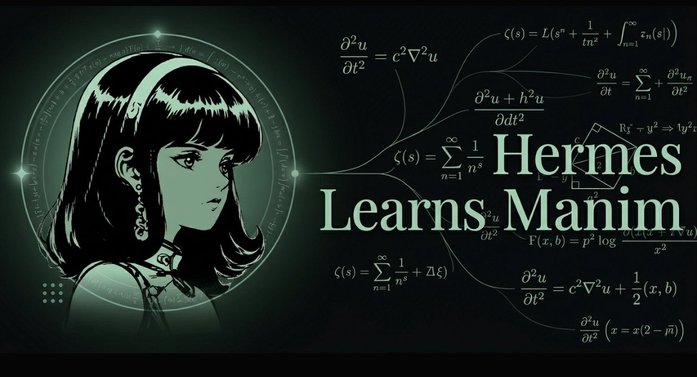

<div align="center">

<a href="https://www.star-history.com/#HarleyCoops/Math-To-Manim&Date">
  <picture>
    <source media="(prefers-color-scheme: dark)" srcset="https://api.star-history.com/svg?repos=HarleyCoops/Math-To-Manim&type=Date&theme=dark" />
    <source media="(prefers-color-scheme: light)" srcset="https://api.star-history.com/svg?repos=HarleyCoops/Math-To-Manim&type=Date" />
    
  </picture>
</a>

# Math to Manim

### Ask a question -> get a freakin' movie

[](#the-mythos-pipeline)
[](#the-reverse-reasoning-tree)
[](https://www.python.org/)
[](https://www.manim.community/)
[](#hermes-agent)
[](LICENSE)

[Mythos pipeline](#the-mythos-pipeline) · [Reverse reasoning](#the-reverse-reasoning-tree) · [The hooks](#the-hooks) · [Motion showcase](docs/showcase/README.md) · [Architecture](docs/ARCHITECTURE.md) · [Prime RL](docs/PRIME_INTELLECT_RL.md) · [Roadmap](docs/ROADMAP.md) · [Agent guide](AGENTS.md)

<br />

<p align="center">
  
  
</p>

<br />

<p align="center">
  <a href="docs/showcase/README.md"></a>
  <a href="docs/showcase/README.md"></a>
  <a href="docs/showcase/README.md"></a>
  <a href="docs/showcase/README.md"></a>
</p>

<p align="center">
  <a href="docs/showcase/README.md"></a>
  <a href="docs/showcase/README.md"></a>
  <a href="docs/showcase/README.md"></a>
  <a href="docs/showcase/README.md"></a>
</p>

<p align="center">
  <a href="docs/showcase/README.md"></a>
  <a href="docs/showcase/README.md"></a>
  <a href="docs/showcase/README.md"></a>
  <a href="docs/showcase/README.md"></a>
  <a href="docs/showcase/README.md"></a>
</p>

**You type one sentence. Six reasoning agents tear it apart, reason backward to everything a mind would need to already know, rebuild that knowledge as a curriculum, choreograph it shot by shot, and hand you a cinematic Manim film — plus every artifact that produced it. The baseline model for the whole chain is Claude Fable 5.**

</div>

---

## The morning it started

Math-To-Manim began on the morning of Donald Trump's inauguration — **January 20, 2025 — the day the reasoning models arrived.** I do not think it was an accident that the Chinese decided to release the R1 model on that day.

I was awake, saw the model hit Hugging Face, and quickly built a `.ipynb` to load the model and run it.

I created this repo at `2025-01-20T11:04:50Z` / `04:04:50 MST`.

Within a couple of minutes I realized what this meant. If the Chinese, via GRPO, had reasoning on a chip, recursive reasoning was not far behind. In my tweet I wrote "Wrap it up, its over" and I still believe it.

```text
09a2f22  2025-01-20T04:24:50-07:00  updated
A        DeepSeek_R1_zero.ipynb
A        Readme.md
```

Three hours later, the first Manim file landed: `pythagorean.py` at `2025-01-20T07:18:12-07:00`.

<p align="center">
  <a href="https://x.com/christiancooper/status/1881335734256492605?s=20"></a>
</p>

> "I asked #R1 to visually explain to me the Pythagorean theorem. This was done in one shot with no errors in less than 30 seconds. Wrap it up, its over: #DeepSeek #R1"
>
> — [Christian H. Cooper, January 20, 2025](https://x.com/christiancooper/status/1881335734256492605?s=20)

What R1 proved that morning is that a reasoning model was already good at Manim out of the box. What this repo became is the thesis taken seriously: **if one shot of reasoning gets you a clean Pythagorean proof, a chain of recursive reasoning gets you a film.** Six planning agents now reason over your prompt — backward, then forward — before a single line of scene code is generated, validated, rendered, and reviewed. The baseline model driving that chain today is **Claude Fable 5**.

And since Prime Intellect rolled out hosted evals, the reasoning traces from every run feed RL training. But this will always just work: if you are a teacher or a parent, you ask for an explanation and get an MP4 back. You never have to see or worry about the reasoning training.

For the curious, follow along here: [Prime Intellect M2M hub: `harleycooper/math-to-manim`](docs/PRIME_INTELLECT_RL.md).

-christian

---

## The reverse reasoning tree

Every text-to-code demo you have seen jumps straight from request to Python. Math-To-Manim takes the long way on purpose, and the long way is the product.

The pipeline's first move is not "write code" — it is a question: **what would a mind need to already hold for this idea to land?** Then it asks that question again, of each answer, recursively, until it bottoms out at things the viewer already knows. That is the reverse reasoning tree:

```text
                     "Explain quantum field theory"
                                  │
                                  ▼  what must you already know?
                 ┌────────────────┴────────────────┐
        special relativity                 quantum mechanics
                 │                                  │
        ┌────────┴────────┐                ┌────────┴─────────┐
   spacetime          Lorentz         wavefunctions       operators
   intervals        invariance             │                  │
        │                │            superposition     commutation
        ▼                ▼                 ▼                  ▼
   ─────────────  the tree bottoms out at known ground  ─────────────
                                  │
                                  ▼  now walk it FORWARD
      known ground → prerequisites → target concept → the film
```

The tree is built backward from the target and then **walked forward as a curriculum**: the film teaches the leaves first, so that by the time the camera reaches the QED Lagrangian, every symbol on screen has already been earned. That single design decision is why the output feels like teaching instead of decoration.

The tree is not a metaphor — it is a file. Every run writes it to disk as a knowledge graph artifact (`02_knowledge_map.json` in the Mythos chain, `knowledge_graph.json` in the typed pipeline) that you can open, inspect, and edit before any code exists.

---

## The Mythos pipeline

<p align="center">
  
</p>

**This repo is built around Claude Fable 5.** The six-agent reasoning chain runs on Claude-native tooling: the agents are Claude Code subagents, a custom harness drives them headlessly through the Claude CLI with `claude-fable-5` as the baseline model, and every frame is written with the camera as narrator — plain-language headlines before symbols, flights into the exact term being explained, pull-backs to restore context, true-3D set pieces.

The chain: **intent → cartographer → curriculum → math-director → cinematographer → scene-composer**, then codegen → static checks → render → self-repair.

| Agent | Question it answers | Artifact |
|---|---|---|
| **Intent** | What is the learner really asking, and at what level? | `01_intent.json` |
| **Cartographer** | What is the reverse reasoning tree beneath the target? | `02_knowledge_map.json` |
| **Curriculum** | In what order does the tree become teachable? | `03_curriculum.json` |
| **Math-director** | Which definitions, equations, and examples carry the load? | `04_math_dossier.json` |
| **Cinematographer** | What does the camera do, beat by beat? | `05_shot_list.json` |
| **Scene-composer** | How does the shot list compile into Manim objects and timing? | `06_scene_spec.json` |

| Piece | Where | What it does |
|---|---|---|
| Agent charters | [`mythos/agents/`](mythos/agents/) (mirrored in `.claude/agents/` for native Claude Code use) | The six minds of the chain, one markdown charter each |
| Custom harness | [`mythos/harness.py`](mythos/harness.py) | Runs the whole chain via `claude -p --model claude-fable-5`; artifacts land in `runs/mythos/<ts>/`; `--offline` rehearsal mode needs no login |
| Camera grammar | [`mythos/cinematography.py`](mythos/cinematography.py) | `headline`, `zoom_to`, `pull_back`, `term_tour`, `tilt_to_3d`, glows — the Mythos house style, Anthropic palette |
| Provider seam | [`math_to_manim/providers/mythos_cli.py`](math_to_manim/providers/mythos_cli.py) | Drops Fable 5 into the legacy typed pipeline: `M2M2_CODEGEN_PROVIDER=mythos-cli` |
| Flagship film | [`examples/mythos/qft_cinematic.py`](examples/mythos/qft_cinematic.py) | QED in 8 acts: 200 s, ~160 animations, term-by-term Lagrangian camera tours |

```bash
uv sync --extra render

# the whole chain, one line, Fable 5 as the baseline
python -m mythos.harness "explain quantum field theory" --render -q m

# or render the flagship directly
manim -qh examples/mythos/qft_cinematic.py QFTCinematicJourney
```

The model backend is a seam, not a marriage: `M2M2_MYTHOS_MODEL` overrides the model (default `claude-fable-5`), and `M2M2_MYTHOS_COMMAND=fugu-api` routes the same chain through an OpenAI-compatible Fugu Ultra endpoint instead of the Claude CLI. The original Codex/OpenAI chain remains available as a legacy provider — nothing was removed, Fable is simply the way the films get made now.

<p align="center">
  
  
</p>

<p align="center"><em>Stills from the Mythos cut of the QED journey: the camera inside the Lagrangian (left); the e⁻e⁻γ vertex as α resolves to 1/137 (right).</em></p>

---

## The hooks

Every arrow in the chain is a hook.

Between any two stages, the pipeline stops at a **stage boundary**: the upstream agent emits a typed JSON artifact, the artifact is validated against a versioned schema, a trace event is written to `trace.jsonl`, and only then does the next agent get to read it. Nothing flows between agents as loose prose — everything crosses a boundary you can watch, intercept, or rewrite.

That gives you four working hooks today:

| Hook | Where it fires | What you can do with it |
|---|---|---|
| **Artifact hook** | After every reasoning stage | Open `02_knowledge_map.json`, prune a branch of the reverse reasoning tree, and the rest of the run inherits your edit |
| **Static-review hook** | After codegen, before any render | The generated scene is gated by static checks; failures trigger a bounded repair loop from the frozen scene spec — code never renders unvetted |
| **Render hook** | Around the Manim subprocess | Render failures feed evidence back into repair instead of crashing the run; `--no-render` and `--offline` short-circuit it entirely |
| **Recovery hook** | Any time after a run | Hand-edit `generated_scene.py` in a run bundle, then `math-to-manim recover-render runs/<run_id>` re-fires validation → render → review without regenerating the plan |

<p align="center">
  
</p>

Because the six charters live in `.claude/agents/`, Claude Code discovers them natively — the same files the harness runs headlessly are the ones you can invoke interactively in a session. The design direction from here is to lift these stage boundaries into first-class Claude Code lifecycle hooks, so a human (or Hermes) can subscribe to any boundary — "pause after the shot list", "reject any scene spec with more than two formulas on screen" — without touching the harness.

---

## The process

End to end, a run is a fixed chain with a memory. The typed pipeline in [`math_to_manim/pipeline/runner.py`](math_to_manim/pipeline/runner.py) makes the path explicit: `IntentAgent`, `PrerequisiteGraphAgent`, `CurriculumAgent`, `MathAgent`, `StoryboardAgent`, `SceneSpecAgent`, `ManimCodeAgent`, `StaticReviewAgent`, `RenderAgent`, `VideoReviewAgent`, `PublisherAgent`.

| Stage | Why it exists | Artifact |
| --- | --- | --- |
| Intent | Clarify what the learner is really asking. | `intent.json` |
| Reverse prerequisites | Build the reverse reasoning tree beneath the target idea. | `knowledge_graph.json` |
| Curriculum | Turn the tree into a teachable order. | `curriculum.json` |
| Math packet | Select definitions, equations, assumptions, and examples. | `math_packet.json` |
| Storyboard | Decide the screen beats before code exists. | `storyboard.json` |
| Scene spec | Compile the visual plan into Manim objects, animations, timing, and camera notes. | `scene_spec.json` |
| Code, validation, render, review | Generate runnable Manim, gate it with static checks, render when allowed, and package the evidence. | `generated_scene.py`, reports, manifest |

Every run leaves an inspectable path from **question** to **understanding** to **animation** — JSON contracts, generated code, render results, review notes, and a manifest. The output is never just a video.

For current editable-video status and the planned prompt/spec/code edit loop, see the [roadmap](docs/ROADMAP.md).

---

## What the output is for

A run bundle is one directory that serves five different people:

**Teachers and parents** take the MP4 and walk away. Ask for an explanation, get a movie. The reasoning machinery is invisible unless you go looking.

**Learners** get a study guide for free: `curriculum.json` is the reverse reasoning tree flattened into a learning order, and `math_packet.json` is the annotated formula sheet the film was built from.

**Developers** get an edit loop: change `generated_scene.py` inside the bundle, run `recover-render`, and validation, render, and review refresh without re-planning. The scene spec stays frozen, so edits are sparse and safe.

**Researchers** get reasoning traces. Every stage boundary is logged, every artifact is typed, and the bundles feed the [Prime Intellect RL environment](docs/PRIME_INTELLECT_RL.md) as training tasks for the repair policy.

**Communicators** get clips: any render cuts down to a README-sized GIF with the [ffmpeg recipe below](#make-a-readme-sized-gif-from-a-render) — that is exactly how the showcase gallery on this page was made.

---

## "Hey man, I just want to see a demo, I don't need a calculus lecture"

Fair. The whole point is that the pipeline should turn a one-sentence idea into something moving on screen before you have to read the architecture docs.

<p align="center">
  
</p>

WSL quickstart:

```bash
cd /mnt/c/Users/$USER

git clone https://github.com/HarleyCoops/Math-To-Manim.git
cd Math-To-Manim

python3 -m venv .venv
source .venv/bin/activate
python -m pip install -U pip
python -m pip install -e ".[dev,render]"
./scripts/bootstrap-render.sh  # Debian/Ubuntu/WSL system deps for real MP4 output

# Fable 5 end to end (requires a logged-in Claude CLI)
python -m mythos.harness \
  "Show why the quantum harmonic oscillator only allows discrete energies: start with a springy potential well, zoom into the wavefunctions, then reveal the ladder of allowed energy levels." \
  --render -q l
```

The same prompt also runs through the legacy typed pipeline if you prefer the m2m2 CLI:

```bash
m2m2 generate \
  "Show why the quantum harmonic oscillator only allows discrete energies: start with a springy potential well, zoom into the wavefunctions, then reveal the ladder of allowed energy levels." \
  --codegen-provider mythos-cli \
  --style cinematic \
  --quality l \
  --runs-dir runs
```

Generated bundles and videos stay in repo-local `runs/<run_id>/` by default;
the `--runs-dir runs` flag above is intentionally explicit so agent-driven runs
do not disappear into `/tmp`.

If you want Hermes to run the harness like an operator instead of driving the CLI by hand:

```bash
hermes --skills manim-video,systematic-debugging,codebase-inspection \
  -z "Run the M2M2 pipeline on the quantum harmonic oscillator demo prompt with --runs-dir runs, inspect the repo-local run bundle, try a low-quality render, and report the generated movie path or the exact blocker. Do not put user-visible outputs in /tmp."
```

That gives you the practical loop: ask for the movie, inspect the run bundle, then tell the agent what to fix.

---

## Hermes Agent

<p align="center">
  
</p>

Hermes is the contributor/operator agent around this repository. It is not imported by Math-To-Manim and is not a runtime dependency; it uses the repo the way a developer would: read files, search code, patch docs and code, run terminal checks, inspect generated artifacts, review frames or GIFs, track todos, delegate larger work, and preserve stable context through skills.

That makes Hermes useful for maintaining the reverse-reasoning pipeline without becoming part of it. A Hermes session can inspect `AGENTS.md`, `pyproject.toml`, schemas, tests, and `runs/<run_id>/` bundles; run `pytest`, CLI smoke commands, Manim, FFmpeg, and git checks; then verify that docs, code, and showcase media still match the artifact contracts.

Repo-local Hermes skills live under [`hermes/skills/`](hermes/skills/). The old Claude `./skill` path is historical; current contributor guidance is in [`AGENTS.md`](AGENTS.md), with launch notes in [`docs/HERMES_LEARNS_MANIM.md`](docs/HERMES_LEARNS_MANIM.md).

---

## Prime Intellect RL repair loop

Math-To-Manim is also becoming a Prime Intellect reinforcement-learning environment. The first RL target is not "make the whole video in one shot." It is the edit move that matters after a base model produces a plausible but flawed scene: text overlaps formulas, equations are too small, the camera angle hides the point, or the zoom never lands on the symbol the learner needs to read.

A concrete target is the quantum-physics homepage-style failure mode: a beautiful Manim pass that still has text/formula collisions. The experiment is to give the model the typed scene plan, the generated Python, validation/render evidence, and a human request such as "fix the overlap," "change the POV angle," or "zoom into the formulas before the narration moves on." The policy should return a sparse code edit that preserves the scene while making the movie more readable.

<p align="center">
  
</p>

<p align="center">
  
</p>

<table>
<tr>
<td width="33%"></td>
<td width="33%"></td>
<td width="33%"></td>
</tr>
<tr>
<td><b>Run bundle as environment</b></td>
<td><b>Reward function as critic</b></td>
<td><b>Policy update as repair engine</b></td>
</tr>
</table>

The current hub environment is `harleycooper/math-to-manim`. A repair task carries the original prompt, typed `scene_spec`, generated Manim Python, static-validation report, and render/recovery evidence when available. The model must return one strict `GeneratedCode` JSON block. The Verifiers reward checks whether the proposed code parses, defines the expected Manim scene, avoids unsafe imports and calls, preserves expected math terms, and reduces obvious text/layout crowding hazards.

```text
generated_scene.py + scene_spec + validation/render evidence
  -> Prime Intellect Verifiers environment
  -> model proposes corrected GeneratedCode JSON
  -> static reward checks parseability, scene shape, safety, terms, layout
  -> hosted RL updates the repair policy
  -> corrected, renderable Manim Python flows back into M2M2 recovery
```

That keeps the fast RL loop text-and-AST based while the slower Manim renderer remains the audit gate. The intended result is a model that learns the house style of this repo: cinematic but readable scenes, sparse formulas, staged captions, safe Manim code, and edits that can respond to text or voice change requests without throwing away the whole movie.

Current hosted-training status: the environment action passes on Prime, the hub package is published as `harleycooper/math-to-manim@0.1.1`, a 1-step smoke completed, and a 25-step W&B-enabled pilot has been launched on `Qwen/Qwen3.5-35B-A3B`.

See the full integration notes in [`docs/PRIME_INTELLECT_RL.md`](docs/PRIME_INTELLECT_RL.md).

---

## Clone and run

### 1. Clone

Windows PowerShell:

```powershell
git clone https://github.com/HarleyCoops/Math-To-Manim.git
cd Math-To-Manim
python -m venv .venv
.\.venv\Scripts\Activate.ps1
python -m pip install -U pip
python -m pip install -e ".[dev]"
python -m pytest
```

macOS / Linux / WSL:

```bash
git clone https://github.com/HarleyCoops/Math-To-Manim.git
cd Math-To-Manim
python3 -m venv .venv
source .venv/bin/activate
python -m pip install -U pip
python -m pip install -e ".[dev]"
python -m pytest
```

### 2. Run a no-API smoke test

This proves the CLI, artifact contracts, and validators are wired before you spend model or render time:

```bash
math-to-manim generate "Explain why derivatives are slopes" --deterministic --no-render
```

Equivalent module form:

```bash
python -m math_to_manim.cli generate "Explain why derivatives are slopes" --deterministic --no-render
```

The Mythos harness has the same rehearsal mode: `python -m mythos.harness "the heat equation" --offline`.

### 3. Generate with model calls

The Fable 5 path needs only a logged-in Claude CLI — the defaults already point at `claude-fable-5`:

```bash
python -m mythos.harness "Explain Fourier epicycles as rotating vectors" --render -q l
```

Override the backend if you want:

```bash
export M2M2_MYTHOS_MODEL="claude-fable-5"   # default
export M2M2_MYTHOS_COMMAND="claude"          # default; "fugu-api" routes to Fugu Ultra
```

The legacy typed pipeline can also run on an OpenAI key:

```bash
export OPENAI_API_KEY="sk-..."
export OPENAI_MODEL="gpt-4.1"
math-to-manim generate "Explain Fourier epicycles as rotating vectors" --no-render
```

PowerShell:

```powershell
$env:OPENAI_API_KEY = "sk-..."
$env:OPENAI_MODEL = "gpt-4.1"
math-to-manim generate "Explain Fourier epicycles as rotating vectors" --no-render
```

### 4. Install render extras when you want MP4 output

Python render dependency:

```bash
python -m pip install -e ".[dev,render]"
```

System render dependencies are also needed for real Manim output, especially FFmpeg and LaTeX for `MathTex`. On Debian/Ubuntu/WSL:

```bash
./scripts/bootstrap-render.sh
```

The package list lives in [`requirements-system.txt`](requirements-system.txt).

---

## Codex CLI codegen path

Math-To-Manim can keep the typed planning pipeline while sending the Manim codegen and repair loop through a locally authenticated Codex CLI session.

Check Codex first:

```bash
codex --version
codex exec "Say ready from inside this repo"
```

Then route codegen through Codex:

```bash
math-to-manim generate "Explain derivatives as slopes with a cinematic tangent-line reveal" \
  --codegen-provider codex-cli \
  --codex-full-auto \
  --style cinematic \
  --quality l
```

Earlier planning stages remain on the typed adapters; only the generated-code and repair stages move first. That makes the migration incremental instead of all-or-nothing.

---

## What lands on disk

A generation writes a self-contained run bundle:

```text
runs/<run_id>/
  request.json
  intent.json
  knowledge_graph.json
  curriculum.json
  math_packet.json
  storyboard.json
  scene_spec.json
  generated_code.json
  generated_scene.py
  validation_report.json
  render_result.json
  review_report.json
  trace.jsonl  # stage-boundary events when tracing is enabled
  recovery_manifest.json  # after recover-render
  draft_review/
    draft_review.md
    contact_sheet.png
    frames/
  animation_package.json
  manifest.json
```

After editing `generated_scene.py` inside a run bundle, rerun the recovery path:

```bash
math-to-manim recover-render runs/<run_id> --quality l
```

That command refreshes validation, render, review, draft-review assets, and
`recovery_manifest.json` without regenerating upstream planning artifacts.

Package layout:

```text
math_to_manim/
  agents/      # stage adapters
  schemas/     # versioned artifact contracts
  tools/       # graph, validation, rendering, video, artifact helpers
  pipeline/    # orchestration, tracing, repair loop
  rendering/   # Manim and FFmpeg wrappers
  review/      # static and visual review scoring
```

---

## Motion showcase

Sixteen curated GIFs are tracked under [`docs/showcase/assets/`](docs/showcase/assets/) as the **art direction target** for Math-To-Manim's visual explanations.

<table>
<tr>
<td width="33%"><a href="docs/showcase/README.md"></a></td>
<td width="33%"><a href="docs/showcase/README.md"></a></td>
<td width="33%"><a href="docs/showcase/README.md"></a></td>
</tr>
<tr>
<td><b>Geometry as spectacle</b></td>
<td><b>Topology as choreography</b></td>
<td><b>Chaos as intuition</b></td>
</tr>
</table>

See the full gallery with descriptions: **[`docs/showcase/README.md`](docs/showcase/README.md)**.

### Make a README-sized GIF from a render

```bash
MP4="media/videos/your_scene/480p15/YourScene.mp4"

ffmpeg -y -ss 95 -t 24 -i "$MP4" \
  -vf "fps=12,scale=720:-1:flags=lanczos,split[s0][s1];[s0]palettegen=max_colors=96[p];[s1][p]paletteuse=dither=bayer:bayer_scale=5" \
  docs/showcase/assets/your-clip.gif
```

Adjust `-ss` and `-t` to capture the teaching beat you want.

---

## License

MIT.
