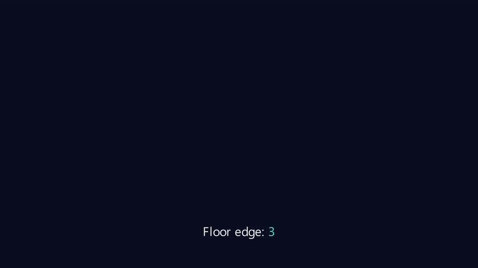

<div align="center">

<a href="https://www.star-history.com/?repos=HarleyCoops%2FMath-To-Manim&type=date&legend=top-left">
  <picture>
    <source media="(prefers-color-scheme: dark)" srcset="https://api.star-history.com/chart?repos=HarleyCoops/Math-To-Manim&type=date&theme=dark&legend=top-left&sealed_token=EjITEOSI8nKcGNkepdjUHZ8WTRNOw4dKGtyggkiM_yrNBnjxIr00U2Pgt5DqaUF8Qgx4-WIhM4WdOM2ipFiXTXOJxhJU87yp_iOKrGOHkaIBES1Wrpn1f7i_TMd8chdgnaa09DKge1DJ93Hwe4MmjX0YO1PpzSsDF9ebqWr0MDDTnpRzPNbPUvweMI00" />
    <source media="(prefers-color-scheme: light)" srcset="https://api.star-history.com/chart?repos=HarleyCoops/Math-To-Manim&type=date&legend=top-left&sealed_token=EjITEOSI8nKcGNkepdjUHZ8WTRNOw4dKGtyggkiM_yrNBnjxIr00U2Pgt5DqaUF8Qgx4-WIhM4WdOM2ipFiXTXOJxhJU87yp_iOKrGOHkaIBES1Wrpn1f7i_TMd8chdgnaa09DKge1DJ93Hwe4MmjX0YO1PpzSsDF9ebqWr0MDDTnpRzPNbPUvweMI00" />
    
  </picture>
</a>

# Math To Manim

### Ask a question. Get a visual explainer.

[](docs/GLM_5_3_FLASH.md)
[](#glm)
[](#mythos)
[](#sol)
[](#grok)
[](#make-your-first-explainer)
[](https://www.python.org/)
[](https://www.manim.community/)
[](LICENSE)

[The January 20 story](#the-morning-of-january-20-2025) ·
[The Third Side](#the-third-side-astra-jev-and-a-new-lesson) ·
[See it move](#see-it-move) ·
[Featured explainers](#featured-visual-explainers) ·
[How an explainer is born](#how-an-explainer-is-born) ·
[Make your first explainer](#make-your-first-explainer) ·
[Reference](#installation)

<br />

> *Math To Manim turns a math or physics question into a carefully reasoned
> visual explanation. It finds what the learner needs to know, teaches those
> ideas in order, checks the mathematics, and builds the explanation in Manim.*

</div>

## The Morning Of January 20, 2025

I started Math To Manim on the morning of January 20, 2025, the day
[DeepSeek R1 was released](https://huggingface.co/deepseek-ai/DeepSeek-R1/commit/5a56bdbde75a16bdfbf3a8e9c852be3dfcfb8eef).

GRPO made me wonder how far **recursive self reasoning** could go. Could a
model revisit an argument, find the ideas it had skipped, and use feedback
to explain it better? Math and animation gave me a way to test that question:
the equation has to hold up, and the explanation has to work on screen.

I began with a practical loop: work backward through an idea's prerequisites,
teach them forward, then inspect and revise the animation. The GRPO connection
was my starting hypothesis. I'm still working on the RL experiment and how
to turn evaluation feedback into useful training signals.

Today, the Codex pipeline produces lessons through six specialist stages,
with Jev checking the mathematics and rendered frames independently.

<details>
<summary>Creation evidence and later screenshots</summary>

The [GitHub repository metadata](https://api.github.com/repos/HarleyCoops/Math-To-Manim)
records `created_at: 2025-01-20T11:04:50Z`; the original commit records
`2025-01-20T04:24:50-07:00`. These timestamps establish the project's start.
[The original commit remains in the history](https://github.com/HarleyCoops/Math-To-Manim/commit/09a2f22ec02b0374d38373d28f76c5764a1e9a2e).
The account of the GRPO intuition is the creator's recollection.

These screenshots were captured **September 24, 2026**. They show the pages
as viewed then; they are not screenshots taken on release morning.

[Repository page capture](docs/assets/math-to-manim-root.png) ·
[DeepSeek R1 release capture](docs/assets/deepseek-r1-release.png)

</details>

## The Third Side: Astra, Jev, And A New Lesson

<a href="docs/showcase/assets/the-third-side.mp4"></a>

A new **eighth-grade math** film starts on the floor of a 3 × 4 × 6 box.
The first right triangle gives a diagonal of 5. Stand up a second triangle,
and the straight route through the box becomes **√61 ≈ 7.81 units**, compared
with 13 along three edges. The camera reveals how the two triangles connect.

[Explore the interactive lesson](https://harleycoops.github.io/Math-To-Manim/) ·
[Watch the MP4](docs/showcase/assets/the-third-side.mp4) ·
[Read the scene](examples/sol/the_third_side.py) ·
[Implementation and deployment](docs/ASTRA_JEV_BASE44.md)

**GPT-6 Astra** runs the six production roles in the Codex-native chain.
**Jev** evaluates the mathematics and sampled rendered frames in a separate
read-only Astra session, returning scores, evidence, and repair feedback.
The **Base44 Docker setup** serves the finished film and an interactive box
whose dimensions you can change. The same lesson is published on GitHub Pages.

For this film, Jev flagged inconsistent coloring inside a square root and a
box outline that was too faint. The scene composer revised the film, and a
fresh review approved the updated source and sampled frames.
[Inspect the production record](docs/showcase/the-third-side/production.json).

This is an inference-time revision system. The separate RL experiment remains
in progress; Jev's diagnostic scores are not evidence of learned improvement.

## See It Move

A selection of rendered explanations from the project. Open the showcase for
source scenes, prompts, and longer films.

<table>
<tr>
<td width="50%">
<p align="center"></p>
<p align="center"><strong>Fourier epicycles.</strong> Each arm spins at one frequency. Stack them tip to tail and the pen draws the signal: rotation rebuilt as arithmetic.</p>
</td>
<td width="50%">
<p align="center"></p>
<p align="center"><strong>Hopf fibration.</strong> A 3D projection shows how the circles associated with points on a sphere link together.</p>
</td>
</tr>
<tr>
<td width="50%">
<p align="center"></p>
<p align="center"><strong>Lorenz attractor.</strong> Two starts almost identical, two endings utterly different. Chaos rendered honestly: the wings never retrace themselves.</p>
</td>
<td width="50%">
<p align="center"></p>
<p align="center"><strong>Minkowski spacetime.</strong> Light cones tilt under a Lorentz boost while simultaneity quietly bends. Relativity you can lean into.</p>
</td>
</tr>
<tr>
<td width="50%">
<p align="center"></p>
<p align="center"><strong>Why area = πr².</strong> Slice the disc, unroll the rings, stack them into a triangle whose base is the circumference. Proof by camera move.</p>
</td>
<td width="50%">
<p align="center"></p>
<p align="center"><strong>Cosmic gravity.</strong> A visual model connects curvature with orbital motion.</p>
</td>
</tr>
</table>

<table>
<tr>
<td width="50%">
<p align="center"></p>
<p align="center"><strong>The grammar reel.</strong> How Mythos thinks about a scene: named objects, staged timing, camera intent written down before pixels exist.</p>
</td>
<td width="50%">
<p align="center"></p>
<p align="center"><strong>The reverse reasoning tree.</strong> Start at the question. Walk backward until every branch touches something the learner already owns. Then walk forward and teach.</p>
</td>
</tr>
<tr>
<td width="50%">
<p align="center"></p>
<p align="center"><strong>Exceptional points.</strong> Circle the singularity once and the eigenvalue branches swap seats. Monodromy made visible, not merely defined.</p>
</td>
<td width="50%">
<p align="center"></p>
<p align="center"><strong>GRPO's semantic manifold.</strong> Reinforcement learning seen from above: meaning settling into shape as rewards accumulate.</p>
</td>
</tr>
</table>

<p align="center"><strong><a href="docs/showcase/README.md">Explore every visual explainer in the motion showcase</a></strong></p>

---

## Featured Visual Explainers

<p align="center">
  <a href="docs/showcase/assets/erdos-1038-potential-landscape.mp4">
    
  </a>
</p>

<p align="center"><strong>ERDŐS 1038: THE POTENTIAL LANDSCAPE</strong></p>

A polynomial is usually introduced as a line of symbols, but it can also be
seen as a landscape made by its roots. Imagine every root pressing into a
flexible sheet stretched above the number line. Taken together, the roots
raise and lower that sheet. The transparent plane in the explainer marks zero.
Wherever the landscape falls beneath it, the polynomial has size less than one.
The footprint under the plane is therefore the exact set whose width the
problem asks us to measure.

That turns the question into something physical. How should the roots be
arranged to make the submerged footprint as narrow as possible, or as wide as
possible? For the narrow side, clusters of roots can be gathered toward their
centres without making the footprint larger. Repeating that idea leads toward
an increasingly fine, one sided distribution of roots. No finite polynomial
quite reaches the limiting shape, but a sequence of them gets arbitrarily
close. Its width is **1.834430475762661…**. This is the certified floor shown
by the curved valley.

The widest case is beautifully simpler. Put the roots at the two endpoints,
−1 and +1, in equal numbers. This produces the family

$$f(x) = (x^2 - 1)^m$$

and the region where $|f(x)| < 1$ runs from $-\sqrt{2}$ to $+\sqrt{2}$. Its
width is exactly $2\sqrt{2}$. The explainer ends by contrasting two different
kinds of extreme: a lower value that can be approached forever but never
attained by a finite polynomial, and an upper value reached exactly by piling
the roots at the endpoints.

<p align="center"><em><a href="docs/showcase/assets/erdos-1038-potential-landscape.mp4">Watch the complete 79 second visual explainer</a> · <a href="docs/prompts/erdos-1038-off-white-3d.md">Read the complete Sol production prompt</a></em></p>

<br />

<p align="center">
  <a href="docs/showcase/assets/olin-off-white-3d-space.mp4">
    
  </a>
</p>

<p align="center"><strong>OLIN: THE SPACE INSIDE A TWEET</strong></p>

A tiny program draws ten thousand points by passing each one through five
linked quantities: \(k\), \(e\), \(d\), \(c\), and \(q\). The final screen
coordinates are only a flat pair,

$$(u,v) = (\,q + 40\cos c,\;\; q\sin c + 35d\,)$$

A picture with two coordinates does not determine one unique object in three
dimensions, so the film explores two different ways to reveal the space
suggested by the code.

The first construction is the exact lift

$$E(i,t) = (\,u,\; 40\sin c,\; v\,)$$

It adds a hidden depth coordinate while leaving \(u\) and \(v\) untouched.
Look straight down that hidden direction and every point lands exactly on the
original drawing. This makes \(E\) a faithful spatial source for the flat
shadow.

The film then explores

$$C(i,t) = \big(\,(40+q)\cos c,\;\;(40+q)\sin c,\;\;35d\,\big)$$

Here \(c\) turns each point around a vertical axis, \(q\) changes its radius,
and \(35d\) sets its height. This is an alternate cylindrical interpretation,
not another exact lift. Its projection does not reproduce the original
drawing. The distinction matters: \(E\) preserves what the code drew, while
\(C\) asks what other spatial form the same ingredients can suggest.

<p align="center"><em><a href="docs/showcase/assets/olin-off-white-3d-space.mp4">Watch the complete Olin visual explainer</a> · <a href="docs/prompts/olin-off-white-3d-space.md">Read the corrected Mythos production prompt</a> · <a href="examples/mythos/olin_off_white_3d_space.py">Inspect the Manim scene</a></em></p>

<br />

<table>
<tr>
<td width="50%">
<p align="center"></p>
<p align="center"><strong>The Jacobian conjecture.</strong> A small cube becomes a parallelepiped, making the determinant visible as local volume change. Then the camera pulls back: reversible nearby is not the same as reversible everywhere.</p>
</td>
<td width="50%">
<p align="center"></p>
<p align="center"><strong>A theorem in one breath.</strong> Three squares, one rearrangement, no algebra assumed. This is the entire argument for why the pictures come before the symbols.</p>
</td>
</tr>
</table>

---

## How An Explainer Is Born

The reasoning process is the product. Math To Manim does not jump from a
sentence to Python. It walks a chain, and every link leaves an artifact you
can open and read.

```text
your question
      ↓
reverse prerequisites   — walk backward until every branch touches what the learner knows
      ↓
curriculum              — reorder those ideas forward so the answer feels earned
      ↓
mathematics             — pick definitions, equations, worked examples, checks
      ↓
camera plan             — decide what moves, what holds still, where attention goes
      ↓
Manim scene             — addressable objects with names and timing, not one opaque blob
      ↓
validation              — parse structure, check math presentation, enforce camera rules
      ↓
render → inspect → repair — produce the MP4, review evidence, fix visible defects
```

### One prompt recipe covers most asks

> Explain [topic] to [learner]. Assume they already know [starting point].
> Use [visual metaphor or physical model]. Work through [specific example].
> End with [summary or check question].

Name the learner's age, prior knowledge, pace, preferred visual model, worked
example, notation level, and final comprehension check. You can ask for
Fourier series as rotating vectors that rebuild a signal one frequency at a
time, or for momentum arrows before and after two carts collide, or for why
one loop around an exceptional point swaps the eigenvalue branches.
**A homework question is enough.**

### The same chain from the command line

```bash
math-to-manim run "Explain Fourier series as rotating vectors that rebuild a signal. Begin with a circle and add one frequency at a time." --render -q l
```

That single command runs the whole chain above: prerequisite map, teaching
sequence, math checks, camera charter, scene composition, validation report,
and the render inside `runs/mythos/<timestamp>-fourier-series/`. Open
`manifest.json` to see every artifact the chain produced.

---
## Make Your First Explainer

The easiest path is a conversation with an assistant that can use MCP. The
pipeline expands it into a teaching plan before any code exists.

```bash
pip install -e ".[mcp]"
math-to-manim serve-mcp
```

The server speaks the current MCP protocol over stdio via the official
MCP Python SDK 2.x API. For a local network endpoint instead:

```bash
math-to-manim serve-mcp --transport streamable-http --port 8643
```

The Streamable HTTP endpoint is `http://127.0.0.1:8643/mcp`.

Add the server to your MCP client:

```json
{
  "mcpServers": {
    "math-to-manim": {
      "command": "math-to-manim",
      "args": ["serve-mcp"]
    }
  }
}
```

Once the server is connected, type this in your assistant:

> Use Math To Manim to create a visual explainer for my eighth grade student.
> Explain why solving an equation means doing the same thing to both sides.
> Use a balance scale, solve 3x + 5 = 20, and end with one practice question.

You do not need to memorize tool names. The assistant starts the explainer,
reports progress, and can inspect every reasoning artifact. The final scene
and render stay in your local run directory.

The MCP server runs the Grok pipeline. Its tools expose progress, reasoning
artifacts, and the finished scene to your assistant.

A login-free rehearsal of the same path:

```bash
python -m venv .venv
pip install -e ".[dev]"
math-to-manim run "the heat equation" --offline
```

That writes `runs/mythos/<timestamp>-the-heat-equation/mythos_scene.py`,
`validation.json`, and `manifest.json`. Add `--render -q l` after
`pip install -e ".[render]"` if you want the MP4 inside that same run
directory. The live layout is `runs/mythos/` or `runs/sol/` or `runs/grok/`,
not `output/<run>/scene.py`.

## Choose A Native Pipeline

Math To Manim contains five independent pipelines for creating visual
explainers. Choose the provider account you already use.

### Mythos

Mythos uses the Claude CLI and a six agent charter chain. It reasons through
learner intent, prerequisite mapping, curriculum, mathematics, camera
direction, and scene composition.

```bash
math-to-manim doctor --ping
math-to-manim run "Explain fractions with a folding paper model for a sixth grade learner." --render -q m
```

### Sol

Sol uses GPT-6 Astra through the logged in Codex CLI and durable specialist stages. Each role saves
its artifact and session so the run can be inspected, resumed, and repaired by
the responsible specialist.

```bash
npm ci  # install the repository's compatible Codex CLI
math-to-manim-sol doctor
math-to-manim-sol run "Explain fractions with a folding paper model for a sixth grade learner." --render --evaluator jev
```

### Grok

Grok uses xAI's Grok 4.6. Offline mode works login-free:

```bash
math-to-manim-grok doctor
math-to-manim-grok run "the heat equation" --offline
```

### GLM

GLM uses Z.ai's Coding Plan with glm-5.3-flash; thinking is always enabled and
effort tunes sampling latitude (low/high/max). Offline mode works login-free:

```bash
math-to-manim-glm doctor
math-to-manim-glm run "the magnetic monopole" --offline
```

Details in [docs/GLM_5_3_SILO.md](docs/GLM_5_3_SILO.md).

### MiMo

MiMo has its own tool-calling chain in `mimo/`; see the
[MiMo pipeline documentation](docs/MIMO_2_6_SILO.md).

## The Ongoing RL Experiment

The original question is still open: can feedback improve the reasoning and
visual explanation together? The repository now explores it at two levels.

**Evaluate and revise an individual film.** In the Codex pipeline, **Jev** is
an independent math and render evaluator powered by **GPT-6 Astra**. A fresh,
read only Codex session scores the mathematics and the rendered presentation,
cites its evidence, and returns concrete revision feedback. The harness sends
repairs back through the responsible stages and renders again before review.
This is repair at inference time: no model weights change.

```bash
math-to-manim-sol run "Explain why Fourier modes solve the heat equation" --render --evaluator jev
```

**Learn across attempts.** The [Prime Intellect experiment](docs/PRIME_INTELLECT_RL.md)
and [visual improvement environment](environments/m2m2_visual_improvement/README.md)
provide a separate path toward training on repair tasks. Actual RL requires
rollouts, a reward, and a trainer that updates policy weights. Running jev does
not start that trainer or turn its scores into a calibrated reward.

Jev's scores are provisional model judgments. A useful next experiment is to
compare them with blinded human reviews on held out mathematical and visual
defects, measure false approvals, and only then test a reward derived from
them. That calibration and the RL training experiment remain work in progress.
See the [Jev design and calibration protocol](docs/JEV.md)
for the acceptance gate, audit records, limitations, and offline checks.

## Installation

```bash
git clone https://github.com/HarleyCoops/Math-To-Manim.git
cd Math-To-Manim
python -m venv .venv
pip install -e ".[dev,render,mcp,api]"
python -m pytest -q
```

Use `math-to-manim doctor --ping` (Mythos), `math-to-manim-sol doctor` (Sol),
or `math-to-manim-grok doctor` (Grok). Run the appropriate check before a live
request so login and rendering problems appear immediately.

Static checks parse `MathTex` and `Tex` fragments in process. If `chktex`
is on `PATH`, the verifier also consults it. If `M2M_LATEX_DEEP_CHECK` is
set and `lualatex TeX Live` on PATH compiles fragments with
`lualatex --halt-on-error --interaction=nonstopmode`. Both tools are optional
and not required for `pytest`.

## Run Artifacts

Every run keeps its reasoning, scene source, validation evidence, and manifest
inside the repository. Mythos writes to `runs/mythos/`. Sol writes to
`runs/sol/`. Grok writes to `runs/grok/`. Open the intermediate JSON when you
want to understand or revise how the explainer was built.

## MCP Reference

These tools are available to assistants and integrations. A learner can simply
ask for an explainer in ordinary language.

| Tool | Purpose |
|---|---|
| `m2m_create_animation` | Starts the Grok reasoning chain as a background job |
| `m2m_get_job` | Reports live progress for each reasoning stage |
| `m2m_list_runs` | Lists local runs with the newest first |
| `m2m_get_run` | Returns the manifest and artifact list for one run |
| `m2m_get_artifact` | Reads a reasoning artifact such as the prerequisite map |
| `m2m_get_scene_code` | Returns the generated Manim scene |
| `m2m_cinematic_charter` | Returns the visual composition contract |

For a headless client, use the reference driver:

```bash
python scripts/drive_mcp_pipeline.py "why does a spinning handle flip itself?" --render -q l --log runs/drive.log
```

## REST API

The REST API exposes Mythos for applications and background jobs.

```bash
pip install -e ".[api]"
math-to-manim serve-api
```

OpenAPI documentation is available at `http://127.0.0.1:8642/docs`.

| Method | Route | Purpose |
|---|---|
| `GET` | `/health` | Reports service health and version |
| `POST` | `/v1/runs` | Submits a prompt and returns a job record |
| `GET` | `/v1/jobs/{job_id}` | Reports queued, running, completed, or failed state |
| `GET` | `/v1/runs` | Lists the local run ledger |
| `GET` | `/v1/runs/{run_id}` | manifest + artifact listing |
| `GET` | `/v1/runs/{run_id}/artifacts/{name}` | Returns one JSON or Python artifact |

```bash
curl -s -X POST localhost:8642/v1/runs \
  -H "Content-Type: application/json" \
  -d '{"prompt": "explain Fourier epicycles as rotating vectors", "render": false}'
```

## Configuration

Mythos reads configuration from the environment or a local `.env` file.

| Variable | Default | Purpose |
|---|---|---|
| `M2M_MODEL` | `claude-fable-5` | Selects the baseline model |
| `M2M_MODEL_FALLBACKS` | `claude-opus-4-8,claude-sonnet-5` | Lists models used when the baseline has a model failure |
| `M2M_COMMAND` | `claude` | Selects the explicit backend command |
| `M2M_TIMEOUT` | `900` | Sets the model call budget in seconds |
| `M2M_RENDER_TIMEOUT` | `1800` | Sets the render budget in seconds |
| `M2M_RUNS_DIR` | `runs/` | Selects the local run directory |
| `M2M_MANIM` | automatic | Overrides the Manim executable |
| `M2M_PREREQ_CACHE_TTL_DAYS` | `30` | How long cached prerequisite trees stay valid |
| `M2M_LATEX_DEEP_CHECK` | unset | When set, also asks `lualatex --halt-on-error` to compile fragments |

Read the [Sol contract](docs/SOL_5_6_SILO.md) and the
[Grok contract](docs/GROK_4_6_SILO.md) for Codex/xAI login, staged sessions,
resume commands, manifests, and environment details.

## Testing

```bash
python -m pytest -q
math-to-manim run "the heat equation" --offline
math-to-manim-sol run "the heat equation" --offline
math-to-manim-grok run "the heat equation" --offline
```

Offline runs validate the complete artifact shape without model calls or an
expensive render.

---

## More From The Project

- [Motion showcase](docs/showcase/README.md) — every visual study and older animation, preserved.
- [Reverse reasoning pipeline diagram](docs/assets/reverse-reasoning-pipeline.svg) — the chain on one page.
- [Prime Intellect RL notes](docs/PRIME_INTELLECT_RL.md) — reinforcement learning for visual repair.
- [Roadmap](docs/ROADMAP.md) — what comes next. · [Agent guide](AGENTS.md) — repository boundaries and verification rules.
- Pipeline contracts: [Astra / Codex](docs/SOL_5_6_SILO.md) · [Grok 4.6](docs/GROK_4_6_SILO.md)
- Kimi K3 grows in its own repository: [HarleyCoops/KimiK3Manim](https://github.com/HarleyCoops/KimiK3Manim)

Hermes Agent is not a supported generate path. The supported surfaces are
Mythos, Sol, Grok, GLM, MiMo, MCP, and REST.

## Repository Layout

```text
mythos/            Claude CLI reasoning chain, service, API, MCP, and CLI
sol/               Codex CLI specialist pipeline
grok/              Grok 4.6 via xAI pipeline
examples/mythos/   Hand finished Mythos examples
examples/sol/      Astra films and curated scene source
web/               Interactive geometry lesson
deployment/        Base44-compatible presentation server
docs/showcase/     Complete visual archive
tests/             Offline repository tests
runs/              Local reasoning and render artifacts
archive/           Retired implementations kept for history
legacy/            Original January 2025 repository material
```

## Try Your Own Lesson

Start with a question, the learner's background, and one example you want
to explain. Inspect the generated mathematics and film before using it to teach.

## License

[MIT](LICENSE).
