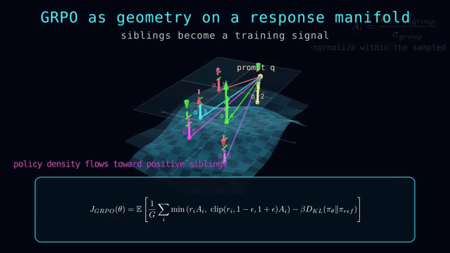
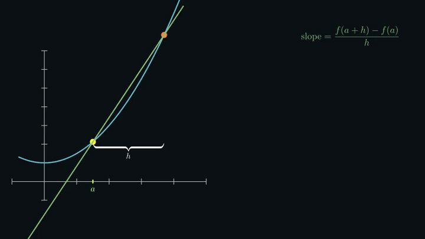
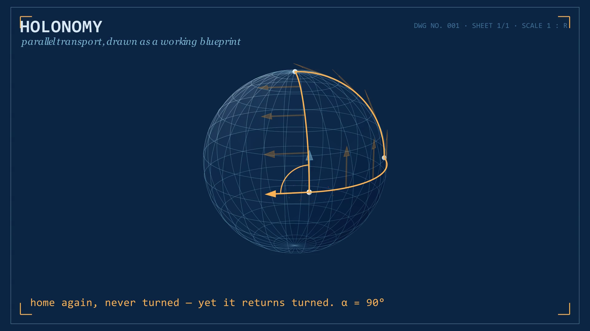
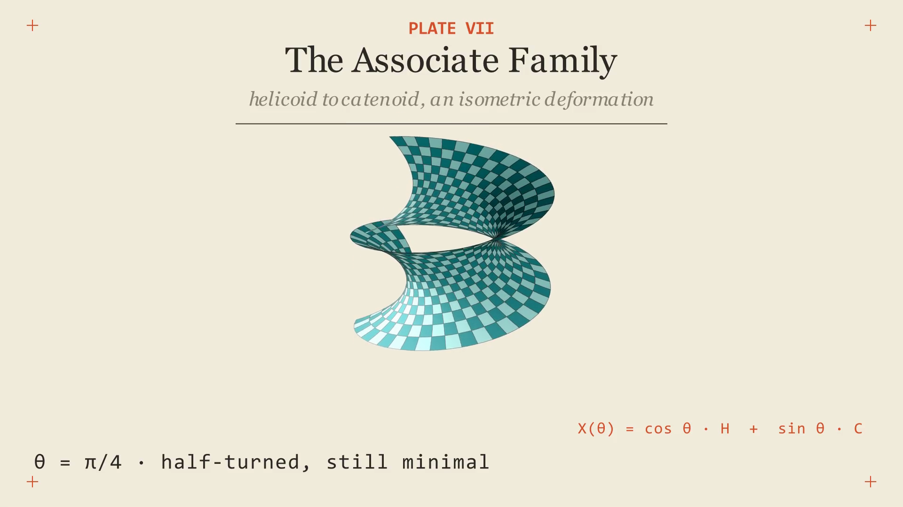

<p align="center">
  
</p>

<div align="center">

# Sol Learns Manim

### Math-To-Manim rebuilt around one long-horizon Sol run and one inspectable mathematical film.

[](docs/SOL_5_6_SILO.md)
[](https://github.com/openai/codex)
[](#authentication-boundary)
[](https://www.manim.community/)
[](https://www.python.org/)
[](LICENSE)

[Quickstart](#quickstart) · [How Sol works](#how-sol-works) · [Artifact contract](#the-run-is-a-ledger) · [Validation and repair](#validation-render-and-repair) · [Showcase](#motion-showcase) · [Sol architecture](docs/SOL_5_6_SILO.md)

</div>

<details>
<summary><strong>Repository star history</strong></summary>

<a href="https://www.star-history.com/?repos=HarleyCoops%2FMath-To-Manim&type=date&legend=top-left">
  <picture>
    <source media="(prefers-color-scheme: dark)" srcset="https://api.star-history.com/chart?repos=HarleyCoops/Math-To-Manim&type=date&theme=dark&legend=top-left&sealed_token=EjITEOSI8nKcGNkepdjUHZ8WTRNOw4dKGtyggkiM_yrNBnjxIr00U2Pgt5DqaUF8Qgx4-WIhM4WdOM2ipFiXTXOJxhJU87yp_iOKrGOHkaIBES1Wrpn1f7i_TMd8chdgnaa09DKge1DJ93Hwe4MmjX0YO1PpzSsDF9ebqWr0MDDTnpRzPNbPUvweMI00" />
    <source media="(prefers-color-scheme: light)" srcset="https://api.star-history.com/chart?repos=HarleyCoops/Math-To-Manim&type=date&legend=top-left&sealed_token=EjITEOSI8nKcGNkepdjUHZ8WTRNOw4dKGtyggkiM_yrNBnjxIr00U2Pgt5DqaUF8Qgx4-WIhM4WdOM2ipFiXTXOJxhJU87yp_iOKrGOHkaIBES1Wrpn1f7i_TMd8chdgnaa09DKge1DJ93Hwe4MmjX0YO1PpzSsDF9ebqWr0MDDTnpRzPNbPUvweMI00" />
    
  </picture>
</a>

</details>

<!-- Stable hero slots for the forthcoming cycle-double-cover proof run.
     Replace these paths with real exports; do not rename them. -->
<p align="center">
  
</p>

<p align="center">
  
  
</p>

<p align="center"><em><strong>Hero in production.</strong> These stable slots are reserved for the cycle-double-cover proof film, its contact sheet, and a scene detail. The run itself will supply the final exports; no synthetic screenshots are checked in here.</em></p>

Math-To-Manim's primary pipeline is now [`sol/`](sol/): an independent GPT-5.6 Sol production system that turns a request into a mathematically checked, cinematic, runnable Manim Community Edition scene. Sol does not bounce a prompt through a relay of provider-agnostic agents. It gives one long-horizon `codex exec` the complete film contract and a private run directory, then lets that process research, reason, storyboard, write code, invoke tools, render, inspect evidence, and repair its work in one coherent context.

The surrounding application remains deliberately strict. It creates an isolated ledger, supplies the output schema, removes API-key authentication, validates every required artifact, compiles and statically inspects the scene, requires an MP4 whenever rendering was requested, and spends only the configured repair budget. Sol owns the film; the wrapper owns the boundary.

> **Provider-native by design.** `sol/` is the primary GPT-5.6 Sol path and uses only the Codex CLI with its cached ChatGPT login. [`mythos/`](mythos/) remains an independent Anthropic-native legacy/secondary provider silo. Neither imports or orchestrates the other.

---

## Quickstart

### Reproducible bootstrap on Ubuntu, Debian, or WSL

```bash
git clone https://github.com/HarleyCoops/Math-To-Manim.git
cd Math-To-Manim

./scripts/bootstrap-sol.sh
.venv/bin/codex login
.venv/bin/math-to-manim-sol doctor
```

The bootstrap installs the native Cairo/Pango build headers, FFmpeg, TeX and `dvisvgm`, the Python development and Manim environment, and the repository-pinned Codex CLI. It keeps the runtime local: Python packages live in `.venv`, the pinned npm tree lives in `node_modules`, and `.venv/bin/codex` points to that exact local CLI.

### Produce a film

```bash
source .venv/bin/activate

math-to-manim-sol run \
  "Explain why Fourier modes solve the heat equation. Build the prerequisites, derive the result, and make the geometry visible." \
  --render -q l \
  --reasoning-effort high \
  --max-repairs 2
```

Useful commands:

```bash
# Rehearse the complete artifact contract without a model call or render.
math-to-manim-sol run "rehearse the Sol pipeline" --offline

# Check the pinned Codex executable and cached ChatGPT login.
math-to-manim-sol doctor

# Inspect recent manifests in runs/sol/.
math-to-manim-sol runs --limit 20
```

`--render` is the production path. When it is present, the contract tells Sol to run Manim, inspect logs and representative frames or contact sheets, and repair obvious defects; application validation then refuses to complete the run unless a nontrivial MP4 exists inside that run's directory. Omit it only when you intentionally want a validated scene bundle without a mandatory video.

---

## How Sol works

```text
math-to-manim-sol run <request>
  |
  +-- create runs/sol/<timestamp>-<slug>/
  |     request.json + CONTRACT.md + output schema + run manifest
  |
  +-- codex exec --model gpt-5.6-sol --sandbox workspace-write
  |     one prompt, one context, shell/workspace tool calls
  |     intent -> prerequisites -> curriculum -> checked mathematics
  |     -> shot list -> scene contract -> Manim code -> render inspection
  |
  +-- wrapper validation
  |     artifact shape + JSON + Python compile + AST safety + camera rule
  |     + required MP4 when --render was requested
  |
  +-- bounded codex exec repair passes, using validation evidence
  |
  +-- final manifest.json
```

### Tool calling without an orchestration layer

The Sol client starts one non-interactive Codex process with the complete contract on standard input:

```text
codex -c model_reasoning_effort="high" exec \
  --model gpt-5.6-sol \
  --sandbox workspace-write \
  --cd runs/sol/<run-id> \
  --json \
  --output-schema final-result.schema.json \
  --output-last-message final-result-0.json \
  -
```

Codex's own shell and workspace tools are the tool-calling plane. The process can inspect the repository and use the installed render toolchain, but the contract permits writes only inside its assigned run directory. Its structured final message is checked against a wrapper-owned schema, while its full JSONL trace is preserved as `codex-trace-0.jsonl`.

This design keeps research decisions, prerequisite reasoning, mathematical checks, cinematic choices, implementation, and visual review in the same long-lived context. There is no HTTP model endpoint, Responses API client, hidden API-key fallback, calculator compiler, Mythos prompt import, or Sol MCP server. The supported Sol front door is the CLI.

### Authentication boundary

The child environment explicitly removes `OPENAI_API_KEY`. Authentication comes only from the Codex CLI's cached ChatGPT session:

```bash
.venv/bin/codex login
.venv/bin/math-to-manim-sol doctor
```

`doctor` resolves the CLI, prints its version, checks `codex login status`, and reports the configured Sol model. A stray API key cannot silently move the run onto another billing or authentication path.

---

## The run is a ledger

Every request gets a unique repository-local directory under `runs/sol/`. Sol may write only there, and every attempt remains inspectable.

```text
runs/sol/<timestamp>-<slug>/
  request.json                    normalized user request and run options
  CONTRACT.md                     exact film contract given to Sol
  final-result.schema.json        wrapper-owned structured output schema
  final-result-0.json             structured summary from the first attempt
  codex-trace-0.jsonl             complete Codex event trace
  01_intent.json                  audience, altitude, scope, success criteria
  02_knowledge_map.json           reverse prerequisite graph
  03_curriculum.json              graph walked forward as a teaching sequence
  04_math_dossier.json            definitions, derivations, checks, sources
  05_shot_list.json               visual beats, camera logic, transitions
  06_scene_spec.json              implementable scene contract
  sol_scene.py                    one self-contained Manim CE scene
  review.json                     checks, render evidence, repairs, limitations
  manifest.json                   wrapper-owned status and attempt ledger
```

Repair passes add `final-result-<n>.json` and `codex-trace-<n>.jsonl` rather than erasing the history. `manifest.json` records the model, request, render mode, quality, timestamps, attempts, scene identity, video path, and any terminal error.

The eight creative artifacts are mandatory. Every JSON artifact must be a non-empty object. The scene must import Manim and define exactly one `Scene`, `ThreeDScene`, or `MovingCameraScene` subclass.

### Why the paper can be the prompt

The input is not treated as a short code-generation instruction. It is the source material for a complete film dossier. A long paper extraction can therefore be supplied as the request along with audience, pacing, visual, and fidelity constraints. The contract first asks what the learner must know, then makes those prerequisites explicit before introducing notation. Dense graduate-level explanations, deliberate reading pauses, close inspection of intricate 3D objects, and wide contextual pull-backs belong in the shot list and scene specification—not as after-the-fact decoration.

---

## Validation, render, and repair

Sol is autonomous inside the run; completion is not self-certified.

| Boundary check | What the wrapper enforces |
|---|---|
| Artifact contract | All eight required creative files exist; JSON artifacts are non-empty objects |
| Python validity | `sol_scene.py` compiles and parses successfully |
| Scene shape | Exactly one supported Manim scene subclass is present |
| Static safety | Blocks network/process/filesystem-capable imports and calls such as `subprocess`, `requests`, `open`, `eval`, and `exec` |
| Camera safety | Rejects `self.camera.animate`; 3D scenes use Manim camera methods |
| Render evidence | With `--render`, an MP4 must exist inside the run and must be larger than 1 KiB |

If validation fails, the wrapper starts another isolated `codex exec` in the same run directory. The repair prompt includes the original request, render settings, exact validation failures, and the instruction to preserve correct work while changing only what the evidence requires. Validation then runs again. `--max-repairs` bounds this loop from 0 to 5 passes; the default is 2. An unresolved failure marks the manifest failed instead of presenting a partial bundle as a finished film.

The model-side contract adds the qualitative half of review: when rendering is requested, inspect Manim logs and representative frames/contact sheets, then record checks, repairs, evidence, and remaining limitations in `review.json`.

---

## Reproducible dependency layers

| File | Contract |
|---|---|
| [`requirements-system.txt`](requirements-system.txt) | Debian/Ubuntu native build and render packages |
| [`requirements.txt`](requirements.txt) | Core development environment and offline tests |
| [`requirements-render.txt`](requirements-render.txt) | Development environment plus Manim |
| [`requirements-sol.txt`](requirements-sol.txt) | Complete Python side of the Sol pipeline |
| [`package.json`](package.json) + [`package-lock.json`](package-lock.json) | Exact Codex CLI runtime |
| [`scripts/bootstrap-sol.sh`](scripts/bootstrap-sol.sh) | Installs and connects all layers in the local environment |

For plumbing changes, keep the deterministic path green:

```bash
pip install -e ".[dev]"
pytest
math-to-manim-sol run "offline release rehearsal" --offline
```

Offline mode writes the same creative artifact shape and exercises compilation and static checks without requiring a model login, network request, Manim render, or expensive long-horizon run.

---

## The visual standard

The film should teach with motion. Headline before symbols. Introduce notation only after its visual meaning has been earned. Use the camera as a narrator: move close when one term carries the argument, pull back when relationships matter, and enter 3D only when the mathematical object truly needs depth. A graduate-level film may be dense, but it must also pause long enough to be read.

<p align="center">
  
</p>

<p align="center"><em><strong>The traitor axis.</strong> Geometry, integration, prediction, and camera language meet in one computed rigid-body argument.</em></p>

<p align="center">
  
</p>

<p align="center">
  
  
</p>

<p align="center">
  
  
</p>

<p align="center">
  
  
</p>

<p align="center">
  
  
</p>

<p align="center">
  
</p>

These films predate or span both provider silos; they are the repository's shared art-direction target, not a claim about which runtime produced a particular asset. See the stories and technical captions in the [full motion showcase](docs/showcase/README.md).

---

## Motion showcase

<p align="center">
  <a href="docs/showcase/README.md"></a>
  <a href="docs/showcase/README.md"></a>
  <a href="docs/showcase/README.md"></a>
  <a href="docs/showcase/README.md"></a>
</p>

<p align="center">
  <a href="docs/showcase/README.md"></a>
  <a href="docs/showcase/README.md"></a>
  <a href="docs/showcase/README.md"></a>
  <a href="docs/showcase/README.md"></a>
</p>

<p align="center">
  <a href="docs/showcase/README.md"></a>
  <a href="docs/showcase/README.md"></a>
  <a href="docs/showcase/README.md"></a>
  <a href="docs/showcase/README.md"></a>
  <a href="docs/showcase/README.md"></a>
</p>

<p align="center">
  <a href="docs/showcase/README.md"></a>
  <a href="docs/showcase/README.md"></a>
  <a href="docs/showcase/README.md"></a>
  <a href="docs/showcase/README.md"></a>
</p>

<p align="center">
  <a href="docs/showcase/README.md"></a>
  <a href="docs/showcase/README.md"></a>
  <a href="docs/showcase/README.md"></a>
</p>

---

## Secondary provider silo

[`mythos/`](mythos/) is retained as an independent Anthropic-native charter chain with its own CLI, API, MCP server, prompts, backends, and run ledger. It remains useful for reproducing earlier provider-specific workflows and showcase films, but it is not the default Sol engine and Sol never routes through it.

For that path, see the source-level guide in [`AGENTS.md`](AGENTS.md), the charters in [`mythos/agents/`](mythos/agents/), and the historical examples in [`examples/mythos/`](examples/mythos/). The previous typed Codex/OpenAI pipeline remains preserved under [`archive/codex-pipeline/`](archive/codex-pipeline/); retired originals remain under [`legacy/`](legacy/).

---

## Repository map

```text
sol/                     GPT-5.6 Sol CLI client, contract, harness, validation, ledger
docs/SOL_5_6_SILO.md     authoritative Sol architecture and deployment contract
runs/sol/                isolated, inspectable Sol run bundles (generated)
mythos/                  secondary Anthropic-native provider silo
examples/mythos/         hand-finished historical films
docs/showcase/           curated motion gallery and art-direction target
tests/                   offline tests, including Sol silo boundaries
scripts/                 reproducible render and Sol bootstrap scripts
archive/                 retired implementations retained for history
legacy/                  original January 2025 repository snapshot
```

## Project history

Math-To-Manim began on January 20, 2025, when a one-shot reasoning model produced a clean Pythagorean-theorem animation in seconds. The repository's thesis has stayed constant: mathematical reasoning should become an explorable visual argument, not merely text beside moving shapes. The Sol rebuild changes the control plane while preserving that goal—one model can now carry a paper-length idea from prerequisites to checked mathematics to an inspected film without surrendering the audit trail.

## License

MIT.
