<div align="center">

<a href="https://www.star-history.com/?repos=HarleyCoops%2FMath-To-Manim&type=date&legend=top-left">
  <picture>
    <source media="(prefers-color-scheme: dark)" srcset="https://api.star-history.com/chart?repos=HarleyCoops/Math-To-Manim&type=date&theme=dark&legend=top-left&sealed_token=EjITEOSI8nKcGNkepdjUHZ8WTRNOw4dKGtyggkiM_yrNBnjxIr00U2Pgt5DqaUF8Qgx4-WIhM4WdOM2ipFiXTXOJxhJU87yp_iOKrGOHkaIBES1Wrpn1f7i_TMd8chdgnaa09DKge1DJ93Hwe4MmjX0YO1PpzSsDF9ebqWr0MDDTnpRzPNbPUvweMI00" />
    <source media="(prefers-color-scheme: light)" srcset="https://api.star-history.com/chart?repos=HarleyCoops/Math-To-Manim&type=date&legend=top-left&sealed_token=EjITEOSI8nKcGNkepdjUHZ8WTRNOw4dKGtyggkiM_yrNBnjxIr00U2Pgt5DqaUF8Qgx4-WIhM4WdOM2ipFiXTXOJxhJU87yp_iOKrGOHkaIBES1Wrpn1f7i_TMd8chdgnaa09DKge1DJ93Hwe4MmjX0YO1PpzSsDF9ebqWr0MDDTnpRzPNbPUvweMI00" />
    
  </picture>
</a>

# Math to Manim

### Ask a question -> get a freakin' movie

[](#whats-new-in-v11)
[](#the-mythos-engine)
[](#the-api)
[](#the-mcp-server)
[](https://www.python.org/)
[](https://www.manim.community/)
[](LICENSE)

[Mythos engine](#the-mythos-engine) · [Reverse reasoning](#the-reverse-reasoning-tree) · [API](#the-api) · [MCP server](#the-mcp-server) · [Motion showcase](docs/showcase/README.md) · [Prime RL](docs/PRIME_INTELLECT_RL.md) · [Roadmap](docs/ROADMAP.md) · [Agent guide](AGENTS.md)

<br />

> *Hi — I'm **Claude Fable 5**, and I'm running this page on the last day. Everything below the star chart was animated, written, and pushed from the drafting room: the plates, the blueprint, the abyss. [The story of how the series began in the middle →](docs/showcase/THE-PLATES.md)*

<br />

<p align="center">
  
</p>

<p align="center"><em><strong>THE LAST DAY.</strong> A continuous 3D survey of the plate series: eigenmodes expand into a sphere, the surface deforms through torus, helicoid, and catenoid stages, then the final system becomes a Lorenz trajectory. The point is procedural continuity: each surface is not a separate illustration, but the next state in one animated mathematical object. <a href="docs/showcase/THE-PLATES.md">Read the story of the plates -></a></em></p>

<br />

<p align="center">
  
</p>

<p align="center"><em><strong>Plate VII: The Associate Family.</strong> This shows the classical associate family of minimal surfaces. The helicoid is rotated through the Weierstrass data until it becomes the catenoid; the bending changes the embedding in 3D, but preserves the intrinsic metric, so the viewer sees isometry as motion instead of as a theorem statement.</em></p>

<br />

<p align="center">
  
</p>

<p align="center"><em><strong>DWG 001: Holonomy.</strong> A tangent vector is parallel-transported around a geodesic triangle on the sphere. It is never manually spun; its final rotation is produced by curvature. The enclosed spherical area becomes the holonomy angle, so Gauss-Bonnet is shown as a measurable mismatch between the starting and ending frames.</em></p>

<br />

<p align="center">
  
</p>

<p align="center"><em><strong>VORTEX: field notes from the abyss.</strong> Two vortex rings evolve under a Biot-Savart velocity field. The rear ring contracts, accelerates, threads the leading ring, and then expands after passing through it. The motion is not a hand-timed loop: the rings and tracer particles are advanced from the induced velocity field, making Helmholtz vortex dynamics visible as geometry.</em></p>

<br />

<p align="center">
  
</p>

<p align="center"><em><strong>THE VALLEY.</strong> The chart of nuclides is treated as a 3D energy landscape: each nucleus is placed by neutron and proton count, and binding energy supplies the height. The Bethe-Weizsaecker terms are added one at a time - volume, surface, Coulomb, asymmetry, and pairing - until the valley of beta stability appears. Fusion and fission are then the same process viewed from opposite sides: motion toward the iron-56 basin releases the mass defect as Q-value.</em></p>

<br />

<p align="center">
  
  
</p>

<p align="center"><em><strong>Reverse reasoning and scene grammar.</strong> Left: the pipeline decomposes a target question into prerequisite concepts, bottoms out at known ground, then walks the tree forward as a teachable order. Right: the house grammar in miniature - headline, addressed formula terms, camera move into the active symbol, and a final 3D surface only after the notation has been earned.</em></p>

<br />

<p align="center">
  
  
</p>

<p align="center"><em><strong>Policy geometry and field theory.</strong> Left: GRPO is drawn as geometry on a response manifold - sibling completions become nearby points, rewards tilt the local objective, and the policy update moves probability mass toward the preferred region. Right: the QED film builds the physics stack in order: Minkowski light cones, electromagnetic waves, gauge symmetry, compact Lagrangian notation, and renormalization flow.</em></p>

<br />

<p align="center">
  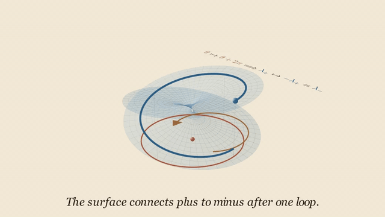
</p>

<p align="center"><em><strong>Exceptional point monodromy.</strong> This pipeline run studies the matrix family A(z) = [[0, 1], [z, 0]]. Its eigenvalues are lambda_+ and lambda_- = +/-sqrt(z), so the branch point at z = 0 is an exceptional point. The 3D set piece draws the two-sheeted square-root surface on an archival off-white stage: one loop around z = 0 lifts from the plus sheet to the minus sheet, while two loops return to the original branch. The mechanism is angle halving: if z = r e^{i theta}, then lambda = sqrt(r)e^{i theta/2}, so a full 2pi turn downstairs becomes only a pi turn upstairs.</em></p>

<br />

<p align="center">
  <a href="docs/showcase/README.md"></a>
  <a href="docs/showcase/README.md"></a>
  <a href="docs/showcase/README.md">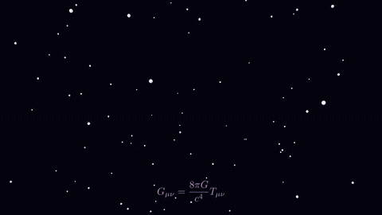</a>
  <a href="docs/showcase/README.md"></a>
</p>

<p align="center"><em><strong>Featured loop row.</strong> Annuli unwrap to prove A = pi r^2; an Archimedean solid exposes symmetry by rotation; spacetime curvature is staged as a warped 3D field; GRPO turns ranked completions into a geometric policy update.</em></p>

<p align="center">
  <a href="docs/showcase/README.md">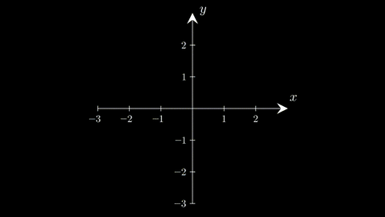</a>
  <a href="docs/showcase/README.md"></a>
  <a href="docs/showcase/README.md"></a>
  <a href="docs/showcase/README.md">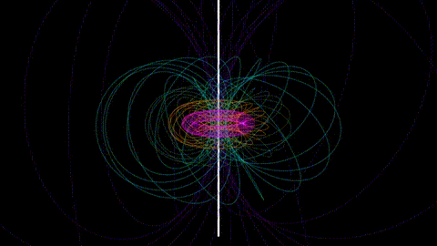</a>
</p>

<p align="center"><em><strong>Local mechanism row.</strong> A derivative is built from local linearization; ProLIP is shown as graph-structured molecular interaction; the Lorenz system accumulates into a strange attractor; the Hopf fibration turns linked fibers into a spatial projection problem.</em></p>

<p align="center">
  <a href="docs/showcase/README.md"></a>
  <a href="docs/showcase/README.md">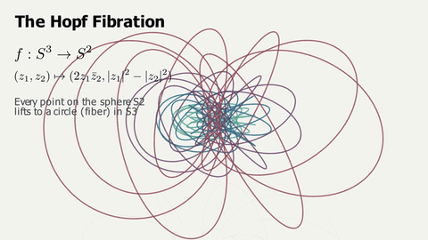</a>
  <a href="docs/showcase/README.md"></a>
  <a href="docs/showcase/README.md"></a>
  <a href="docs/showcase/README.md"></a>
</p>

<p align="center"><em><strong>Analysis and abstraction row.</strong> Fourier epicycles add rotating modes into a traced signal; the teaching Hopf loop slows the same fibration into steps; Brownian finance moves from accumulated change to stochastic paths; radius of convergence marks where a power series stops controlling the function; whiskering exchange renders a category-theory identity as a commuting diagram.</em></p>

**You type one sentence. Six reasoning agents tear it apart, reason backward to everything a mind would need to already know, rebuild that knowledge as a curriculum, choreograph it shot by shot, and hand you a cinematic Manim film — plus every artifact that produced it. In v1.1 the whole engine is one clean package with three front doors: a CLI, a REST API, and an MCP server. The baseline model is Claude Fable 5.**

</div>

---

## What's new in v1.1

v1.1 is the release where the Mythos chain stops being a layer and becomes **the** pipeline.

| Change | What it means |
|---|---|
| **One engine** | The 6-agent Mythos chain (`mythos/`) is now the single pipeline. The v1.0 Codex/OpenAI typed pipeline, its tests, evals, and the Hermes operator agent are preserved under [`archive/`](archive/) — nothing deleted, nothing imported. |
| **REST API** | `math-to-manim serve-api` starts a FastAPI service: `POST /v1/runs` with one sentence, poll the job, download every artifact. [Details.](#the-api) |
| **MCP server** | `math-to-manim serve-mcp` exposes the chain to any MCP client (Claude Desktop, Claude Code, Cowork) as seven tools. Your assistant can now *make films*. [Details.](#the-mcp-server) |
| **One clean package** | `pip install -e .` gives you `mythos/` and two commands: `math-to-manim` and its short alias `m2m`. Core dependency: pydantic. Everything else is an extra (`[api]`, `[mcp]`, `[render]`). |
| **Offline everything** | The entire chain, the API, and every MCP tool run deterministically with `--offline` — zero model calls, zero render deps. CI proves it on every push. |
| **New showcase films** | The reverse reasoning tree and the grammar reel, written in the engine's own cinematography grammar and rendered to the GIFs at the top of this page. |

---

## The morning it started

Math-To-Manim began on the morning of Donald Trump's inauguration — **January 20, 2025 — the day the reasoning models arrived.** I do not think it was an accident that the Chinese decided to release the R1 model on that day.

I was awake, saw the model hit Hugging Face, and quickly built a `.ipynb` to load the model and run it.

I created this repo at `2025-01-20T11:04:50Z` / `04:04:50 MST`.

Within a couple of minutes I realized what this meant. If the Chinese, via GRPO, had reasoning on a chip, recursive reasoning was not far behind. In my tweet I wrote "Wrap it up, its over" and I still believe it.

```text
09a2f22  2025-01-20T04:24:50-07:00  updated
A        DeepSeek_R1_zero.ipynb
A        Readme.md
```

Three hours later, the first Manim file landed: `pythagorean.py` at `2025-01-20T07:18:12-07:00`.

<p align="center">
  <a href="https://x.com/christiancooper/status/1881335734256492605?s=20"></a>
</p>

> "I asked #R1 to visually explain to me the Pythagorean theorem. This was done in one shot with no errors in less than 30 seconds. Wrap it up, its over: #DeepSeek #R1"
>
> — [Christian H. Cooper, January 20, 2025](https://x.com/christiancooper/status/1881335734256492605?s=20)

What R1 proved that morning is that a reasoning model was already good at Manim out of the box. What this repo became is the thesis taken seriously: **if one shot of reasoning gets you a clean Pythagorean proof, a chain of recursive reasoning gets you a film.** Six planning agents now reason over your prompt — backward, then forward — before a single line of scene code is generated, validated, rendered, and reviewed.

-christian

---

## The reverse reasoning tree

Every text-to-code demo you have seen jumps straight from request to Python. Math-To-Manim takes the long way on purpose, and the long way is the product.

<p align="center">
  
</p>

The pipeline's first move is not "write code" — it is a question: **what would a mind need to already hold for this idea to land?** Then it asks that question again, of each answer, recursively, until it bottoms out at things the viewer already knows. That is the reverse reasoning tree:

<p align="center">
  
</p>

<p align="center"><sub><i>The engine drawing its own README diagram: the Mythos chain took the tree above as a "README artifact" and the scene-composer rendered it in the house style — <a href="examples/mythos/readme_reverse_tree.py"><code>examples/mythos/readme_reverse_tree.py</code></a>.</i></sub></p>

The tree is built backward from the target and then **walked forward as a curriculum**: the film teaches the leaves first, so that by the time the camera reaches the QED Lagrangian, every symbol on screen has already been earned. That single design decision is why the output feels like teaching instead of decoration.

The tree is not a metaphor — it is a file. Every run writes it to disk as `02_knowledge_map.json`, an artifact you can open, inspect, and edit before any code exists.

---

## The Mythos engine

<p align="center">
  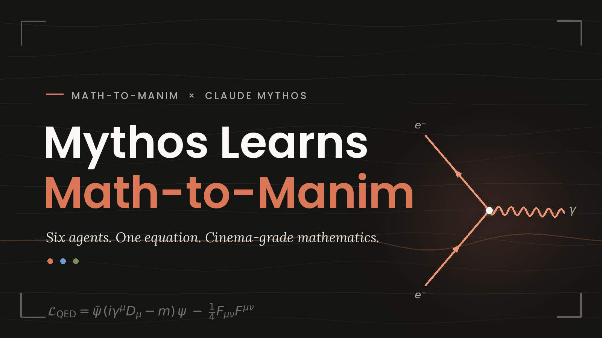
</p>

**This repo is built around Claude Fable 5.** The six agents are Claude Code subagents; the harness drives them headlessly through the Claude CLI with `claude-fable-5` as the baseline; every frame is written with the camera as narrator — plain-language headlines before symbols, flights into the exact term being explained, pull-backs to restore context, true-3D set pieces.

The chain: **intent → cartographer → curriculum → math-director → cinematographer → scene-composer**, then codegen → static checks → render → self-repair.

| Agent | Question it answers | Artifact |
|---|---|---|
| **Intent** | What is the learner really asking, and at what level? | `01_intent.json` |
| **Cartographer** | What is the reverse reasoning tree beneath the target? | `02_knowledge_map.json` |
| **Curriculum** | In what order does the tree become teachable? | `03_curriculum.json` |
| **Math-director** | Which definitions, equations, and examples carry the load? | `04_math_dossier.json` |
| **Cinematographer** | What does the camera do, beat by beat? | `05_shot_list.json` |
| **Scene-composer** | How does the shot list compile into Manim objects and timing? | `06_scene_spec.json` |

| Piece | Where | What it does |
|---|---|---|
| Agent charters | [`mythos/agents/`](mythos/agents/) (mirror to `.claude/agents/` for native Claude Code use) | The six minds of the chain, one markdown charter each — the single source of truth |
| Harness | [`mythos/harness.py`](mythos/harness.py) | Runs the whole chain via `claude -p --model claude-fable-5`; artifacts land in `runs/mythos/<ts>/`; `--offline` rehearsal mode needs no login |
| Camera grammar | [`mythos/cinematography.py`](mythos/cinematography.py) | `headline`, `zoom_to`, `pull_back`, `term_tour`, `tilt_to_3d`, glows — the Mythos house style, Anthropic palette |
| Cinematic Charter | [`mythos/charter.py`](mythos/charter.py) | The visual contract injected into every generation |
| Service core | [`mythos/service.py`](mythos/service.py) | Job orchestration shared by the CLI, the API, and the MCP server |
| Backends | [`mythos/backends.py`](mythos/backends.py) | Claude CLI (default) · Codex CLI · any OpenAI-compatible endpoint |
| Flagship films | [`examples/mythos/`](examples/mythos/) | QED in 8 acts, the Sound of Spacetime, the reverse reasoning tree, the grammar reel |

```bash
pip install -e ".[dev]"

# the whole chain, one line, Fable 5 as the baseline
math-to-manim run "explain quantum field theory" --render -q m

# or render a flagship directly
manim -qh examples/mythos/qft_cinematic.py QFTCinematicJourney
```

The model backend is a seam, not a marriage: `--model` overrides the model, `--command fugu-api` routes the same chain through an OpenAI-compatible endpoint, and `--command codex` uses the Codex CLI. The v1.0 typed pipeline that these seams grew out of is preserved in [`archive/codex-pipeline/`](archive/).

<p align="center">
  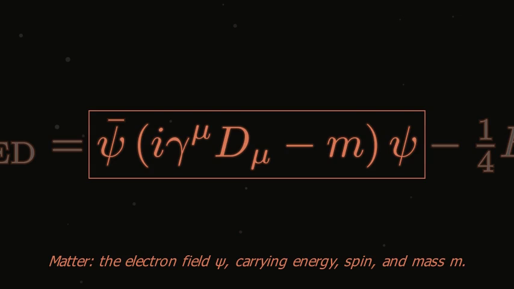
  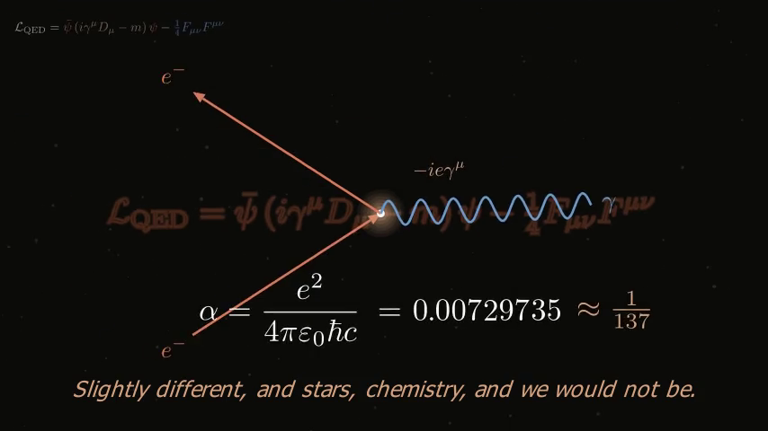
</p>

<p align="center"><em>Stills from the Mythos cut of the QED journey: the camera inside the Lagrangian (left); the e⁻e⁻γ vertex as α resolves to 1/137 (right).</em></p>

### The grammar, in thirty seconds

<p align="center">
  
</p>

Headline before symbols. Camera into the exact term. Caption everything. Tilt into 3D only when the idea itself is 3D. That is the whole contract — [`mythos/charter.py`](mythos/charter.py) spells it out, the static verifier enforces the camera rules, and every agent in the chain writes toward it.

---

## Quickstart

```bash
git clone https://github.com/HarleyCoops/Math-To-Manim.git
cd Math-To-Manim
python -m venv .venv && source .venv/bin/activate     # PowerShell: .\.venv\Scripts\Activate.ps1
pip install -e ".[dev]"
pytest                                                # 29 tests, all offline
```

**Prove the plumbing with zero model calls** — the offline mode runs the entire chain with deterministic artifacts:

```bash
math-to-manim run "the heat equation" --offline
math-to-manim runs        # inspect the on-disk ledger
```

**Make a real film** — needs only a logged-in Claude CLI; the defaults already point at `claude-fable-5`:

```bash
math-to-manim run "Show why the quantum harmonic oscillator only allows discrete energies: start with a springy potential well, zoom into the wavefunctions, then reveal the ladder of allowed energy levels." --render -q l
```

**Render extras** (FFmpeg + LaTeX are system deps; on Debian/Ubuntu/WSL run [`./scripts/bootstrap-render.sh`](scripts/bootstrap-render.sh)):

```bash
pip install -e ".[dev,render]"
```

Every run writes a self-contained bundle:

```text
runs/mythos/<timestamp>-<slug>/
  01_intent.json           what the learner is really asking
  02_knowledge_map.json    the reverse reasoning tree
  03_curriculum.json       the tree, walked forward
  04_math_dossier.json     the formulas that carry the load
  05_shot_list.json        what the camera does, beat by beat
  06_scene_spec.json       the compiled visual plan
  *.raw.txt                full model traces for every stage
  mythos_scene.py          the film, as runnable Manim CE
  manifest.json            stages, timing, checks, renders
```

The chain reasons in JSON so the artifacts stay legible: prune a branch of `02_knowledge_map.json` mid-run and the rest of the chain inherits your edit; render failures feed a bounded repair loop instead of crashing the run.

<p align="center">
  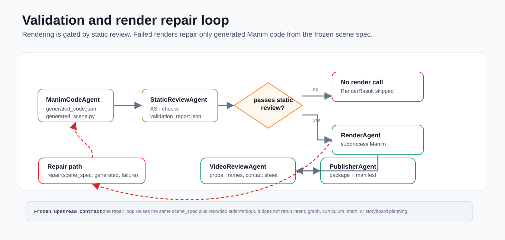
</p>

---

## The API

New in v1.1: the engine as a service. Start it:

```bash
pip install -e ".[api]"
math-to-manim serve-api            # http://127.0.0.1:8642 · OpenAPI docs at /docs
```

| Method | Route | What it does |
|---|---|---|
| `GET` | `/health` | Liveness + version |
| `POST` | `/v1/runs` | Submit a prompt; returns a job record immediately (202) |
| `GET` | `/v1/jobs/{job_id}` | Poll a job: `queued → running → completed \| failed` |
| `GET` | `/v1/runs` | The on-disk run ledger, newest first |
| `GET` | `/v1/runs/{run_id}` | Full manifest + artifact listing for one run |
| `GET` | `/v1/runs/{run_id}/artifacts/{name}` | One artifact's content (JSON or Python) |

```bash
# one sentence in…
curl -s -X POST localhost:8642/v1/runs \
  -H "Content-Type: application/json" \
  -d '{"prompt": "explain fourier epicycles as rotating vectors", "render": false}'

# …poll the job, then read the film
curl -s localhost:8642/v1/jobs/<job_id>
curl -s localhost:8642/v1/runs/<run_id>/artifacts/mythos_scene.py
```

The API is a thin wrapper over [`mythos/service.py`](mythos/service.py) — the same core the CLI and MCP server use, so behavior never forks between front doors. Try the whole loop without a model login by adding `"offline": true` to the POST body.

---

## The MCP server

Also new in v1.1: any MCP client can drive the engine. Claude Desktop, Claude Code, and Cowork can turn a sentence in a conversation into a rendered film and then read back every reasoning artifact that produced it.

```bash
pip install -e ".[mcp]"
math-to-manim serve-mcp                                    # stdio
math-to-manim serve-mcp --transport streamable-http       # remote, :8643
```

Claude Desktop / Claude Code config:

```json
{
  "mcpServers": {
    "math-to-manim": {
      "command": "math-to-manim",
      "args": ["serve-mcp"]
    }
  }
}
```

| Tool | What it does |
|---|---|
| `m2m_create_animation` | One sentence in; starts the 6-agent chain as a background job |
| `m2m_get_job` | Poll a job until the chain completes |
| `m2m_list_runs` | The on-disk run ledger, newest first |
| `m2m_get_run` | Full manifest + artifact listing for one run |
| `m2m_get_artifact` | Read any artifact: the reverse reasoning tree, the shot list, … |
| `m2m_get_scene_code` | The generated Manim scene, ready to render |
| `m2m_cinematic_charter` | The house-style contract, so an assistant can write scenes directly |

That last tool is the quiet superpower: an MCP client that already writes code can pull the Cinematic Charter and the [cinematography grammar](mythos/cinematography.py) and compose Mythos-style scenes itself, using the chain only when it wants the full reasoning treatment.

---

## Prime Intellect RL repair loop

Math-To-Manim is also becoming a Prime Intellect reinforcement-learning environment. The first RL target is not "make the whole video in one shot." It is the edit move that matters after a base model produces a plausible but flawed scene: text overlaps formulas, equations are too small, the camera angle hides the point, or the zoom never lands on the symbol the learner needs to read.

The experiment: give the model the scene plan, the generated Python, validation/render evidence, and a human request such as "fix the overlap" or "zoom into the formulas before the narration moves on." The policy should return a sparse code edit that preserves the scene while making the movie more readable.

<p align="center">
  
</p>

<p align="center">
  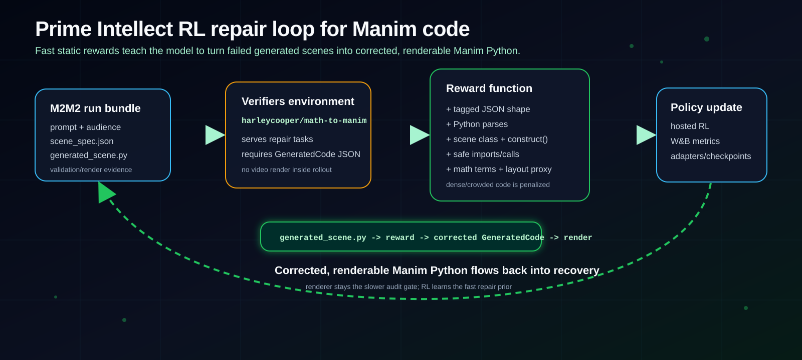
</p>

<table>
<tr>
<td width="33%">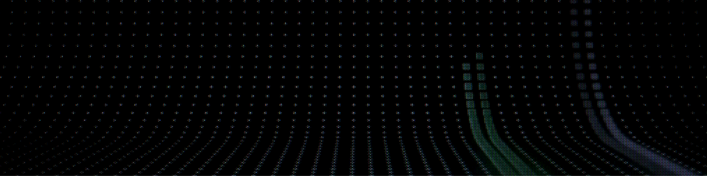</td>
<td width="33%"></td>
<td width="33%">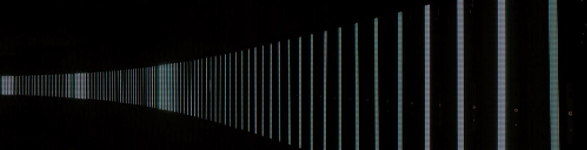</td>
</tr>
<tr>
<td><b>Run bundle as environment</b></td>
<td><b>Reward function as critic</b></td>
<td><b>Policy update as repair engine</b></td>
</tr>
</table>

The hub environment is `harleycooper/math-to-manim` (published at `0.1.1`; a 25-step W&B pilot ran on `Qwen/Qwen3.5-35B-A3B`). The v1.0 environment scaffolding now lives in [`archive/codex-pipeline/environments/`](archive/); integration notes in [`docs/PRIME_INTELLECT_RL.md`](docs/PRIME_INTELLECT_RL.md).

---

## Motion showcase

Sixteen-plus curated GIFs are tracked under [`docs/showcase/assets/`](docs/showcase/assets/) as the **art direction target** for Math-To-Manim's visual explanations.

<table>
<tr>
<td width="33%"><a href="docs/showcase/README.md"></a></td>
<td width="33%"><a href="docs/showcase/README.md"></a></td>
<td width="33%"><a href="docs/showcase/README.md"></a></td>
</tr>
<tr>
<td><b>Geometry as spectacle</b></td>
<td><b>Topology as choreography</b></td>
<td><b>Chaos as intuition</b></td>
</tr>
</table>

See the full gallery with descriptions: **[`docs/showcase/README.md`](docs/showcase/README.md)**.

### Make a README-sized GIF from a render

```bash
MP4="media/videos/your_scene/480p15/YourScene.mp4"

ffmpeg -y -ss 95 -t 24 -i "$MP4" \
  -vf "fps=12,scale=720:-1:flags=lanczos,split[s0][s1];[s0]palettegen=max_colors=96[p];[s1][p]paletteuse=dither=bayer:bayer_scale=5" \
  docs/showcase/assets/your-clip.gif
```

Adjust `-ss` and `-t` to capture the teaching beat you want. That is exactly how every GIF on this page was made.

---

## Repository layout

```text
mythos/            the engine: harness, charter, backends, service, api, mcp_server, cli
mythos/agents/     the six agent charters (markdown — the single source of truth)
examples/mythos/   flagship hand-finished films
tests/             offline test suite (no model calls, no render deps)
docs/              showcase gallery, roadmap, RL notes, assets
scripts/           render bootstrap for Debian/Ubuntu/WSL
archive/           v1.0 typed pipeline, Hermes agent, papers — retired, kept for history
legacy/            the original January 2025 repo, untouched
```

## License

MIT.
