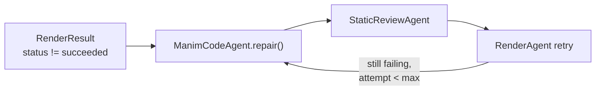

# Codex and OpenAI Agents SDK Refactor Architecture

M2M2 turns a short mathematical prompt into validated educational animation
artifacts. The refactor keeps the public Math-To-Manim idea of a reverse
knowledge tree, but makes each stage explicit, testable, and provider-agnostic.

## Goals

- Preserve the prompt-to-Manim workflow while replacing ad hoc agent scripts with
  typed stage contracts.
- Keep LLM output reviewable by emitting intermediate artifacts before code.
- Make failures local: a bad visual plan should not require rerunning concept
  discovery, and a bad render should not require rerunning planning.
- Support Codex workers in parallel by assigning stable file ownership and
  artifact handoff points.

## Runtime shape

Execution is **single-threaded and strictly ordered**: `AnimationPipeline.generate()`
in `math_to_manim/pipeline/runner.py` walks a fixed list of stage agents. There is
no hidden parallelism; each arrow in the diagrams below is a synchronous call whose
output becomes the input type for the next stage.

**What gets written:** the runner saves `request.json` first, then almost every
stage adds a sibling JSON file under the new `runs/<timestamp>-<slug>/`
directory (`intent.json`, `knowledge_graph.json`, and so on). `trace.jsonl` records the same boundaries as structured events, and
`manifest.json` summarizes artifact keys for that run. That is the concrete meaning
of “typed pipeline”: the disk layout mirrors the control flow.

**LLM vs deterministic:** when `RuntimeConfig.deterministic` is false (default),
planning stages call `run_structured_sdk_agent()` and return Pydantic artifacts.
When deterministic, stages fall back to scaffolded graphs or templates so CI and
offline runs stay reproducible. Code generation uses the Agents SDK,
`CodexCliProvider`, or a tiny deterministic Manim stub—see `ManimCodeAgent`.
Rendering and static validation are tool-backed (Python AST, subprocess Manim).

**Mermaid in docs:** GitHub renders fenced `mermaid` blocks in Markdown. If you
paste the same source into [mermaid.live](https://mermaid.live), you get an
editable canvas and optional PNG or SVG export—similar in spirit to services like
mermaid.ink, without checking rendered bitmaps into git.

### What the main diagram shows

The graph is an **artifact chain**, not a sociogram of agents chatting. Each box
names the Python stage class; the second line in a node is the primary JSON file
produced for inspectability and reruns.

```mermaid
flowchart TB
  subgraph planning["Planning — intent through scene spec"]
    REQ["UserRequest"]
    IA["IntentAgent"]
    CI["ConceptIntent\n(intent.json)"]
    PGA["PrerequisiteGraphAgent"]
    KG["KnowledgeGraph\n(knowledge_graph.json)"]
    CA["CurriculumAgent"]
    CUR["CurriculumPlan\n(curriculum.json)"]
    MA["MathAgent"]
    MP["MathPacket\n(math_packet.json)"]
    SA["StoryboardAgent"]
    SB["VisualStoryboard\n(storyboard.json)"]
    SSA["SceneSpecAgent"]
    SPEC["ManimSceneSpec\n(scene_spec.json)"]

    REQ --> IA --> CI --> PGA --> KG --> CA --> CUR --> MA --> MP --> SA --> SB --> SSA --> SPEC
  end

  subgraph codegen["Code — generation and static gate"]
    MCA["ManimCodeAgent"]
    GC["GeneratedCode\n(generated_code.json)"]
    PY["generated_scene.py"]
    SRA["StaticReviewAgent"]
    VAL["ValidationReport\n(validation_report.json)"]

    SPEC --> MCA --> GC --> PY --> SRA --> VAL
  end

  subgraph render_pkg["Render — subprocess Manim + packaging"]
    RA["RenderAgent"]
    RR["RenderResult\n(render_result.json)"]
    VRA["VideoReviewAgent"]
    REV["VideoReviewReport\n(review_report.json)"]
    PA["PublisherAgent"]
    PKG["AnimationPackage\n(animation_package.json)"]

    VAL --> RA --> RR --> VRA --> REV --> PA --> PKG
  end
```

Rendering runs only when rendering was requested **and** static validation
reports success; otherwise `RenderAgent.run` is never called and the runner
synthesizes a skipped `RenderResult` so downstream stages still receive the same
schema shape. The skipped record carries stderr explaining whether the skip was
intentional (`--no-render`) or due to validation failure.

### Render repair loop (when Manim fails)

Failed renders can trigger a bounded repair cycle **without** recomputing earlier
planning artifacts. `ManimCodeAgent.repair()` consumes the same frozen
`ManimSceneSpec` plus stderr or stdout; static validation must pass again before
a retry. Attempts are capped by `RuntimeConfig.max_render_repairs`.

When `codegen_provider=codex-cli`, repair calls `CodexCliProvider.repair_code` on
the same path.

### Mapping to classic Math-To-Manim names

The public repo names stages after pedagogy (ConceptAnalyzer, PrerequisiteExplorer,
and similar). M2M2 keeps that **idea** but folds some narrative steps into single
typed artifacts so the chain stays short and testable.

| Legacy mental model | M2M2 stage(s) | Artifact |
| --- | --- | --- |
| Concept / goal framing | `IntentAgent` | `intent.json` |
| Reverse knowledge tree | `PrerequisiteGraphAgent` | `knowledge_graph.json` |
| Teachable ordering | `CurriculumAgent` | `curriculum.json` |
| Equations and definitions | `MathAgent` | `math_packet.json` |
| Visual plus narrative design | `StoryboardAgent` | `storyboard.json` |
| Compiler-like scene contract | `SceneSpecAgent` | `scene_spec.json` |
| Code generation and repair | `ManimCodeAgent` | `generated_code.json`, `generated_scene.py` |
| Syntax and scene class checks | `StaticReviewAgent` | `validation_report.json` |
| FFmpeg or Manim subprocess | `RenderAgent` | `render_result.json` |
| Draft review handoff | `VideoReviewAgent` | `review_report.json` |
| Final bundle metadata | `PublisherAgent` | `animation_package.json` |

## Agent roles (implementation)

Orchestration today is the pipeline runner, not nested SDK handoffs between every
stage. Individual stages still use the Agents SDK (structured outputs) or Codex
CLI where configured; tools handle AST checks, filesystem writes, Manim, and
video probing.

| Stage class | Typical mechanism | Primary output schema |
| --- | --- | --- |
| `IntentAgent` | Agents SDK structured call or deterministic scaffold | `ConceptIntent` in `intent.json` |
| `PrerequisiteGraphAgent` | Agents SDK | `KnowledgeGraph` |
| `CurriculumAgent` | Agents SDK or topological fallback from graph | `CurriculumPlan` |
| `MathAgent` | Agents SDK | `MathPacket` |
| `StoryboardAgent` | Agents SDK | `VisualStoryboard` |
| `SceneSpecAgent` | Agents SDK | `ManimSceneSpec` |
| `ManimCodeAgent` | Agents SDK, Codex CLI provider, or deterministic code | `GeneratedCode` |
| `StaticReviewAgent` | AST and scene discovery tools | `ValidationReport` |
| `RenderAgent` | Subprocess Manim | `RenderResult` |
| `VideoReviewAgent` | Probe and scoring helpers | `VideoReviewReport` |
| `PublisherAgent` | Pure assembly | `AnimationPackage` |

Use SDK handoffs inside a stage when a specialist needs to take over one
structured call. Use function tools for deterministic steps such as schema
validation, filesystem I/O, Manim invocation, and artifact packaging. Use
guardrails at the first input, final output, and tool boundary where malformed
code or unsafe file access can cause downstream failures.

## Codex Worker Boundaries

Codex is a development and maintenance worker, not a required runtime dependency.
Workers should communicate through files and docs rather than shared memory.

- Package/runtime workers own application code and tests.
- Docs/evals workers own `docs/**`, `evals/**`, `examples/reference/**`, and
  non-overlapping `scripts/**`.
- Generated media should stay out of source control unless a later owner defines
  a golden-artifact policy.

## Provider Policy

The refactor should not encode Anthropic, Gemini, Kimi, or OpenAI assumptions
inside artifact schemas. Provider-specific clients belong behind stage runners.
The same `scene_spec` should be accepted by any compatible Manim code generator.

For OpenAI implementations, prefer the Agents SDK primitives documented by
OpenAI: agents, tools, handoffs, guardrails, sessions, and tracing. Tracing is
especially useful because it records model generations, tool calls, handoffs,
and guardrail activity across a run.

## Failure Handling

- Schema failure: stop the stage, return a validation report, and preserve the
  last valid upstream artifact.
- Code syntax failure: repair only the generated Manim file from the same
  `scene_spec`.
- Render failure: record command, stderr summary, environment, and scene class.
- Eval failure: keep the artifacts and mark the run non-shipping; do not delete
  evidence needed for debugging.

## Source Links

- Public baseline: https://github.com/HarleyCoops/Math-To-Manim
- Codex docs: https://platform.openai.com/docs/codex
- Agents SDK docs: https://openai.github.io/openai-agents-python/
- Agents SDK tracing: https://openai.github.io/openai-agents-python/tracing/

