# Codex and OpenAI Agents SDK Refactor Architecture

M2M2 turns a short mathematical prompt into validated educational animation
artifacts. The refactor keeps the public Math-To-Manim idea of a reverse
knowledge tree, but makes each stage explicit, testable, and provider-agnostic.

## Goals

- Preserve the prompt-to-Manim workflow while replacing ad hoc agent scripts with
  typed stage contracts.
- Keep LLM output reviewable by emitting intermediate artifacts before code.
- Make failures local: a bad visual plan should not require rerunning concept
  discovery, and a bad render should not require rerunning planning.
- Support Codex workers in parallel by assigning stable file ownership and
  artifact handoff points.

## Runtime Shape

```mermaid
flowchart LR
  A["User prompt"] --> B["Request normalizer"]
  B --> C["Concept planner"]
  C --> D["Prerequisite explorer"]
  D --> E["Mathematical enricher"]
  E --> F["Visual designer"]
  F --> G["Narrative composer"]
  G --> H["Scene spec compiler"]
  H --> I["Manim code generator"]
  I --> J["Static validator"]
  J --> K["Renderer"]
  K --> L["Artifact packager"]
  L --> M["Eval record"]
```

## Agent Roles

The OpenAI Agents SDK should be used as the application orchestration layer.
Agents own decisions; tools own deterministic work.

| Stage | Agent or tool | Output |
| --- | --- | --- |
| Request normalizer | tool | `request_spec` |
| Concept planner | agent | `concept_plan` |
| Prerequisite explorer | agent with bounded depth | `knowledge_tree` |
| Mathematical enricher | agent with math validation tools | `math_enrichment` |
| Visual designer | agent | `visual_spec` |
| Narrative composer | agent | `narrative_spec` |
| Scene spec compiler | tool or constrained agent | `scene_spec` |
| Manim code generator | agent | `manim_artifact` |
| Static validator | tool | syntax, imports, scene-class checks |
| Renderer | tool | `render_artifact` |
| Eval grader | tool plus optional judge agent | `eval_record` |

Use SDK handoffs when a stage needs a specialist to take over the conversation.
Use function tools for deterministic steps such as schema validation, filesystem
I/O, Manim invocation, and artifact packaging. Use guardrails at the first input,
final output, and tool boundary where malformed code or unsafe file access can
cause downstream failures.

## Codex Worker Boundaries

Codex is a development and maintenance worker, not a required runtime dependency.
Workers should communicate through files and docs rather than shared memory.

- Package/runtime workers own application code and tests.
- Docs/evals workers own `docs/**`, `evals/**`, `examples/reference/**`, and
  non-overlapping `scripts/**`.
- Generated media should stay out of source control unless a later owner defines
  a golden-artifact policy.

## Provider Policy

The refactor should not encode Anthropic, Gemini, Kimi, or OpenAI assumptions
inside artifact schemas. Provider-specific clients belong behind stage runners.
The same `scene_spec` should be accepted by any compatible Manim code generator.

For OpenAI implementations, prefer the Agents SDK primitives documented by
OpenAI: agents, tools, handoffs, guardrails, sessions, and tracing. Tracing is
especially useful because it records model generations, tool calls, handoffs,
and guardrail activity across a run.

## Failure Handling

- Schema failure: stop the stage, return a validation report, and preserve the
  last valid upstream artifact.
- Code syntax failure: repair only the generated Manim file from the same
  `scene_spec`.
- Render failure: record command, stderr summary, environment, and scene class.
- Eval failure: keep the artifacts and mark the run non-shipping; do not delete
  evidence needed for debugging.

## Source Links

- Public baseline: https://github.com/HarleyCoops/Math-To-Manim
- Codex docs: https://platform.openai.com/docs/codex
- Agents SDK docs: https://openai.github.io/openai-agents-python/
- Agents SDK tracing: https://openai.github.io/openai-agents-python/tracing/

