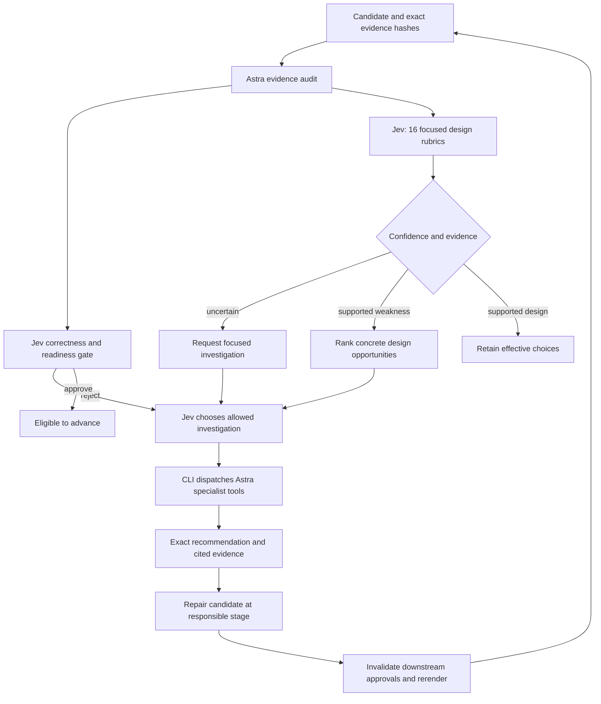

# Jev decision map for ambitious mathematical films

The goal is an explanation whose geometry earns its spectacle: a camera move
reveals a relationship, color carries mathematical meaning, and the final
formula names what the audience has just seen. More motion and more notation
are not automatically better.

Astra generates and investigates; TypeSafe Jev evaluates typed questions; the
CLI dispatches allowed actions and records evidence. Jev is text-only. For
rendered material it receives attributed Astra observations, not image pixels.

## Decision and repair flow



The correctness/readiness gate controls advancement. Design scores are advisory;
weak artistic scores do not silently invalidate an otherwise approved run.
Automatic investigations currently run after rejected gates. Operators can run
`recommend --design --execute` on an accepted candidate to investigate additional
artistic improvements; that command records advice without editing the film or
changing its approvals. Any resulting source change still requires a fresh
render and approval. The diagram shows the full repair workflow, including
operator-directed artistic revisions.

## How each decision is scored

Every row below becomes its own Score question with five ordered levels:

| Level | Meaning |
|---|---|
| 0 | Absent or contradicted by the supplied evidence |
| 1 | Major failure supported by evidence |
| 2 | Partly effective, with a specific unresolved weakness |
| 3 | Effective with minor limitations |
| 4 | Exceptionally clear and purposeful, supported by concrete evidence |

The returned value is an expected score, not an integer vote. Confidence below
0.65 marks **investigate**: obtain better evidence rather than inventing a fix.
Confidence at least 0.65 and score below 3.2 marks **improve**. Other results are
**supported**. These thresholds are provisional engineering policy, not measured
quality or correctness probabilities. There is no averaged “epic score” that can
hide a wrong formula or an unreadable shot.

## Detailed mapping

### Dramatic Question

**Domain:** art. **Checkpoints:** brief, storyboard, render.

**Jev question:** Does the opening establish a specific visual question whose answer the film reveals?

**Required evidence:** Opening shot plan or timestamped observations.

**Investigation:** `clarify_definitions`. **Concrete repair:** Replace a generic title-first opening with a visible puzzle; preserve a short orientation beat.

**Verification:** A viewer can state the question after the opening.

### Geometric Reveal

**Domain:** art. **Checkpoints:** storyboard, scene, render.

**Jev question:** Does a geometric transformation reveal the central mathematical relationship rather than merely decorate narration?

**Required evidence:** Transformation specification, source, or before/after frame observations.

**Investigation:** `replan_camera`. **Concrete repair:** Stage the actual mathematical transformation before its symbolic conclusion.

**Verification:** The relevant relation is visibly identifiable before the summary formula.

### Visual Hierarchy

**Domain:** clarity. **Checkpoints:** storyboard, scene, render.

**Jev question:** Is one primary mathematical object or event visually dominant in each shot?

**Required evidence:** Shot composition or per-frame descriptions.

**Investigation:** `replan_camera`. **Concrete repair:** Dim scaffolding, remove competing labels, and isolate the object that carries the argument.

**Verification:** The focal object remains distinguishable at delivery resolution.

### Definition Order

**Domain:** clarity. **Checkpoints:** brief, mathematics, storyboard, render.

**Jev question:** Are prerequisite terms and symbols introduced before their first consequential use?

**Required evidence:** First-use timeline and captions.

**Investigation:** `clarify_definitions`. **Concrete repair:** Move or add a concise definition immediately before first use.

**Verification:** Every new symbol has an earlier or simultaneous explicit meaning.

### Reading Time

**Domain:** clarity. **Checkpoints:** storyboard, scene, render.

**Jev question:** Does each new formula have a stable reading interval without competing camera or topology changes?

**Required evidence:** Timed storyboard and source schedule; isolated stills cannot verify duration.

**Investigation:** `inspect_scene`. **Concrete repair:** Separate reveal, explanation, and motion; add a hold sized to formula complexity.

**Verification:** Source and sampled timestamps support a readable interval; flag unobserved motion.

### Latex Hierarchy

**Domain:** latex. **Checkpoints:** storyboard, scene, render.

**Jev question:** Is the principal equation clearly distinguished from definitions and secondary annotations?

**Required evidence:** Exact MathTex strings, font sizes, overlay bounds, actual frame observations.

**Investigation:** `replan_camera`. **Concrete repair:** Keep one principal formula, subordinate captions, and clear screen-space bands.

**Verification:** Main equation remains readable without competing text.

### Latex Integrity

**Domain:** latex. **Checkpoints:** mathematics, storyboard, scene, render.

**Jev question:** Do visible LaTeX expressions preserve grouping, domains, signs, indices and mathematical meaning?

**Required evidence:** Approved equations versus exact source strings and rendered observations.

**Investigation:** `check_math`. **Concrete repair:** Correct the exact expression; color whole semantic terms without splitting radicands or indices.

**Verification:** Source and rendered expression agree with the mathematical dossier.

### Symbol Geometry Binding

**Domain:** latex. **Checkpoints:** storyboard, scene, render.

**Jev question:** Can each important symbol be connected unambiguously to the geometric object it describes?

**Required evidence:** Symbol legend, object colors and shot transitions.

**Investigation:** `clarify_definitions`. **Concrete repair:** Highlight the corresponding object as its symbol appears; maintain consistent colors.

**Verification:** Symbol-to-object associations remain consistent across shots.

### Camera Purpose

**Domain:** camera. **Checkpoints:** storyboard, scene, render.

**Jev question:** Does each camera move reveal depth, an invariant, a hidden relationship or a local event?

**Required evidence:** Camera targets and per-shot teaching purpose.

**Investigation:** `replan_camera`. **Concrete repair:** Replace arbitrary orbiting with a move that exposes the mathematical relation.

**Verification:** Each movement has a named explanatory purpose.

### Local Global Bridge

**Domain:** camera. **Checkpoints:** storyboard, scene, render.

**Jev question:** Does the sequence restore global orientation after a local close-up?

**Required evidence:** Wide/detail/return sequence and camera centers.

**Investigation:** `replan_camera`. **Concrete repair:** Establish the whole object, push into the critical region, then pull back to reconnect the result.

**Verification:** Local events remain locatable on the full object.

### Camera Clearance

**Domain:** camera. **Checkpoints:** scene, render.

**Jev question:** Do the inspected views keep the critical geometry visible and clear of fixed overlays?

**Required evidence:** Projected bounds or actual frame observations; source intent alone is insufficient.

**Investigation:** `inspect_frames`. **Concrete repair:** Change target, zoom or angle; relocate labels into reserved screen space.

**Verification:** Re-render the affected views and inspect their actual bounds.

### Spatial Depth

**Domain:** space. **Checkpoints:** storyboard, scene, render.

**Jev question:** Do occlusion, mesh, lighting and perspective make the relevant three-dimensional structure legible?

**Required evidence:** Surface/material plan, source and frame observations.

**Investigation:** `replan_camera`. **Concrete repair:** Use restrained mesh, directional shading, depth-aware opacity and a revealing oblique view.

**Verification:** Near/far surfaces and the relevant opening can be distinguished.

### Surface Volume Boundary

**Domain:** space. **Checkpoints:** mathematics, storyboard, scene, render.

**Jev question:** Does the explanation distinguish surfaces, enclosed volumes and boundary curves wherever their distinction matters?

**Required evidence:** Definitions, geometric construction, captions and frame observations.

**Investigation:** `check_math`. **Concrete repair:** Render and label the correct dimensional object; remove misleading filled-volume metaphors.

**Verification:** The displayed object has the intended dimension and boundary.

### Topology Transition

**Domain:** space. **Checkpoints:** mathematics, storyboard, scene, render.

**Jev question:** Are claimed topology changes supported by the actual construction and shown only at the appropriate critical events?

**Required evidence:** Critical values, connectivity checks, source and observations on both sides of events.

**Investigation:** `check_math`. **Concrete repair:** Correct connectivity or clipping; distinguish regular states from singular crossings.

**Verification:** Pre-event and post-event states match the verified topology.

### Color Semantics

**Domain:** art. **Checkpoints:** storyboard, scene, render.

**Jev question:** Do colors encode stable mathematical roles rather than change meaning between shots?

**Required evidence:** Color-role map and observed usage.

**Investigation:** `replan_camera`. **Concrete repair:** Assign consistent colors to included sets, boundaries, extrema and saddles; reinforce with shape or labels.

**Verification:** Color-role assignments stay consistent in all inspected shots.

### Earned Finale

**Domain:** art. **Checkpoints:** storyboard, scene, render.

**Jev question:** Does the final tableau visibly account for the terms of the concluding equation?

**Required evidence:** Final objects, formula and preceding argument.

**Investigation:** `replan_camera`. **Concrete repair:** Bring the relevant objects into one clean composition and reveal the relation term by term.

**Verification:** Every important term has a visible or explicitly recalled geometric meaning.

## Tool dispatch rules

`check_math` uses an Astra session with calculation tools and primary-source
search. `clarify_definitions` traces first use and produces exact replacement
wording and ordering. `inspect_scene` checks source and installed Manim APIs.
`inspect_frames` opens actual supplied images. `replan_camera` specifies targets,
angles, zoom, overlay bands, colors and reading holds. No action executes an
arbitrary command supplied by Jev. The available choices are fixed by the host.

At storyboard stage, timing inspection routes to `replan_camera` because scene
code does not yet exist. At scene stage, frame-clearance concerns route to
`inspect_scene`; actual `inspect_frames` requires an existing render. Jev can
choose `no_action`. Choice confidence below 0.65 prevents dispatch. Investigations
return Astra-authored prose, labeled separately from Jev's numerical decisions.

## Stage-specific evidence

- **Brief:** learner, question, prerequisites and acceptance criteria. Judge the
  proposed learning task, without pretending there is a finished film.
- **Mathematics:** definitions, exact equations, domains, numerical checks and
  primary references. Style cannot override correct geometry or topology.
- **Storyboard:** shot timings, formula strings, camera poses, color-role map,
  transformations and explicit teaching purpose.
- **Scene:** actual source, Manim API checks, object construction and schedule.
  When a movie is requested, a real final-frame execution probe adds runtime,
  LaTeX and one-view evidence. Intended visibility is not proof of all views.
- **Render:** actual frame observations linked to filenames plus source and
  metadata. Isolated stills cannot establish all motion, pacing or continuity.

## Optimization protocol

1. Keep the original request, rubric version, candidate and input hashes.
2. Identify a specific supported weakness or uncertainty; avoid rewriting
   everything because one score is lower.
3. Ask Jev to choose the most useful allowed investigation. Record its full
   option distribution and whether the host executed it.
4. Convert the resulting evidence into an exact change: a camera target, a
   formula grouping, a color-role correction, a hold, or a surface construction.
5. Repair at the responsible stage. Mathematical changes invalidate storyboard,
   scene and render; camera/source changes require fresh scene/render review.
6. Compare the same shots and rubrics before and after. Retain both reports,
   including failures and limitations. A higher score alone is not proof of
   improvement; check the named visible result and keep correctness gates.

## CLI

```bash
# Print the complete mapping without model calls.
math-to-manim design-map
math-to-manim design-map --stage render

# Real Jev design evaluation and action selection, with no Astra dispatch.
math-to-manim recommend runs/astra/<run-id> --stage storyboard --design

# Also execute the selected focused investigation when sufficiently confident.
math-to-manim recommend runs/astra/<run-id> --stage render --design --execute
```

Machine-readable decisions live in `astra/design.py`. Each invocation saves the
request, raw TypeSafe answer, interpreted design map, selected action and any
Astra investigation. API failure stops evaluation; no simulated answer is used.
