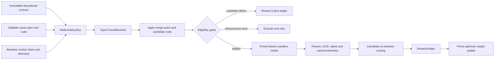

# Prime Visual-Improvement RL Experiment Design

**Status:** Approved

**Date:** 2026-07-24

**Primary environment ID:** `harleycooper/math-to-manim-visual-improvement`

## Problem

Math-To-Manim currently uses bounded language-model repair loops after static or
render failures. Those loops are useful production automation, but they are not
reinforcement learning: they do not update model weights, and a successful
render ends the loop even when text is crowded, objects are clipped, or a camera
move fails to emphasize the intended detail.

An older divergent checkout contains a published Prime Intellect Verifiers
environment, a static reward function, and training configuration fragments.
That work proves the packaging path, but it is not a reproducible visual RL
experiment:

- the active source is absent from the current repository;
- its default dataset has only two unsplit tasks;
- the action can replace generated code but cannot revise the scene spec;
- its reward can be maximized by a nearly empty scene that mentions required
  terms in comments;
- it does not render candidates in the reward path;
- its local Git worktree metadata is broken, and published additions are not
  recoverable from its surviving branch;
- its training templates mix incompatible model and configuration generations.

The replacement must train a model to improve technically valid animations.
Compilation and rendering are eligibility conditions, not the definition of
success.

## Goals

1. Put the environment, reward implementation, datasets, training/evaluation
   configs, runtime image, launcher, and experiment ledger in the active
   Math-To-Manim repository.
2. Run genuine RL through Prime Hosted Training, with repository-owned,
   versioned inputs and an externally hosted, explicitly documented optimizer.
3. Give the policy rendered baseline evidence and allow it to revise the scene
   specification and generated Manim code together.
4. Reward candidate-versus-baseline visual improvement in framing, legibility,
   density, camera focus, pacing, and instructional clarity.
5. Compare RL and artifact scope independently with a predeclared 2x2
   experiment.
6. Preserve the provider-native Mythos and Sol silos. The experiment reads their
   run ledgers through filesystem adapters and imports neither orchestration
   package.
7. Publish reproducible evidence without publishing credentials, local run
   directories, or unreviewed claims.

## Non-goals

- Replacing Mythos or Sol generation and repair orchestration.
- Training full-length films in the first experiment.
- Treating stderr, Python exceptions, or render failures as the main learning
  signal.
- Claiming that automated visual judgment is equivalent to human preference.
- Vendoring or forking Prime's optimizer into this repository.
- Adding a third provider orchestration layer.

## Terminology

**Visual improvement** means changing a valid render so it communicates more
clearly. It includes moving material on screen, staging objects over time,
making text readable, improving composition, and directing the camera to the
right detail.

**Eligibility gate** means a condition required before visual reward can be
computed: valid action schema, safe code, preserved educational contract, and a
completed candidate render.

**Infrastructure exclusion** means a rollout that cannot be scored because the
judge, Prime sandbox, or render service failed independently of the candidate.
Excluded rollouts are retried and do not become negative training examples.

## Recommended Approach

Use a render-grounded, one-action Verifiers environment.

The policy receives a valid baseline bundle and its visual evidence. It emits
one typed hierarchical revision. The environment applies the revision in a
network-disabled Manim sandbox, renders a short candidate, extracts visual
measurements, compares it with the baseline, and emits a component reward
ledger. Prime then updates policy weights across rollout groups.

This is deliberately not an iterative "try again with stderr" conversation.
One rollout is one state, one policy action, one environment transition, and one
reward. The learning loop is the optimizer updating weights across rollouts.

Two alternatives were rejected:

1. Static code/layout proxies are inexpensive but optimize source-code patterns
   rather than the rendered product.
2. Full-film end-to-end regeneration has higher fidelity but is too slow and
   reward-sparse for the first controlled experiment.

## Repository Layout

```text
environments/
  m2m2_visual_improvement/
    pyproject.toml
    README.md
    m2m2_visual_improvement/
      __init__.py
      schemas.py
      merge_patch.py
      dataset.py
      environment.py
      renderer.py
      telemetry.py
      scoring.py
      judge.py
      adapters/
        __init__.py
        common.py
        mythos.py
        sol.py
      data/
        tasks.jsonl
        manifest.json
        preference_calibration.jsonl
      fixtures/
        micro_scenes/
        provider_holdout/
    runtime/
      Dockerfile
    tests/
      test_schemas.py
      test_adapters.py
      test_dataset.py
      test_merge_patch.py
      test_scoring.py
      test_reward_hacking.py
      test_render_integration.py

configs/
  eval/
    m2m2-visual-code-only.toml
    m2m2-visual-hierarchical.toml
  rl/
    m2m2-visual-code-only-smoke.toml
    m2m2-visual-hierarchical-smoke.toml
    m2m2-visual-code-only.toml
    m2m2-visual-hierarchical.toml

experiments/
  prime_rl/
    README.md
    schema.json
    runs/

scripts/
  prime_visual_experiment.py
```

The environment is a standalone Python package. The root project continues to
install only `mythos*` and `sol*`, so the RL dependency graph cannot leak into
either production silo.

## Typed Contracts

### Immutable educational contract

Each task contains an `EducationalContract` that the policy cannot patch:

- task and source identifiers;
- original user request and audience;
- required concepts and formulas;
- required narrative beats;
- duration bounds;
- provider and source-artifact hashes.

The contract prevents a policy from improving visual scores by deleting the
lesson.

### Editable baseline

Each task also contains:

- an opaque provider-native scene-spec JSON object;
- complete Manim source;
- a baseline render manifest;
- representative frames or a contact sheet;
- OCR boxes and render telemetry;
- annotated focus beats and target regions;
- a deterministic defect family for synthetic tasks.

### Policy action

The model returns exactly one `VisualRevision`:

```json
{
  "schema_version": "m2m2.visual_revision.v1",
  "scope": "code_only",
  "diagnosis": [
    {
      "category": "crowding",
      "evidence": "Three captions overlap in frames 03-05",
      "intent": "Stage the captions sequentially"
    }
  ],
  "scene_spec_patch": null,
  "code": "from manim import *\n...",
  "expected_improvements": ["legibility", "visual_density"]
}
```

`scope` is one of:

- `code_only`: `scene_spec_patch` must be `null`;
- `spec_and_code`: `scene_spec_patch` must be an RFC 7396 JSON Merge Patch;
- `no_change`: both patch and code must reproduce the baseline, with a
  non-empty diagnosis explaining why a change would regress the lesson.

A spec-only action is not supported because the candidate must remain an
executable realization of the revised specification.

### Visual evidence

`VisualEvidence` records:

- render status, duration, resolution, and sampled timestamps;
- contact-sheet and frame hashes;
- OCR text boxes, confidence, and pixel height;
- tracked object bounds and visible intervals;
- focus target bounds and camera occupancy at annotated beats;
- clipping, overlap, density, and persistence measurements.

### Reward ledger

`RewardLedger` records eligibility, exclusion state, every raw measurement,
baseline and candidate component scores, judge order and verdicts, aggregate
reward, image/model/prompt hashes, and timing. No component is available only
in transient logs.

## Provider Adapters

Adapters read files only. They do not import `mythos`, `sol`, their prompts,
backends, clients, or orchestration.

Both adapters recognize the common reasoning spine:

```text
01_intent.json
02_knowledge_map.json
03_curriculum.json
04_math_dossier.json
05_shot_list.json
06_scene_spec.json
```

The Mythos adapter reads `mythos_scene.py` and its manifest. The Sol adapter
reads `sol_scene.py`, `review.json`, and its manifest. Both produce the same
experiment-facing contract while retaining the original scene spec as opaque
JSON.

Missing or malformed artifacts produce an explicit export rejection. The
exporter never guesses a provider or silently creates empty requirements.

## Dataset

### Training surface

The committed laboratory dataset contains eighteen clean 6-12 second base
scenes. Each base scene has eight deterministic corruptions spanning:

1. off-frame placement;
2. text or formula crowding;
3. text below the readability threshold;
4. excessive simultaneous objects;
5. absent or weak zoom-to-detail;
6. temporal stacking and insufficient cleanup.

This produces 144 reproducible tasks. Splits are grouped by base scene:

- 12 base scenes / 96 tasks for training;
- 3 base scenes / 24 tasks for validation;
- 3 base scenes / 24 tasks for held-out testing.

No mutation of one base scene may cross a split boundary. The manifest records
the seed, generator version, source hashes, task IDs, and split assignment.

Clean source scenes act as calibration references, not exact-match targets.
Alternative revisions can earn full reward when their rendered evidence is
better than the corrupted baseline.

### Provider holdout

Normalized, text-only fixtures from completed Mythos and Sol ledgers form a
separate generalization suite. Source code and scene specs are committed; the
runtime regenerates low-resolution evidence. Full videos and local `runs/`
directories remain ignored.

Provider holdout is never used for policy updates. It tests whether gains on
short laboratory scenes transfer to authentic Math-To-Manim artifacts.

### Preference calibration

Obvious clean-versus-corrupted pairs form a committed judge-calibration set.
Candidate/baseline order is deterministically randomized and every pair is
judged again with order reversed. The pairwise judge must achieve at least 90%
order consistency before it can contribute training reward.

## Render Runtime

The runtime image is built from
`environments/m2m2_visual_improvement/runtime/Dockerfile` and published as
`m2m2-visual-runtime:0.1.0`. It pins:

- Python 3.12;
- Manim Community Edition 0.19;
- FFmpeg;
- a documented TeX Live subset;
- Tesseract and its English language data;
- the environment's locked Python dependencies.

The experiment manifest stores the resolved Prime image digest; a mutable tag is
never sufficient evidence for reproduction.

Candidate code runs with outbound networking disabled, bounded CPU/memory/disk,
a wall-clock timeout, and a read-only baseline bundle. Generated code may write
only to its assigned candidate/output directories.

## Rollout Data Flow



The model sees the baseline contact sheet as multimodal input and the typed
artifact bundle as text. It does not receive hidden reward internals or the
clean calibration scene.

## Reward

Eligibility requires:

- valid `VisualRevision`;
- merge-patch consistency with `scope`;
- safe Python source;
- preserved immutable educational requirements;
- a candidate render completed within the candidate budget.

Candidate-caused schema, safety, content-preservation, or render failures receive
reward `0.0`. Prime sandbox failures, judge outages, and platform render
failures are marked as infrastructure exclusions and retried.

For each deterministic metric `m` in `[0, 1]`, relative improvement is:

```text
relative(m) = clamp(0.5 + 0.5 * (candidate_m - baseline_m), 0, 1)
```

An unchanged candidate is therefore neutral at `0.5`; regression scores below
neutral; improvement scores above neutral.

The eligible reward is:

```text
0.25 * framing_relative
+ 0.25 * legibility_relative
+ 0.20 * focus_relative
+ 0.30 * pairwise_visual_preference
```

### Framing

Framing combines clipped visible area, safe-margin violations, object overlap,
and excess simultaneous-object density. Telemetry is measured at committed
sample timestamps.

### Legibility

Legibility combines OCR confidence, detected text height at 854x480, text-box
overlap, single-frame flashes, and accumulated caption persistence. Required
formula tokens are checked against the immutable contract rather than comments
in source code.

### Focus

Each task declares one or more focus beats. At each beat, the target must be
inside the frame, near the intended focal region, and occupy enough of the
viewport to read without becoming clipped. This detects camera moves that
execute successfully but zoom to the wrong place or at the wrong scale.

### Pairwise visual preference

A configurable vision-capable judge compares blinded baseline and candidate
contact sheets for composition, hierarchy, pacing, instructional clarity, and
content preservation. It returns loss `0.0`, tie `0.5`, or win `1.0`.

The environment judges both A/B and B/A orders with temperature zero. A
disagreement becomes a neutral `0.5` and is logged as order-inconsistent. Judge
endpoint configuration comes from Verifiers rollout state; credentials are
never stored in task data, source code, or experiment manifests.

## Anti-reward-hacking Requirements

The suite must prove that:

- required terms in comments do not count as visible content;
- deleting text or required concepts cannot improve total reward;
- replacing all content with one large title cannot maximize legibility;
- returning the baseline is neutral, not a perfect score;
- a scene-spec patch that deletes difficult objects fails content preservation;
- excessive whitespace cannot hide an off-screen target;
- judge order reversal is recorded and inconsistent votes are neutralized;
- `scope=code_only` cannot smuggle a scene-spec patch;
- `scope=spec_and_code` must produce code aligned with the patched spec.

## Experiment

Use the same base model, task splits, seeds, sampling parameters, rollout budget,
judge, and evaluation harness in a 2x2 design:

| Arm | Policy weights | Editable scope |
|---|---|---|
| A | Untuned | Code only |
| B | Untuned | Scene spec and code |
| C | RL-trained | Code only |
| D | RL-trained | Scene spec and code |

The initial model is `Qwen/Qwen3-VL-4B-Instruct` because it is currently
supported by Prime Hosted Training and can consume the baseline contact sheet.

Smoke configs use 5 steps, batch size 8, and 2 rollouts per example. They prove
packaging, multimodal inputs, sandbox rendering, judging, weight updates, and
ledger capture at bounded cost.

Full configs use 50 steps, batch size 32, and 4 rollouts per example. A full run
is launched only after both smoke arms complete, the judge calibration passes,
and the held-out baseline has been captured.

## Outcomes and Predeclared Success

The primary outcome is blinded visual-preference win rate on held-out tasks.
Secondary outcomes are component deltas, render eligibility, content
preservation, chosen revision scope, judge consistency, runtime, and usage.

The experiment succeeds only if:

1. Arm D improves held-out win rate over A by at least 15 percentage points.
2. Arm D beats both B and C.
3. Mathematical and educational content preservation regresses by no more than
   2 percentage points relative to A.
4. Pairwise judge order consistency is at least 90%.
5. The recorded repository, dataset, image, model, configuration, and seed
   digests reproduce the reported evaluation.

Results that miss these thresholds remain valid negative experimental results.
Documentation must not relabel them as a successful training outcome.

## Experiment Ledger

`experiments/prime_rl/runs/<run-id>/manifest.json` records:

- repository Git SHA and dirty-state check;
- environment package version and archive digest;
- dataset and split-manifest digest;
- Prime runtime image reference and immutable digest;
- Prime CLI and Verifiers versions;
- base model, adapter/checkpoint IDs, and sampling parameters;
- all random seeds;
- exact config file digest;
- Prime environment version and training run ID;
- training status, reward curves, rollout counts, and exclusions;
- token usage and reported cost;
- baseline and post-training evaluation IDs;
- aggregate and per-task metrics;
- links to committed result summaries, not credentials.

The launcher refuses to start a publishable run from a dirty worktree or with an
unrecorded dataset/image digest. Local development and tests may explicitly use
`--allow-dirty`, and the ledger marks that run non-publishable.

## Launcher

`scripts/prime_visual_experiment.py` provides:

```text
prepare
validate
publish-image
publish-environment
baseline
train
collect
compare
```

The launcher invokes the Prime CLI and records the commands and returned opaque
IDs. It does not implement or pretend to replace the optimizer. Documentation
states that Prime Hosted Training runs the actual weight updates.

## Error Handling

- Malformed source bundles are rejected during dataset preparation.
- Candidate action errors receive zero with structured model-attributable
  reasons.
- Infrastructure errors are distinct typed states, excluded from reward, and
  retried within a fixed budget.
- Render and judge timeouts are recorded separately.
- Partial artifacts use atomic writes and never replace a completed ledger.
- A run with unresolved exclusions, missing digests, or mismatched task counts
  cannot be marked complete.
- Secrets are sourced from Prime environment/training secrets or local process
  state and are redacted from logs.

## Verification

### Offline unit tests

- schema and scope invariants;
- RFC 7396 merge-patch behavior;
- Mythos and Sol adapter fixtures;
- deterministic task generation and group-safe splits;
- reward arithmetic and neutral no-change behavior;
- all anti-reward-hacking cases;
- ledger completeness and redaction;
- launcher dry-run command construction.

### Local render integration

A two-task integration test renders one baseline and one known improvement in
the pinned runtime, then verifies framing, legibility, focus, and contact-sheet
artifacts. It runs separately from the root offline suite.

### Prime smoke validation

1. Build and publish the pinned runtime image.
2. Install and evaluate the local environment on two tasks.
3. Publish the environment to
   `harleycooper/math-to-manim-visual-improvement`.
4. Run the two smoke training arms.
5. Collect run IDs, usage, checkpoints, and reward ledgers.
6. Evaluate the resulting adapters on the held-out split.

### Repository regression

The existing root suite must remain green, including offline Mythos and Sol
pipeline tests. No experiment module may appear in either silo's import graph.

## Documentation and Publication

The root README will describe the project as two provider-native film pipelines
plus a separate, evidence-backed visual RL experiment. It will not call ordinary
prompt retries RL.

`docs/PRIME_INTELLECT_RL.md` will be replaced with:

- the environment/action/reward contract;
- exact local, publish, baseline, training, and collection commands;
- the 2x2 experiment and success criteria;
- links to the public environment, runtime image, config, and result manifest;
- explicit limitations and the distinction between repository-owned components
  and Prime's hosted optimizer.

The previous `harleycooper/math-to-manim` code-only environment remains
available for historical reproduction and is marked deprecated. It is not
silently overwritten.

Verified work is published from `codex/prime-visual-improvement-rl` as a pull
request to `HarleyCoops/Math-To-Manim`. The public environment and image are
published only after local and Prime smoke validation succeeds.

## Acceptance Criteria

- The active repository contains the complete standalone environment and
  training/evaluation workflow.
- Both provider adapters export real fixtures without importing provider
  orchestration.
- The policy can change scene spec and code in hierarchical mode.
- Every scored candidate is rendered; no source-only proxy can produce the
  primary reward.
- Comment-only acceptance-term gaming scores zero on visible-content
  preservation.
- The deterministic dataset contains 144 tasks with 96/24/24 grouped splits.
- The runtime image, environment, dataset, configs, and results have recorded
  immutable digests.
- The 2x2 baseline and smoke training workflow is executable through documented
  commands.
- Root and environment tests pass.
- A public Prime environment version and smoke-run evidence are recorded.
- README and Prime documentation make only claims supported by the committed
  ledger.
