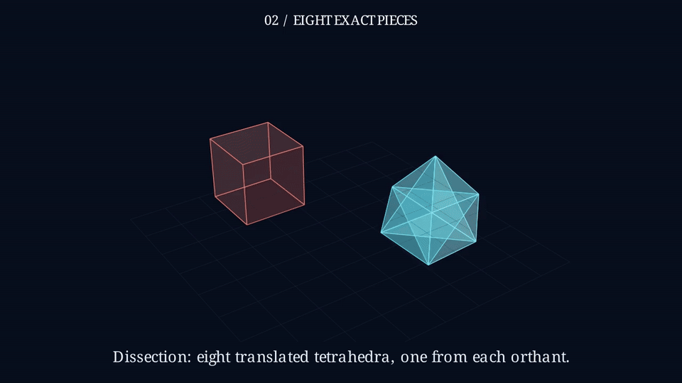

# The Shape and Its Shadow

A three-minute 3D pilot explaining polarity, the cube's exact Mahler volume
product, reciprocal deformation and the manuscript's analytic proof route.
The original request, pinned manuscript and source distinctions are in
[source-context.md](source-context.md).

**The complete 179.8-second movie is rendered at 720p and 30 fps.**
The retained [Astra scene](scene.py) and [renderable artifact](candidate.json)
produced the [completed GitHub cloud render](https://github.com/HarleyCoops/Math-To-Manim/actions/runs/37558520865).
The real Codex SDK / GPT-6 Astra chain was launched through MCP, with Jev off.

[Watch the complete movie](../../docs/showcase/assets/mahler-film.mp4) ·
[Inspect 23 rendered frames](../../docs/showcase/assets/mahler-contact-sheet.png) ·
[Read the production record](production/production.json) ·
[Read the final Astra assessment](production/final-render-audit.json)

These pictures are frames extracted from the completed movie:

The [curation record](curation.md) explains the geometry and timing repairs.
The [initial source assessment](production/curated-source-audit.json) and its
[exact input hashes](production/curated-source-audit-record.json) are retained.
The [first rendered assessment](production/first-render-audit.json) then found
presentation defects that source-only inspection missed. The curation record
explains their repairs. The final Astra audit found no blocking defects on its
23-frame evidence bundle. Every video frame decoded without errors, and the
rendered source hash matches the published scene. Exact input hashes, original
audit context and extracted frames are retained in the production record.

Run the retained source without model calls using the **Render a paper film**
workflow with a branch containing this candidate and quality `m`. The cloud
machine uses Manim CE 0.19.0, LaTeX and FFmpeg; delivery is 1280×720 at 30 fps.
Its artifact includes the full MP4, sampled frames, source, logs and metadata.

The theorem and reported Lean formalization are attributed to the manuscript.
The film does not independently validate the all-dimensional proof. Stills and
source audits do not certify every transition or reading hold. The final assessment
records nonblocking refinements, including brief captions and a partially overlapping
mixed Hanner example. No Jev approval is claimed.
