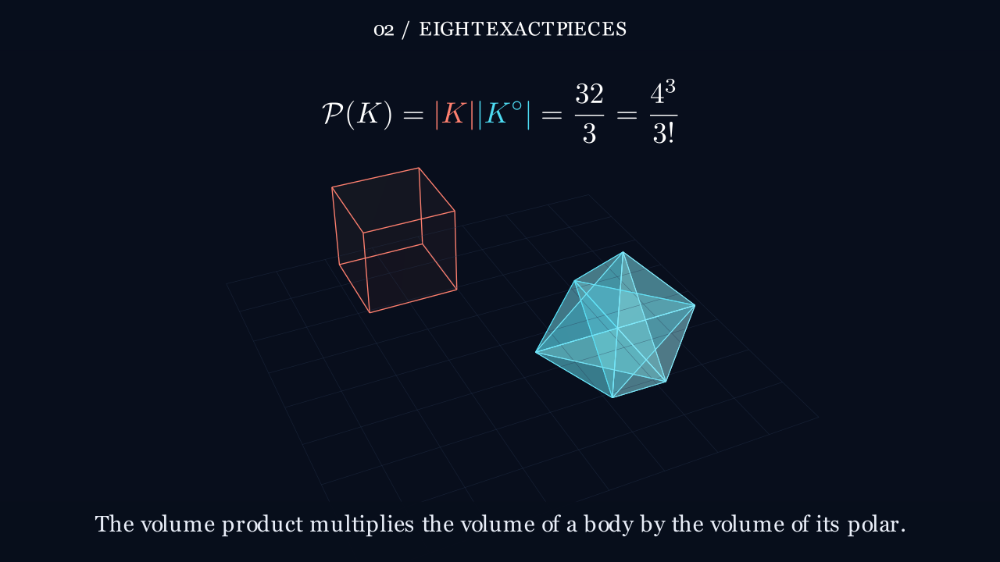
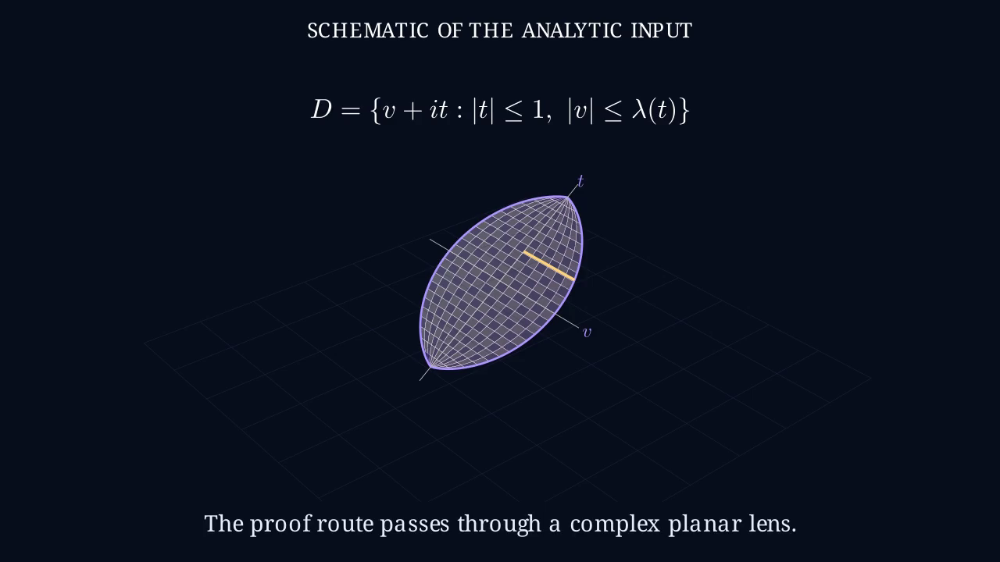

# The Shape and Its Shadow

A three-minute 3D pilot explaining polarity, the cube's exact Mahler volume
product, reciprocal deformation and the manuscript's analytic proof route.
The original request, pinned manuscript and source distinctions are in
[source-context.md](source-context.md).

The retained [Astra scene](scene.py) and [renderable artifact](candidate.json)
produced a [first full GitHub Actions render](https://github.com/HarleyCoops/Math-To-Manim/actions/runs/37557454747).
Its rendered audit prompted clearer volume close-ups, actual formula camera zooms
and explicit Hanner construction schematics. The revised cut is in production.
The real Codex SDK / GPT-6 Astra chain was launched through MCP, with Jev off.

These are actual Manim execution stills from the corrected source:

The [curation record](curation.md) explains the geometry and timing repairs.
The [initial source assessment](production/curated-source-audit.json) and its
[exact input hashes](production/curated-source-audit-record.json) are retained.
The [first rendered assessment](production/first-render-audit.json) then found
presentation defects that source-only inspection missed. The curation record
explains their repairs. The revised render has its own source hash and review scope.

Run the retained source without model calls using the **Render a paper film**
workflow, selecting the `codex/mahler-render` branch and quality `m`. The cloud
machine uses Manim CE 0.19.0, LaTeX and FFmpeg; delivery is 1280×720 at 30 fps.
Its artifact includes the full MP4, sampled frames, source, logs and metadata.

The theorem and reported Lean formalization are attributed to the manuscript.
The film does not independently validate the all-dimensional proof. Stills and
source audits do not establish continuous-film quality. No Jev approval is claimed.
